## Appearance

In addition to creating dashboards, an important role plays the setting of this panel and its elements.

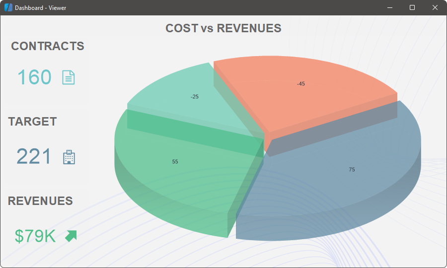

In this chapter, we will describe the parameters of the dashboard and its elements:
* [Styles](#Styles);

* [Fore Color](#ForeColor);

* [Back Color](#BackColor);

* [Margins and padding](#Margins);

* [Titles elements](#Titles);

* [Text Format](#TextFormat);

* [Watermark](#watermark);

* [Text of watermark](#watermarktext);

* [Image of watermark](#watermarkimage);

* [Weave of watermark](#watermarkweave);

* [Transparency of elements](#transparency);

* [Rounding of elements](#cornerradius);

* [Shadows of elements](#shadow).

> **Information**
>
> Some elements, besides those listed below, may also have individual design options.

**Styles of a dashboard and elements**

When creating a dashboard, the report designer contains predefined styles. The first style from the list is applied to the dashboard. For all newly added elements on this dashboard, the current color scheme of the dashboard is used. By default, when you change the style of the dashboard, the newly selected color scheme will be applied to all elements on this panel. However, for each component of the dashboard you can assign your style.
To change the style of the dashboard, you should:

* Left-click on the empty area of the dashboard;

* Select the dashboard style on the **Home** tab, in the styles menu.

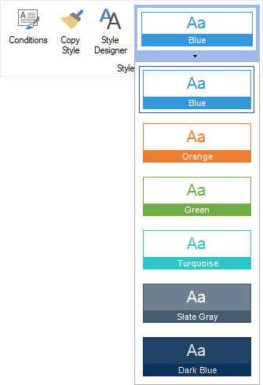

To change the style of an element in the dashboard, you should:

* Select an dashboard element;

* Select the desired element style on the **Home** tab, in the style menu.

> **Information**
>
> In this case, if you change the style of the dashboard, the color scheme of the element will not change.

In addition, you can create custom styles for the elements of the dashboard. To do this, call the [Style Designer](../Report_Internals/Appearance/Styles/index.md) and create styles for the elements. You can also assign the created style using the style menu on the Home tab or using the Style property of the element.

**Background**

One of the settings for the design is to set the background color of the element. By default, the background color is used from the assigned style. To change the background color of the dashboard or its elements you should:

* Select the dashboard or element;

* Change the value of the **Back Color** property in the property panel.

* After that, select the background color from the drop-down list.

Also, you can change the background color of the element on the Home tab in the report designer:

* Select the dashboard or element;

* Use the **Background** tool to select a background color from the palette or specify a custom color.
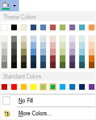

**Text color**

When customizing the design, you can change the text color of a specific item. To do this:

* Select an element;

* Select the required color from the drop-down list in the **Fore Color** property.

> **Information**
>
> The [Table](Table.md) element also has its own color for each column. To do this, select the data field in the **Table** element editor and change the text color.

**Margin and padding**

Each element in the dashboard can define the margin and padding of the element. To do this:

* Select an item on the dashboard;

* Change the values of the **Margins** and **Padding** property groups on the property panel.

You can also customize the type, borders, size and color of the borders of the element. To do this:

* Select an item on the dashboard;

* Change the type, size, sides, borders color using the **Border** property group on the property panel, or tools on the **Home** tab in the report designer.

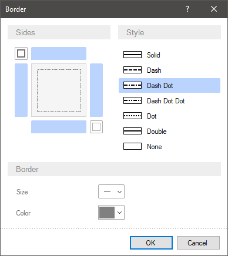

**Element titles**

The titles of elements on the dashboard can be created in various ways. For example, using the **Text** element. However, elements also have the ability to enable and configure an element title. To include the title:

* Move the cursor to the top of the element;

* In the upper right corner, check the box to enable the title display or uncheck the box to disable the title display. By default, the title of the elements is enabled.

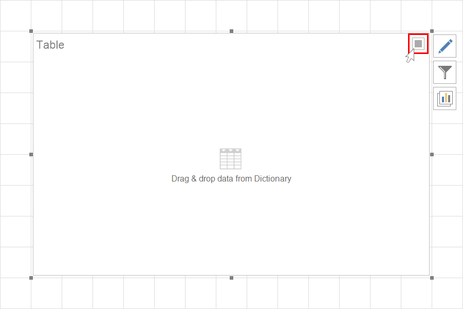

* You can also enable or disable displaying of the title by setting the **Visible** property from the **Title** group on the property panel to **true** or **false**.

To change the title text you should do the following:

* Double-click the input pointer on the header area on the item.

* Enter the title text.

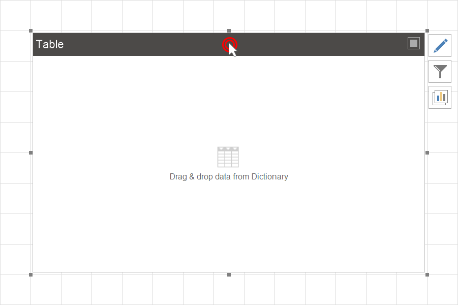

You can also change the title on the property panel:

* Select an item;

* In the **Title** property group, change the **Text** property value.

In addition, text of the title can also be changed:

* Align the title horizontally;

* Header background color;

* The color of the text and its font.

**Text formatting**

You can apply formatting to the elements of the dashboard. You should do the following steps:

* Select an item on the dashboard;

* Using the **Text Format** tool on the **Home** tab of the ribbon panel, apply the format to the element values.

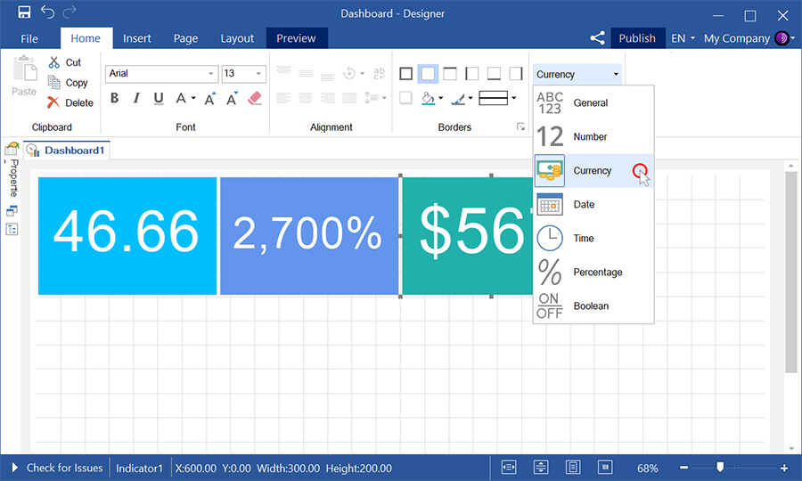

Also, you should remember that for the Table and Pivot Table elements you can set the formatting for the values of each data field. You should do the following steps:

* In the [Table](Table.md) or [Pivot Table](Pivot_Table.md) element editor, select the data field;

* Select a format using the **Text Format** tool on the **Home** tab of the ribbon panel.
For charts, you can specify the formatting of the chart axis values. To do this:

* Select a chart on a dashboard panel;

* Click the **Browse** button of the **Argument Format** or **Value Format** property and respectively set up the formatting of the arguments or chart values.

> **Information**
>
> Please note that the **Text** element on the Dashboard doesn't support the **Text Format** tool. However, to format data of the DateTime type, you can use the Format function. For example:
>
> {Format("{0:MM/dd/yyyy}", Today)} - the result of this will be the current date in the following format: "Month/Day/Year";
>
> {Format("yyyy", Today)} - the result of this will be the year from the current date;
>
> {Format("From {0:yyyy} ", Today)} - the result of this will be the text  "From" + year from the current date.

**Watermark**

When creating dashboards for watermark you can specify:

* [Text](#watermarktext) which will be displayed in a dashboard.

* [Image](#watermarkimage), which will fill image background

* [Weave](#watermarkweave), basic and auxiliary icons. Using them you can create different weaves.

**Information**

When creating watermark for a dashboard, you can use various combinations of watermark modes. For example, image and text or text and weave or all of them.

Watermark is set in a special editor. To call the watermark editor you should:

* Select a dashboard;

* Click the **Browse** button in the **Watermark** property.

* Click the **Watermark** on the **Page** tab in the report designer.

**Text parameters**

All parameters of the watermark text are placed on the corresponding tab in the watermark editor.

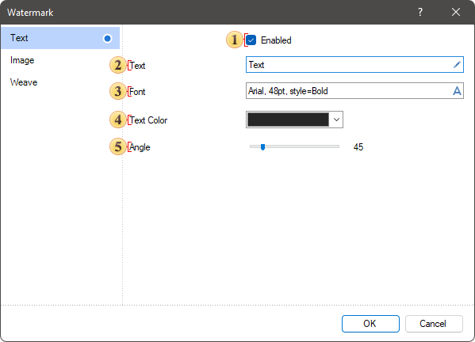

 The **Enabled** parameter allows you to enable or disable watermark text;

 The **Text** parameter allows you to define the text which will be displayed as watermark;

 The **Font** parameter allows you to define font, its size and style for watermark text;

 The **Text Color** parameter allows you to select watermark text color;

 The **Angle** parameter allows you to define rotation angle for watermark text.

**Image parameters**

You can specify image as watermark. The parameters of this watermark type are placed on the corresponding tab in the watermark editor.

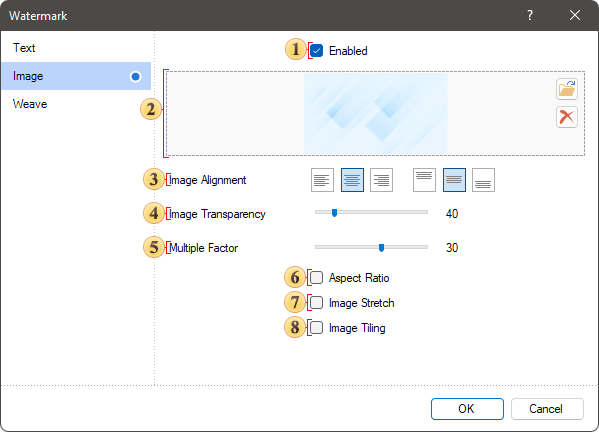

 The **Enabled** parameter allows you to enable or disable watermark text;

 The field of image loading, which will be watermark for the dashboard.

 Controls of horizontal and vertical image alignment;

 The **Image Transparency** parameter allows you to change the transparency of watermark image;

 The **Multiple Factor** parameter allows you to set a multiplier for watermark image sizes;

 The **Aspect Ratio** parameter allows you to enable or disable the mode of saving image aspect ratio when it is stretched.

 The **Image Stretch** parameter allows you to stretch an image over the entire area of a dashboard.

 The **Image Tiling** parameter allows you to fill the entire area of a dashboard with image copies not stretching it.

**Weave parameters**

You can specify image as watermark. The parameters of this watermark type are placed on the corresponding tab in the watermark editor.

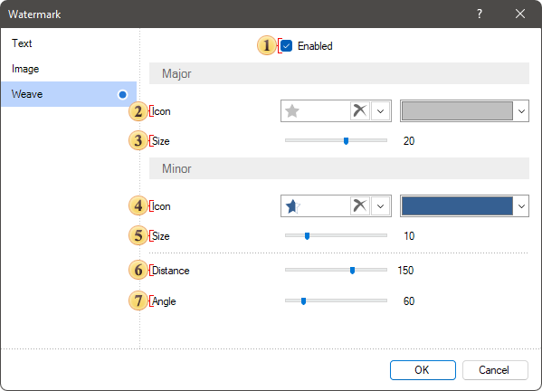

 The **Enabled** parameter allows you to enable or disable watermark weaves;

 The **Icon** parameter allows you to specify main icon and its color for weave.

 The **Size** parameter allows you to define the size of the main icon;

 The **Icon** parameter allows you to specify an additional icon and its color for weave;

 The **Size** parameter allows you to define the size of an additional icon;

 The **Distance** parameter allows you to change the distance between icons in weave;

 The **Angle** parameter allows you to define rotation angle of icons in weave.

**Transparency of elements**

Transparency of elements can be defined using the Alpha parameter in the color picker of a component or specify ARGB color code as a value of the **Back Color** property. As a result, the component background will have the transparency you specified and the using of watermark will become more obvious.

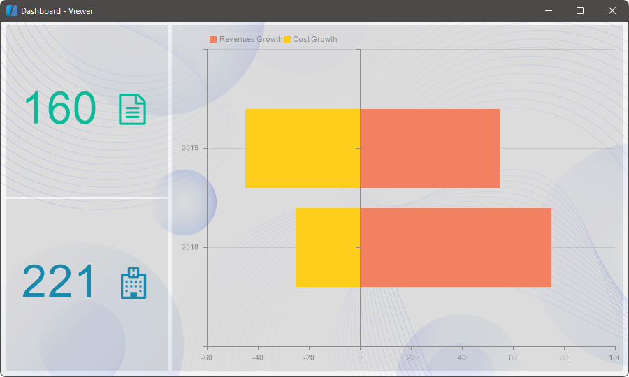

**Rounding of elements**

When designing a dashboard, you can round the angles of elements. You can do it using the **Corner Radius** property group. These properties can be set to value from 0 to 30, where 0 is the absence of rounding, and 30 is max radius of element angle rounding.

* To round element angles you should:

* Select the element in a dashboard;

* Define the radius of each angle rounding of the element.

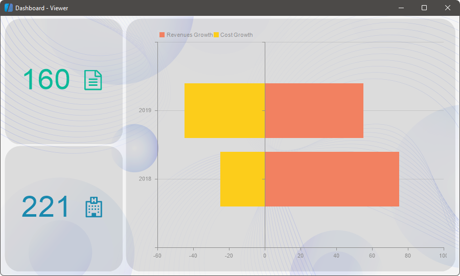

**Shadows of elements**

Also, when designing a dashboard you can apply shadows of elements. You can do it using the group of the **Shadow** element properties.

* To set shadow of an element, you should:

* Select the element in a dashboard;

* Set the **Visible** property in the **True** value;

* Change shadow color using the **Color** property;

* Define the depth of shadow using the **Size** property;

* Change the location of shadow on the X and Y axis of the element using the **Position** property group. The X and Y properties can be set from 0 to 10, where 0 is absence of shadow shift on the axis and 10 is max shadow shift on the X and Y axis.

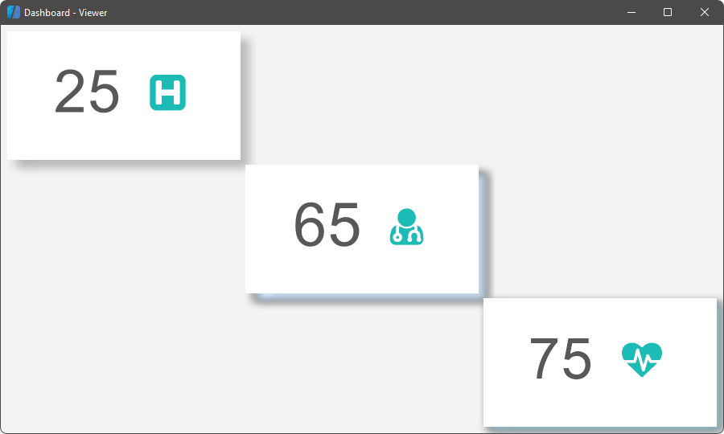
