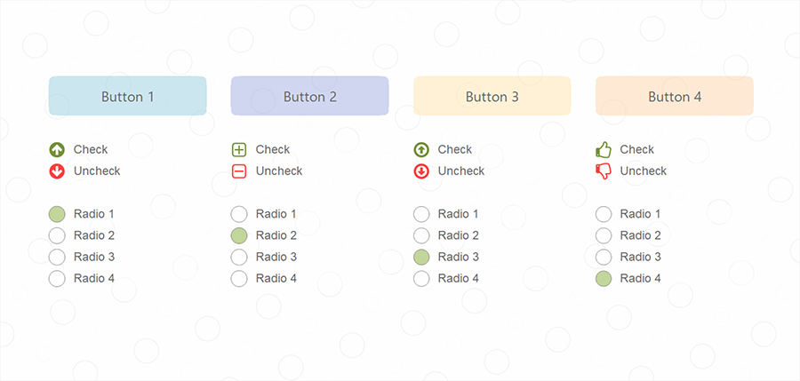
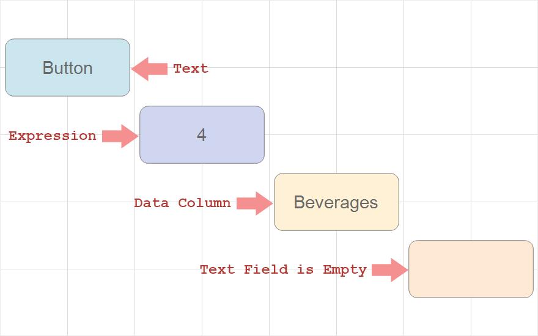
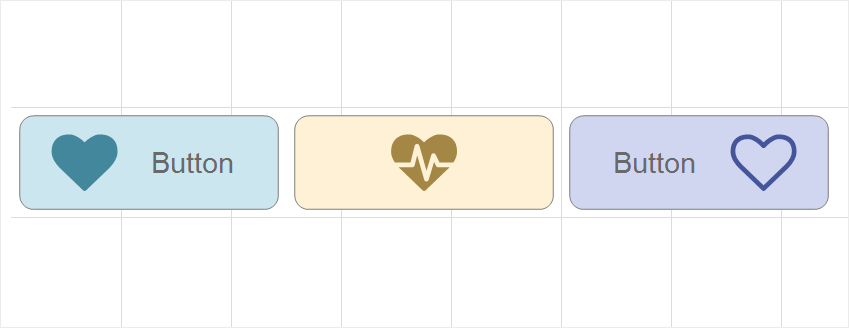
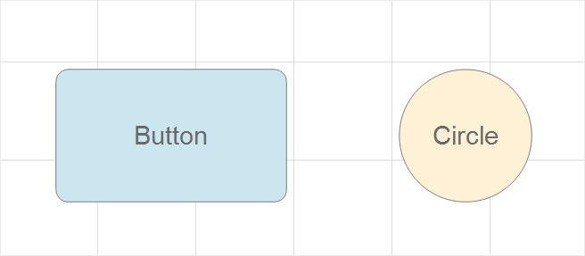

## Button

Important

Scripts can be a security risk, so they are disabled in the [Interpretation mode](../Reports_Designer/Template/Calculation_Mode.md). However, if you are confident in the safety of your scripts, you can use them in the [Compilation mode](../Reports_Designer/Template/Calculation_Mode.md).

Button is a dashboard element, which allows you to execute a certain script when clicking or depending on click condition. When using the Button, you can change design settings of dashboard elements, filter data, hide other elements, etc. The Button element doesn’t have its own editor, and it is customized using properties and controls on the Ribbon panel. A full set of properties will be presented in the table of element properties.

This chapter will cover the following:

* [Button Text](#text);

* [Icons in the Button](#icons);

* [Button Shape](#shape);

* [Appearance](#visualstates);

* [Table of the Properties](#tableofproperties).

When creating dashboards, you can change a type for the Button element. To do this, you should set the Type property to one of the following values:
* Button, i.e. an element will be presented as a simple button and will call a script when clicking.

* Check Box, i.e. an element will be presented as a check box, accordingly it may have checked and unchecked conditions. You can define a condition by default using the Checked property. Depending on a condition, a script can be executed. Also, you can execute a script when clicking.

* The Radio Button, i.e. several buttons can be grouped into one control, where only one button can be checked from the group. Buttons are formed into groups to the general rule of [grouping elements in a dashboard](Groups.md). Depending on a condition, a script can be executed. You can define a condition by default using the Checked property. Also, it’s possible to execute a script when clicking.

The script, that is executed when interacting with the Button element, is defined in its events. The following events can be defined for this element:
* When clicking the Click, it occurs when clicking on the element by the input pointer. It’s the main event.

* Checked Changed, it occurs when changing element condition from the preset value of the Checked property.

Button Text
When creating dashboards, you can define some text, which will be displayed in the Button element. It is defined using the Text property. Also, as a value of this property you can specify an expression in curly brackets - {expression}. In this case, the text will be the result of the expression calculation. Please, note if an expression is a link to a data source column, the first value from this data source column will be displayed on the button.

In addition, you can change horizontal or vertical text alignment. You can do this using the Horizontal Alignment and Vertical Alignment properties. In cases, when the text is longer than the button, it will be wrapped to the next line. However, you can disable wrapping having set the Word Wrap property to the False value. In this case, the text will be clipped to the border of the element.

Icons in the Button

In addition to the text in the Button element, you can specify an icon. It can be done using the Icon Set properties group. In this group, using properties, you can define an icon by default, also icons depending on button condition. It’s relevant for buttons of Check Box and Radio Button type. This way, the button may have three icons:
* By default, an icon is defined using the property of the same name – Icon;
* Checked Icon, i.e. the icon which will be displayed on the button, if its status will be defined as checked;

* Unchecked Icon, i.e. the icon, that will be displayed on the button, if its status will be defined as unchecked.
Icon alignment in the Button element is defined using the Icon Alignment property, and can be defined to the left, to the right, bottom, and center. Please, note that the None value for the Icon Alignment property disables the display of an icon on the button.

Button Shape

To display the button in a dashboard, you can use one of two shapes: Rectangle and Circle. By default, rectangle is used to display the button. You can change button shape using the Shape Type property.

It’s worth taking into account, that when viewing, the entire dashboard will be stretched to the viewer area. If another is not defined using the Content Alignment property. Elements of the dashboard will be stretched proportionally. However, you can define behavior for the Button element when stretching in width and height. You can do this, having set the Stretch property to the Stretch XY value, i.e. stretch in height and width, or Stretch X, i.e. stretch only in width.

**Appearance**

Element visual design is defined using the properties, which are located in the Appearance group in the properties panel or style settings of the Report Control type. All design properties of the Button element can be divided into the following categories:
* Common, i.e. the categories that are present and for other elements of a dashboard. For example, border, brush, style, rounding radius, font, icon brush, shadow, text brush.

* Special, i.e. the categories that are located in the Visual States group. These properties allow you to define design depending on the interaction with the Button element. For example, you can change an icon, its brush, button brush when clicking or hovering. More detailed the set of the property will be presented in a table of properties.
It's worth considering that you can’t define design settings in the style properties. For example, you’re not able to change an icon when hovering there. You can do it only using special design properties.

Table of properties

The table contains name and description of the Button element properties.

Name

Description

Text

It allows you to specify some text on the button. Also, you can specify an expression in curly braces. For example, {expression}. In this case, the result of the expression calculation will be displayed as the text. If the expression is a link to a data column, the first value from this data column will be displayed as the button text.

Checked

It allows you to define button element condition by default. This property is available for buttons of the Check Box and the Radio Button types. If the current property is set to the true value, the element condition will be defined as Checked. If the property is set to the false value, the element condition will be defined as Unchecked.

Group

It allows you to combine Button elements into a group. This property is available only for buttons of the Radio Button type. Using grouping, you can form a single control from different buttons. Buttons are combined according to the general principle of [grouping elements in a dashboard](Groups.md).

Icon Alignment

It allows you to change icon alignment in the button. Icon can be aligned to Left, Right, Top, Bottom and Center of the button. In addition, this property can be set to the None value. In this case, the button icon will not be displayed.

Icon Set

The group of properties, that allows you to set an icon for the button:

The Icon property allows you to define an icon by default for the Button element;

The Checked Icon property allows you to define an icon for the Button element in Checked condition.

The Unchecked Icon property allows you to define an icon for the Button element in Unchecked condition.

Horizontal Alignment

It allows you to define the horizontal alignment of the Button text: Left, Center, Right, Width.

Vertical Alignment

It allows you to define the vertical alignment of the Button text: Left, Center, Right.

Type

It allows you to change the element type, which can be defined as Button, Check Box, Radio Button.

Word Wrap

It allows you to enable or disable text wrapping in the Button element. If the current property is set to the True, the text can be wrapped to the next line in the button element. If the property is set to the False, word wrapping will not be possible, and the text will be cut off at the border of the element.

Shape Type

It allows you to change drawing shape of the Button element. The following kinds of shape: Rectangle and Circle.

Stretch

It allows you to define the element stretch mode in a dashboard. It can be set to one of two modes:

The Stretch XY value allows you to stretch the element in width and height in a dashboard;

The Stretch X value allows you to stretch the element only in width in a dashboard.

Border

The group of properties, which allows you to set element borders: color, sides, size and style.

Brush

It allows you to change brush type and its customization for the Button element.

Corner Radius

It allows you to define the rounding radius for the corners of an element in a dashboard. You can round each corner of the element separately: Top - Left, Top - Right, Bottom - Right, Bottom - Left. The property can be set to a value from 0 to 30, where 0 is no rounding angle and 30 is the maximum value of the rounding radius.

Font

The group of properties that allows you to define font family, its style and size for the values of the Indicator element.

Icon Brush

It allows you to change brush type and its settings for the Button icon. It’s relevant, if icon is defined for the button.

Shadow

The group of properties allows you to customize the element's shadow:

The Color property allows you to specify the color that will be used to display the element's shadow;

The properties in the Location group allow you to determine the shadow shift in X and Y coordinates, relative to the location of the element in a dashboard;

The Size property allows you to set the size of the shadow from the borders of the element. It can be set to the value from 1 to 10, where 1 is the minimum size and 10 is the maximum;

The Visible property allows you to enable or disable the display of the element's shadow in a dashboard.

Style

It allows you to select a style for the current element. By default, the Auto is set, i.e. a style of this element is inherited from a style of a dashboard.

Text Brush

It allows you to change brush type and its settings for some text in the Button element. It’s relevant if some text is specified for the button.

Visual States

The group of special properties allows you to define different design settings, depending on the state of the interaction:

The Checked property group allows you to define the border, brush, font, icon brush, character set, and text brush for the Button element when its state is checked.

The Hover property group allows you to define the border, brush, font, icon brush, character set, and text brush for the Button element when the input pointer is hovered.

The Pressed property group allows you to define the border, brush, font, icon brush, character set, and text brush for the Button element if the element has been clicked.

Enabled

It allows you to enable or disable the current element in a dashboard. If the property is set to the True, the current element is enabled and will be displayed when viewing the dashboard in the viewer. If this property is set to the False, this element is disabled and will not be displayed when viewing the dashboard in the viewer.

Margin

The group of properties allows you to define margins (left, top, right, bottom) of the value area from the border of this element.

Padding

The group of properties allows you to define paddings (left, top, right, bottom) of the graphic element area from the border of the value area.

Name

It allows you to change name of the current element.

Alias

It allows you to change the alias of the current element.

Restrictions

Configures the permissions to use the current item in the dashboard:

The **Allow Change** option enables or disables changes of the element. If checked, the current item can be changed.

The **Allow Delete** option enables or disables the deletion of an element.

The **Allow Move** option allows or prohibits moving an element.

The **Allow Resize** option enables or disables resizing of an element.

The **Allow Select** option enables or disables the element selection.

Locked

It allows you to prevent or allow resizing and moving the current element. If the property is set to the True value, the current element cannot be moved or resized. If this property is set to the False value, this element is moved and resized.

Linked

It allows you to bind the current location to a dashboard or another element. If the property is set to the True value, the current element is anchored to the current location. If this property is set to the False value, this element is not anchored to the current location.
