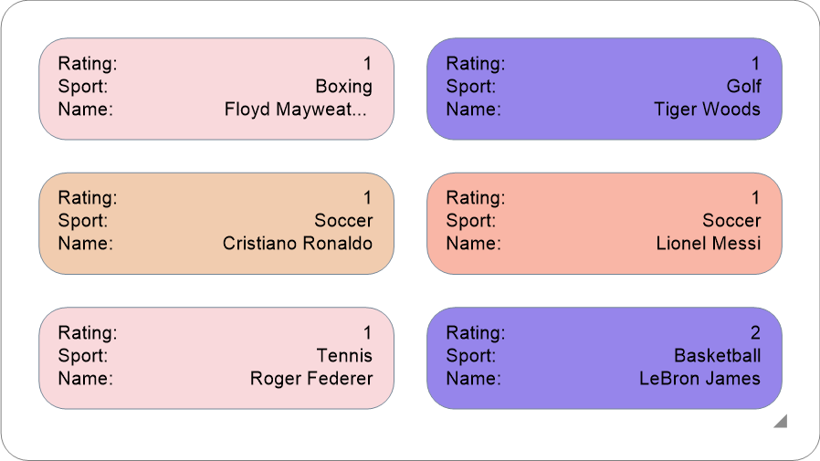
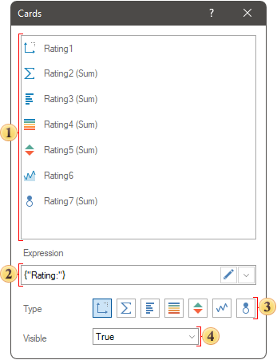
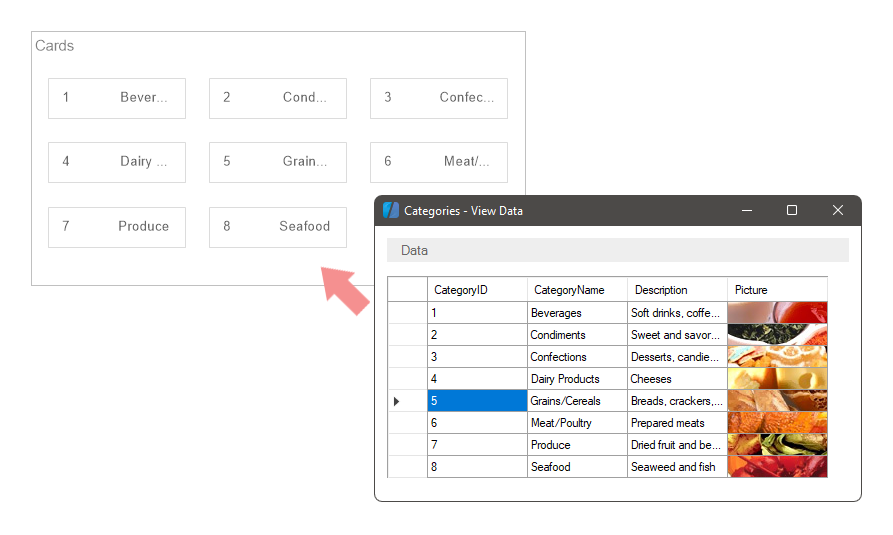
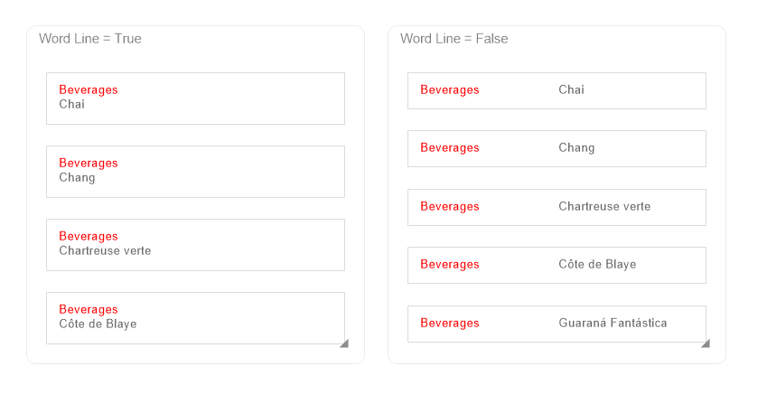
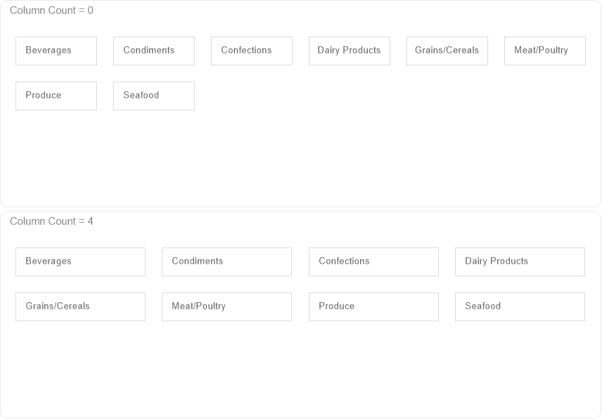
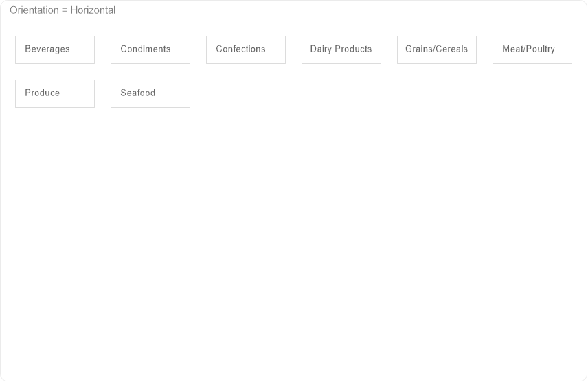
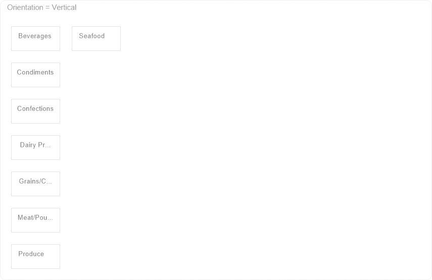
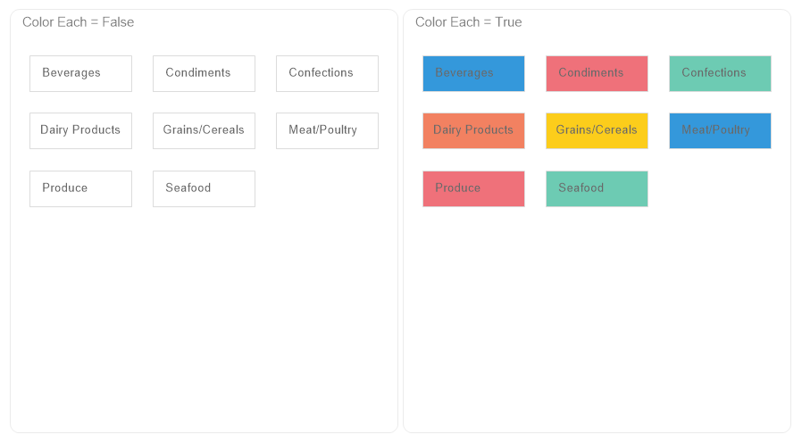

## Cards

Cards is a data analytics element, which allows you to display grouped values of data fields as a card.

In this chapter the following questions will be considered:

* [Element editor](#editor);

* [Card Layout](#ordertocreatecards);

* [The order of displaying values in cards](#ordertooutputvalues);

* [The order of displaying cards in an element](#ordertooutputincards);

* [The color of cards background](#backcolor);

* [Table of Properties](#propertiestable).

You can display on cards:

* Values from data fields and a graphic analysis applied to them;
* Manually specified value;

* Images from data fields.

Values display of the **Cards** element is customized in its editor and using properties. To call the editor, you should:
* Double click on the **Cards** element;
* Select the **Cards** element, and choose the **Design** command in the context menu.

**Element Editor**
In the editor of the **Cards** element, you can add fields with data, the order of their display in each card, deletion and enable of different types of graphic data analysis.

 The list of data fields of the **Cards** element.

 The **Expression** field of a selected data field.

 Value type of the selected data filed:

* The **Dimension** is the type at which the value of the data field will be displayed in its initial state.

* The **Measure** indicator is the type in which various functions can be applied to the values of the data field.
* The **Data Bars** is the type in which various functions can be applied to the values of a data field, and a Data Bars will be added for each value of this field.
* The **Color Scale** is the type in which various functions can be applied to the values of a data field, and a color scale will be added for each value of this field.
* The **Indicator** is the type in which various functions can be applied to the values of a data field, and an indicator will be added for each value of this field.
* The **Sparklines** is the type in which a value of a data field will be presented as a graphic. By the way, in this case, the sparkline has several views – graphic, area, data bars, win/lose. In addition, you can define the mode of starting points for sparkline, graphic or area.

* The **Bubble** is the type in which various functions can be applied to the values of a data field, and each value will be presented as a bubble.

 The **Visible** parameter allows you to enable or disable the display of a selected column in a element of a dashboard. Also, enable or disable of a column can depended on the result of a logic expression. If the result of expression calculation will be the true value, a column will be enabled. If the result of expression calculation will be the false value, the column will be disabled.

In cases, if such types of graphic analysis as **Color Scale**, **Sparkline**, **Bubble** are used for data fields, other parameters, which allow you to define additional settings of these types will be displayed in the editor.

**Card Layout**

When adding the first data field to the **Cards** element, for each value from a data column will be formed its own card. Next, if another data column will be added from the same source, its values will be added to existing cards as well as these data is compared in the source.

If a data column will be added from another data source, its values will be added to existing cards if there is a connection between data sources. Otherwise, if there is no connection between data sources, for values from the second column data column will be formed their own cards.

**The order of displaying values in the cards**

Each value from a data column, by default, it is displayed in a new row. The order of displaying values in rows of a card is defined by the location of fields in the **Cards** element editor. This way, the higher a data column, the higher a value from it in the card.

If you need to display a value from the following data column in the same row as the previous one, you should use the **Wrap Line** property and set to the **False** value. After that, the values from the data column which is located in the element editor below will be displayed in the card of the same row.

**The order of displaying cards in the element**

The order of displaying cards in the element is defined by the following element properties: **Column Count** and **Orientation**. By default, the **Column Count** property is set to 0 value, i.e. the number of columns in the element to display cards is calculated automatically. However, you can change it, having specified the necessary number of columns as a value of this property.

The direction of cards columns filling depends on a value of the **Orientation** property and by default is defined as **Horizontal**, i.e. cards are displayed from left to right line by line.

However, the **Orientation** property can be defined as the Vertical, i.e. firstly cards will be filled with from top to bottom, after in the next right column.

**Cards Back Color**
By default, cards back color in the element and the element back color are defined from the **Back Color** property. The value for this property can be received from the element style or defined from the **Back Color** property. However, each card can have its own shade. It depends on the value of the **Color Each** property. If the **Color Each** property is set to the True value, each card will have a unique shade.

Color sets for creating shades depend on a value of the **Series Colors** property and can be received from a style of the element or defined from preset color collections in the list of values of this property.

**Table of Properties**
The table contains name and description of the **Cards** element properties and its fields.

| **Name** | **Description** |
| --- | --- |
| Cross-Filtering | It allows you to enable or disable the Cross-Filtering mode for the current item. |
| Group | Adds the current item to a specific [group of items](Groups.md). |
| Cards | The group of properties, which allows you to set cards in the element: The **Color Each** property allows you to enable or disable the mode of a unique shade for each card in the element. If the property will be set to the False value, cards back color will be the same. If the property will be set to the True value, cards back color will be unique for Each card. The **Corner Radius** group of properties allows you to define radiuses of rounding for cards in the element. A group of properties that allows you to define indents (left, top, right, bottom) of the value area from the cards border. The **Padding** group of properties allows you to define paddings (left, top, right, bottom) values of area border from the border of cards in the element. |
| Column Count | It allows you to define the number of columns in the element. By default, the property is set to 0, i.e. the number of columns for cards in element is counted automatically. |
| Data Transformation | Customizes the data transformation of the current item. |
| Orientation | It allows you to define the direction of filling the columns of the element with cards. If the property is set to the **Horizontal** value, the columns are first filled from left to right within the width of the element, and a transition to a new line is performed. If the property is set to the **Vertical**, the columns are first filled from top to bottom within the height of the element, and then a transition is made to a new column on the right. |
| Back Color | It allows you to specify a background color for cards in an element. By default, the color from the style is used. Also, it’s worth taking into account that if the **Color for each** mode is enabled, the background color of the cards is defined by the value of the **Series Colors** property. |
| Border | A group of properties that allows you to customize the borders of the cards - color, sides, size, and style. |
| Corner Radius | It allows you to define the rounding radius for the corners of an element on the dashboard. You can round each corner of the element separately: **Top - Left**, **Top - Right**, **Bottom - Right**, **Bottom - Left**. The property can be set to a value between 0 and 30, where 0 is no rounding angle and 30 is the maximum value of the rounding radius. |
| Series Colors | It allows you to define a collection of colors to generate unique background hues for cards in an element. This property is relevant if the Color each mode is enabled. |
| Shadow | The group of properties that allows you to customize the element's shadow: The **Color** property allows you to specify the color that will be used to display the element's shadow; Properties in the **Location** group allow you to define the shadow shift in X and Y coordinates, relative to the location of the element in a dashboard; The **Size** property allows you to set the size of the shadow from the borders of the element. Can be set to a value between 1 and 10, where 1 is the minimum size and 10 is the maximum; The **Visible** property allows you to enable or disable the display of the element's shadow in a dashboard. |
| Style | It allows you to select a style for the current element. By default, the value is **Auto**, i.e. the style of this element is inherited from the style of a dashboard. |
| Enabled | It allows you to enable or disable the current item in a dashboard. If the property is set to the **True**, the current element is enabled and will be displayed when viewing a dashboard in the viewer. If this property is set the **False**, this element is disabled and will not be displayed when viewing the dashboard in the viewer. |
| Interaction | Customizes the [interaction](Interaction.md) element of the cards. |
| Margin | The group of properties that allows you to define the indents (left, top, right, bottom) of the value area from the border of this element. |
| Padding | The group of properties that allows you to define indents (left, top, right, bottom) of values from the border of the value area. |
| Show Blanks | Allows displaying or hiding the label "Show (blank)" in the dashboard element when there is no data available for that element. |
| Title | The **Back Color** property allows you to change the background color of the current element's header. By default, this property is set to **From Style**, i.e. the background color will be obtained from the settings of the current element style. The **Fore Color** property provides the ability to change the text color of the heading of the current element. By default, this property is set to **From Style**, i.e. the heading text color will be derived from the current element style settings. The **Font** property group allows you to define the font family, its style and size for the title of the current element. The **Horizontal Alignment** property allows you to change the alignment of the title relative to the element: **Left**, **Center**, **Right**. The **Text** property allows you to set the title text of the current element. The **Visible** property allows you to enable or disable the display of the title of the current element. If the property is set to the **True**, the header elements will be included. If this property is set to the **False**, the title of the element will be disabled. |
| Name | It allows you to change name of the current element. |
| Alias | It allows you to change alias of the current element. |
| Restrictions | It allows you to set the permissions to use the current element in a dashboard: The **Allow Change** parameter provides the option to allow or deny the element to be modified. If the checkbox is checked, the current element can be changed. If the checkbox is not checked, this element cannot be changed. The **Allow Delete** option provides the option to allow or deny the item's deletion. If the checkbox is checked, then the current element can be deleted. If the checkbox is not checked, then this element cannot be deleted. The **Allow Move** parameter provides the ability to allow or prohibit the element from being moved. If the checkbox is checked, the current element can be moved. If the checkbox is not checked, then this element cannot be moved. The **Allow Resize** option provides the ability to allow or prohibit the element from being resized. If the checkbox is checked, the size of the current element can be changed. If the checkbox is not checked, the dimensions of this element cannot be changed. The **Allow Select** option provides the option to allow or deny the selection of the element. If the checkbox is checked, the current element can be selected. If the checkbox is not checked, then this element cannot be selected. |
| Locked | It allows you to prevent or allow resizing and moving the current element. If the property is set to True, the current element cannot be moved or resized. If this property is set to the False, this element is moved and resized. |
| Linked | It allows you to bind the current location to a dashboard or another element. If the property is set to the True, the current element is anchored to the current location. If this property is set to the False, this element is not anchored to the current location. |
| **Properties of the element data fields:** |  |
| Expression | It allows you to specify an expression for the current data field. |
| Label | It allows you to change the label of a data field. |
| Fore Color | It allows you to specify fore color for the current data field. |
| Height | It allows you a row height for the value of the current data field. By default, the property is set to 0, i.e. the line height for the value is calculated automatically. |
| Horizontal Alignment | It allows you to specify the horizontal text alignment for the current data field. |
| Vertical Alignment | It allows you to specify vertical text alignment for the current data field. |
| Wrap Line | It allows you to define whether the next value in the current card will be displayed on the same line or will be moved to the next line. If the property is set to the True value, the next value will be displayed in a new line. If the property is set to the False value, the value from the next data field will be displayed on the same line as the value from the current data field. |
| Font | The group of properties that allows you to define font family, its style for values of the current data field. |
| Text Format | It allows you to specify text format for the values of the current data field. |
| Word Wrap | Allows enabling or disabling word wrap mode. |
