## Chart

**Chart** is a graphical element of data analysis, using which the data can be processed and the result is displayed as graphs.
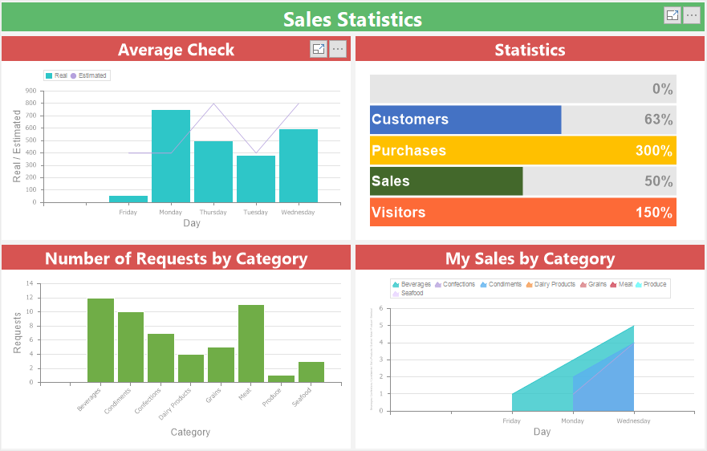

> **Information**
>
> [Text formatting](Appearance.md#TextFormat) and [Interaction](Interaction.md) can be applied to the values of the current element.

This chapter will cover the following:
* [Chart Editor](#ChartEditor);

* [Chart Values](#ChartValues);

* [Chart Types](#ChartTypes);
* [Chart Arguments](#ChartArguments);

* [Chart Series](#ChartSeries);

* [The Color Each Property](#ColorEach);
* [Chart Legend](#ChartLegend);

* [Constant Lines](#ConstantLines);

* [More Options](#moreoptions);

* [Icons](#charticons);

* [Round Values](#roundvalue);

* [Show Zero and Show nulls](#showzeroshownull);

* [Width and Style of Line](#linewidthlinestyle);

* [Y axis](#yaxis);

* [Views](#viewchart);
* [Table of Properties](#TableOfProperties).

**Chart Editor**

You can configure the **Chart** element in the special editor. To call the chart editor, you should:

* Double-click the left mouse button;

* Select the **Chart** item and select the **Design** command in the context menu;

* Select the **Chart** item, and, on the property panel, click the **Browse** button for the **Values**, **Arguments** or **Series** properties.

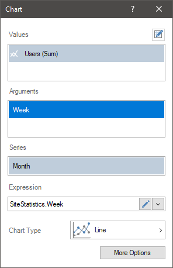

In the chart editor, you can do the following:

* Specify data fields with values for the chart;

* Specify chart arguments;

* Specify the rows of the chart;

* Choose a chart type;

* Modify the expression of the selected item.

> **Information**
>
> The chart area is configured using the **Area** group on the property bar. You can adjust the horizontal, vertical lines and etc.

**Chart values**

To create a chart in the dashboard, at least one data field specified in the **Value** field is required:

* Drag and drop the data column from the dictionary into the **Value** field, and for newly added items - into the editor or chart area.

* Create **New Field**. Set the expression for this element, the processing result of which will be the values for the chart.

Also, the chart can specify the arguments and series. If the arguments and series are not specified, then all element values will be processed and displayed using one graphic element. For example, if three data fields are created in the **Value** field, then three graphical elements will be displayed in the **Chart**.

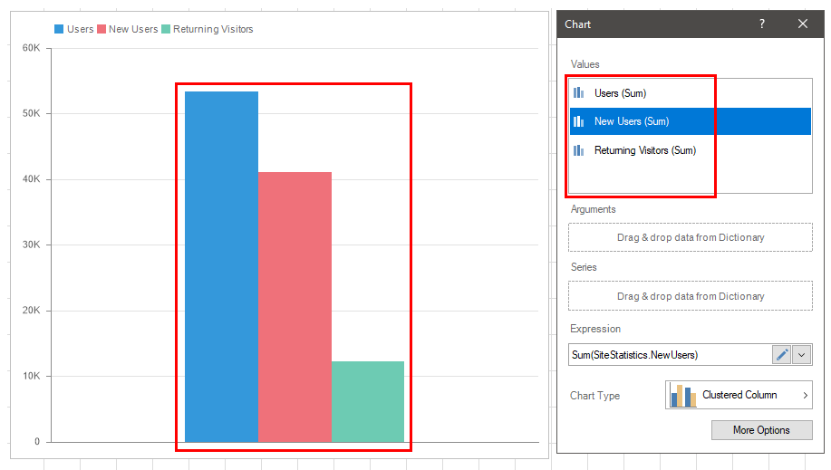

> **Information**
>
> For some types of charts require setting values in several fields. For example, for financial charts you need to specify the value in the fields - **Open**, **Close**, **Max**, and **Min**. In this case, you should create at least one data field for every Value field.

**Chart types**

Depending on the type of a chart chosen, the data will be displayed using one or another graphic element. You can display several types of charts within the same chart element. For example Clustered Column and Line.

> **Information**
>
> Within the same **Chart** element, not all types are compatible. It is impossible to display the **Funnel** and **Gantt** in one element.
>
> You should know that only one type of a chart can belong to one data field. If it is necessary to display the same data field with different types of charts within the same **Chart** element, you should create several duplicates of this data field in the **Value** field and specify one of the chart types for every copy.

To change the type of a chart, you should do the following:

* Double-click the left mouse button on the **Chart** item;

* Click the chart type button in the editor;

* Select the chart type you need.

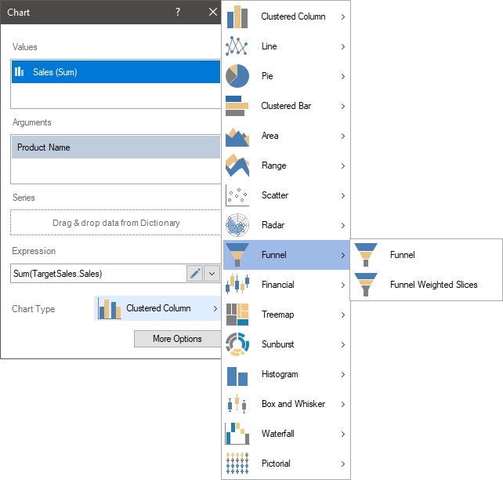

**Arguments**

The argument refers to data that is associated with the values of the chart. In other words, every value of the chart will correspond to some value. For example, product prices are related to the list of products, i.e. every product has its own price. In this case, in the chart, each product will be represented in a separate graphic element.

Also, for product prices, an argument may be a category of products. In this case, for each category of products, a graphic element will be presented. The value of this graphic element will be the sum of the prices of products which are included into this category.

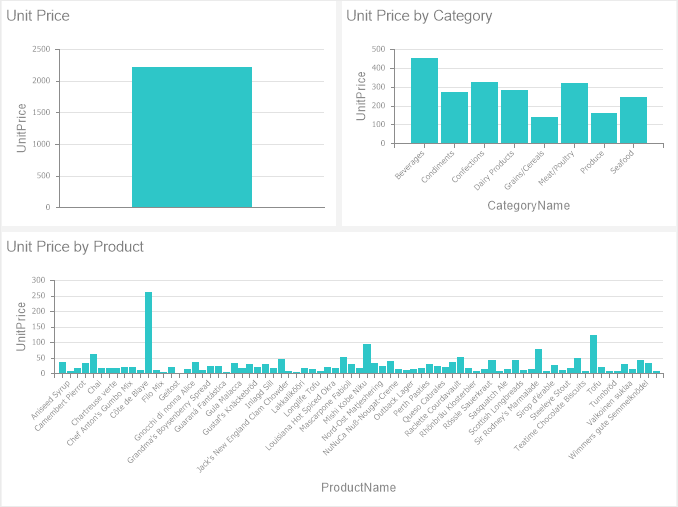

For charts with an area of X - Y, the arguments are the values along the X axis (except for bar charts). In the case of other chart types, the arguments are separate chart segments.

To set chart arguments, you should to the following:

* Double-click the mouse left button on the **Chart** element;

* In the element editor, drag ad drop the data column from the dictionary to the **Arguments** field.

Create **New Field** in the **Arguments** field. Set the expression for this element, the processing result of which will be the arguments for the chart.

> **Information**
>
> In the chart editor, you can specify multiple data fields for the **Arguments** field.

**Series**

Series of charts are graphical elements with or without arguments and grouped by a specific value.

For example, you have a chart with product prices (chart values) and a list of products (chart arguments). If you add an element to the series of the chart with the category data for these products, then a list of products will be displayed for every category. Below is a chart with prices for every product category and one argument.

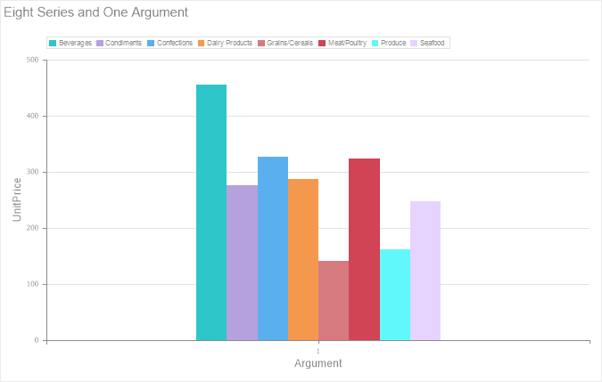

To set the series of a chart, you should do the following:

* Double-click the mouse left button on the Chart item;

* In the element editor, drag and drop the data column from the dictionary to the **Series** field.

* Create **New Item** in the **Series** field. Set an expression for this element, the processing result of which will be series for the chart.

> **Information**
>
> The chart axes are configured using the **X Axis** and **Y Axis** property groups (you can find them on the property panel). You can customize axis labels and titles.

**The Color Each property**

By default, the graphical elements of a diagram within one series have one color. However, if you need to display each graphic element in a separate color, you should:

* Select the Chart element;

* set the **Color Each** property to **true** on the property panel.
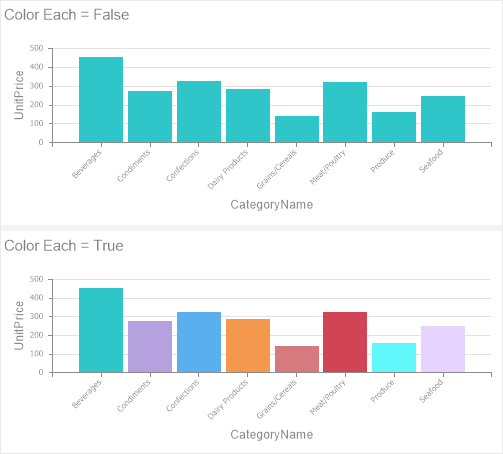

**Chart Legend**

The chart legend is a description for the graphic elements. If the chart has series, the legend will automatically be enabled. The legend shows:

* **Marker** is a special graphic icon with the color of the graphic element to which it belongs.

* The value of the series for a specific graphic element of the chart;

* If the arguments are set for the chart, it shows the value of the argument for a specific graphic element of the chart.

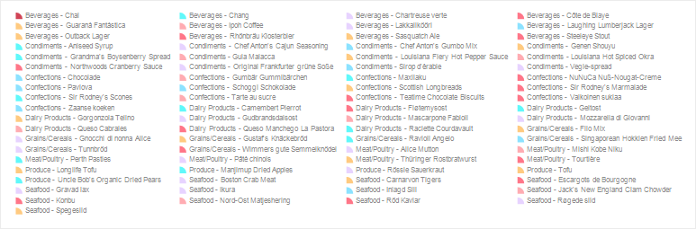

> **Information**
>
> Setting the legend is done using properties from the **Legend** group on the property panel. You can adjust the alignment of the legend horizontally and vertically, the title of the legend, the text of the legend, and etc.

**Constant lines**

Constant lines are used to display value lines in the chart area.

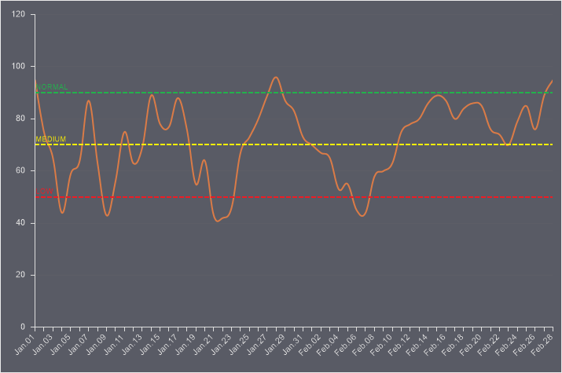

You should do the following to add constant lines in the chart:

* Select a chart in the dashboard;

* On the property panel, click the **Browse** button of the **Constant Lines** property.

After that, the editor will open. Configure constant lines for the current chart in the editor.

**Constant Lines editor**

In the current editor, you can add, setup and remove constant lines for the current chart.

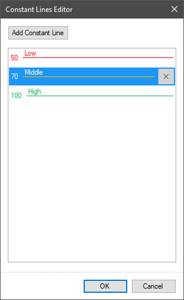

* **click the** **Add Constant Line** button to create a new constant line. After that, you can use the properties on the properties panel to set this constant line. For each constant line, you can specify value, color, style, width, text and it position.
* **You can move constant lines in the list of lines by dragging.**
* You can remove constant line from the list hovering over and click **Delete** button.

**More Options**

There are additional parameters on the **More Options** panel. However, a list of additional parameters depends on the type of a chart. Some of them can be available only for Line charts, other only for Clustered Columns, the third, such as the bind to the **right Y-axis**, depend on the values of the element properties. To open the additional parameters panel you should click the **More Options** button in the element editor. To hide the additional parameters panel you should click the **Less Options** button.

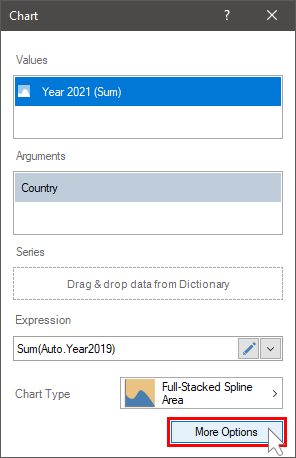

Below we will consider each parameter separately.

**Icons**

You can display a graphic value as a selected icon. It`s worth noting, that if the **Color Each** parameter is set, the icons of each graphic value will be of different colors. This parameter is available not only for all chart types. For example, you can`t display values by an icon for lines.

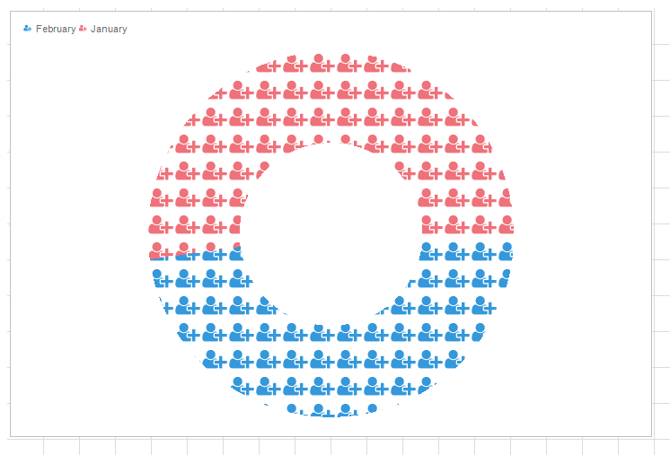

The menu of icon selection is placed on the additional panel of parameters in the element editor. To display a value using an icon, you should select an icon. If you select the **None** value, an icon will not be applied to draw graphic chart values.

**Round Values**

The **Round Values** parameter allows you to display all or part of the icons for Clustered Columns. Accordingly, whether or not this parameter is present depends on whether or not the current chart type supports icons. If the property is set to **True** value, then only the entire icons will be displayed in Clustered Columns. If the property is set to **False** value, then the icons can be partially displayed.

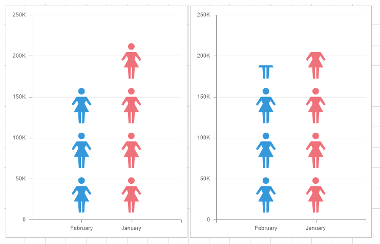

**Show Zero and Show nulls**

The **Show Zeros** and **Show nulls** parameters allow you to display zeros and nulls in a chart as chart zero values, a gap, a line connection points using a line. These parameters can be present individually for a specific chart type or together. These parameters are not available for some chart types.

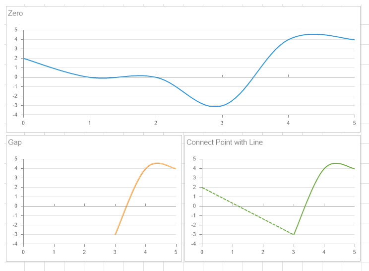

**Width and Style of Line**

You can change line width and line style for the charts that use lines when drawing values. It can be made using the **Line Width** and the **Line Style** parameters.

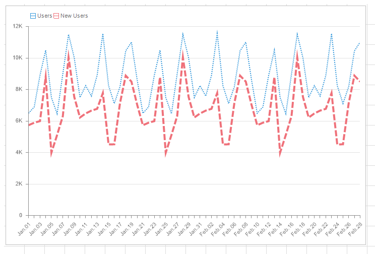

**Bind to various axis of values**

Sometimes there are situations when several data fields need to be displayed in one chart. In addition, the values of these fields may differ by several orders. For example, sales volumes (millions and billions) and average bill (hundreds and thousands), or number of visitors (hundreds, thousands, millions) and bounce rate (relative index from 0 to 100). Since the range of Y-axis values is calculated automatically during data processing, displaying values of different orders in a chart, especially the lowest ones, may not be comprehensible.

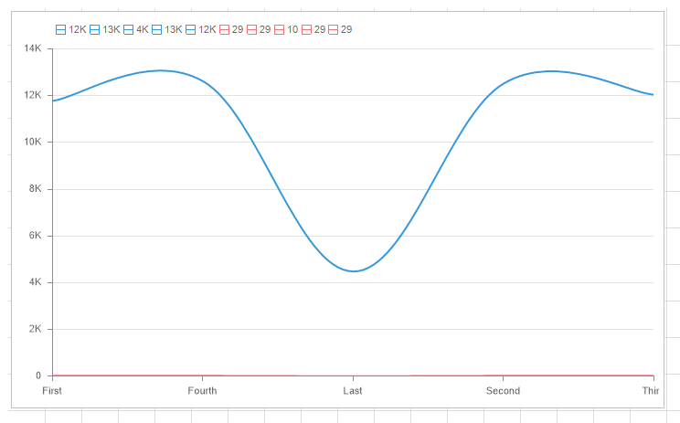

Pay your attention to the values of the red line. It was impossible to perceive values, tendencies of their behavior. To do that you should enable the display of the right Y axis. It can be done having set the **Area - Y Right Axis – Visible** property of chart element in the **True** value. Next in the chart editor, you should select data field and define an **Y axis** to which it will be assigned. The bind is carried out using the **Y axis** parameter in the additional parameter panel and by default, it is set to **Left Y** value, i.e. all data fields are bound to the left Y axis.

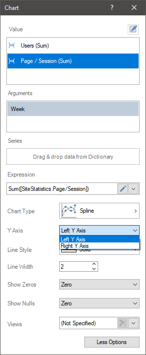

For the example above, we will set the right Y-axis to the red line. In this case, the range of the left Y-axis values will be calculated from the values of the blue line, and the range of the right Y-axis values will be calculated from the values of the red line. Now, you can analyze the graph of the red line, its values, and tendencies.

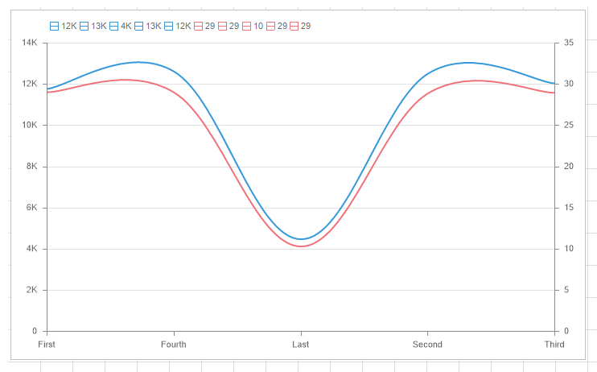

**Views**

You can create several chart views in one element and then use controls to switch chart view when viewing a dashboard in the viewer. To add an alternative view to the current chart, you should select the **New** command in the additional parameters panel, from the drop-down menu of the **Views** parameter. Each view should be set, i.e. you should specify data, define chart type, and change some properties. A maximum of 5 views the **Chart** element can have, i.e. the main kind element and 4 views. The **Duplicate** command allows you to create a copy of the current view. It is comfortable if you need to display the same data in a new view, but with another chart type.

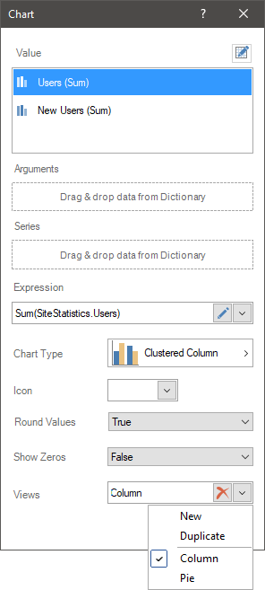

The views are controlled using controls (buttons) in a chart when editing or viewing a dashboard. Each button includes a certain view. This way, views within one chart are switched using buttons.

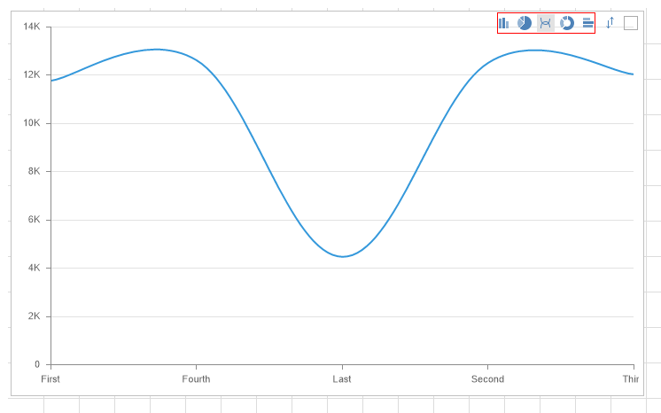

**List of properties**

The list shows the name and description of the properties of the element which you may find in the properties panel of the report designer.

| **Name** | **Description** |
| --- | --- |
| Area | A property group that is used to customize the chart area: The **Color Each** property is used to set a unique shade for every graphic element of the chart. If this property is set to **true**, then colors from the style collection will be applied to graphic elements. Every graphic element will have its own color. After all the colors from the collection are used, the same colors with a lightening coefficient will be applied to the other graphic elements. Thus, every graphic element will have a certain shade. If this property is set to **false**, then the graphic elements of one series will use one color from the collection of style colors. The **Grid Lines Horizontal** group of properties is used to change the color and visibility of horizontal grid lines. If the **Visible** property is set to **true**, the horizontal grid lines will be displayed. The **Grid Lines Vertical** group of properties is used to change the color and visibility of horizontal grid lines. If the **Visible** property is set to **true**, the vertical grid lines will be displayed. The **Interlacing Horizontal** group of properties is used to change the color and visibility of horizontal interlacing. If the **Visible** property is set to **true**, the horizontal interlacing will be displayed. The **Interlacing Vertical** group of properties is used to change the color and visibility of vertical interlacing. If the **Visible** property is set to **true**, the vertical interlacing will be displayed. The **Reverse Horizontal** property is used to mirror the chart area horizontally. If the property is set to **true**, the area will be displayed horizontally. The **Reverse Vertical** property is used to mirror the chart area horizontally. If the property is set to **true**, the area will be displayed vertically. The **X Axis** group of properties, which allows you to set the range of arguments: **Labels**, **Range**, **Show Edge Values**, **Start from zero**, **Title**, **Visible**. The **X Top Axis** group of properties which allows you to set the upper axis of arguments: **Lables**, **Show Edge Values**, **Title**, **Visible**. The **Y axis** group of properties, which allows you to set the axis of values: **Lables**, **Range**, **Start from zero**, **Title**, **Visible**. The **Y Right Axis** group of properties, which allows you to set the right axis of arguments: **Lables**, **Start from zero**, **Title**, **Visible**. |
| Cross-Filtering | It allows you to enable or disable the cross-filtering mode for the current element. |
| Constant Lines | Customizes the constant lines of the chart element. |
| Data Transformation | Customizes the data transformation of the current item. |
| Group | Adds the current item to a specific [group of items](Groups.md). |
| Labels | A group of properties that is used to customize the chart labels: The **Auto Rotate** property is used to enable or disable the auto rotate mode of chart labels. The **Font** group property allows you to change the text color of the title of the current item. By default, this property is set to From Style, the text color of the title will be obtained from the settings of the current element style. The **Fore Color** property allows you to change the text color of the labels of the current item. By default, this property is set to From Style, the text color of the labels will be obtained from the settings of the current element style. The **Position** property allows you to select the type of headers of values in a chart area. The **Style** property allows you to change the label style. The **Text After** property is used to specify text after a label value. The **Text Before** property is used to specify text before a label value. |
| Legend | A property group that is used to customize the chart legend: The **Columns** property allows you to define  the number of columns for the Legend values. The **Direction** property allows you to define the direction of column fill in by the Legend values. The **Horizontal Alignment** property is used to determine the horizontal position of the legend on the Chart element. The legend can be located in the chart area or outside of it. The **Labels** group of properties is used to change the color and font of the legend label. The **Title** group of properties is used to customize the title of the legend - specify the text of a title, change its color and font. The **Vertical Alignment** property is used to set the vertical position of the legend on the Chart element. The legend can be located in the chart area or outside of it. The **Visible** property allows you to enable or disable the display of the Legend chart. |
| Trend Line | It allows you to set a trend line in the current chart. |
| Marker | A group of properties that is used to customize the chart markers: The **Angle** property allows you to change the inclination angle of markers. The value of the property can be negative and positive. If a value of the property is negative then the marker is inclined anticlockwise. If the value of the property is positive then the marker is inclined clockwise. The **Size** property is used to set marker size in pixels. The **Type** property allows you to set the marker type. The **Visible** property is used to define the display mode of markers:  The **From Style** value - displaying of markers will depend on the visibility property in the chart style.  The **True** value - markers will always be displayed.  The **False** value - markers will not be displayed always. |
| Back Color | Changes the background color of the Chart element. By default, this property is set to **From Style**, i.e. the color of the element will be obtained from the settings of the current element style. |
| Border | A group of properties that allows you to customize the borders of a table - color, sides, size, and style. |
| Conditions | Customizes the [conditions element of the chart](Conditions.md#conditionparametersofchart). |
| Corner Radius | It allows you to define the rounding radius for the corners of an element on the dashboard. You can round each corner of the element separately: **Top - Left**, **Top - Right**, **Bottom - Right**, **Bottom - Left**. The property can be set to a value between 0 and 30, where 0 is no rounding angle and 30 is the maximum value of the rounding radius. |
| Negative Series Color | Customizes the list of colors for negative values of the rows of the Chart element. |
| Series Color | Customizes the list of colors for the values of the rows of the Chart element. |
| Shadow | A group of properties that allows configuring the shadow of an element: The **Color** property allows you to specify the color that will be used to display the shadow of the element. The properties in the **Location** group allow you to define the offset of the shadow along the X and Y coordinates, relative to the element's position on the indicator panel. The **Size** property allows you to set the size of the shadow from the element's borders. It can be set to a value from 1 to 10, where 1 is the minimum size and 10 is the maximum size. The **Visible** property allows you to enable or disable the display of the element's shadow on the indicator panel. |
| Style | Selects a style for the current element. The default it is set to **Auto**, i.e. the style of this element is inherited from the style of the dashboard. |
| Argument Format | Customizes the formatting [of the arguments](../Report_Internals/Text_Formatting/index.md) the Chart element. |
| Enabled | Enables or disables the current item on the dashboard. If the property is set to **True**, the current item is enabled and will be displayed when previewing the dashboard in the viewer. If this property is set to **False**, this element is disabled and will not be displayed when previewing the dashboard in the viewer. |
| Interaction | Customizes the [interaction](Interaction.md) element of the chart. |
| Margin | A group of properties that allows you to define indents (left, top, right, bottom) of the value area from the border of this element. |
| Padding | A group of properties that allows you to define indents (left, top, right, bottom) of the columns from the range of values. |
| Show Blanks | Allows displaying or hiding the label "Show (blank)" in the dashboard element when there is no data available for that element. |
| Title | A group of properties that allows you to customize the title of the Table element: The **Back Color** property provides the ability to change the background color of the title of the current item. By default, this property is set to **From Style**, i.e. the background color will be obtained from the style settings of the current element. **Fore Color** allows you to change the text color of the title of the current item. By default, this property is set to **From Style**, i.e. the text color of the title will be obtained from the settings of the current element style The group property **Font** allows you to define the font family, its style and size for the title of the current element. The **Horizontal Alignment** property provides the ability to change the title alignment relative to the element - Left, Center, Right. The **Text** property is used to set the title text of the current element. The **Visible** property is used to enable or disable displaying of the title of the current item. If the property is set to **True**, then the element title will be included. If this property is set to **False**, then the element header will be disabled. |
| Value Format | Customizes the [formatting of the values](../Report_Internals/Text_Formatting/index.md) of the Chart element. |
| Name | Changes the name of the current element. |
| Alias | Changes the alias of the current item. |
| Restrictions | Configures the permissions to use the current item in the dashboard: The **Allow Change** option enables or disables changes of the element. If checked, the current item can be changed. The **Allow Delete** option enables or disables the deletion of an element. The **Allow Move** option allows or prohibits moving an element. The **Allow Resize** option enables or disables resizing of an element. The **Allow Select** option enables or disables the element selection. |
| Locked | Locks or unlocks resizing and movement of the current element. If the property is set to **True**, the current element cannot be moved or resized. If this property is set to **False**, then this element can be moved and resized. |
| Linked | Binds the current location to the dashboard or another element. If the property is set to **True**, then the current item is bound to the current location. If this property is set to **False**, then this element is not tied to the current location. |
