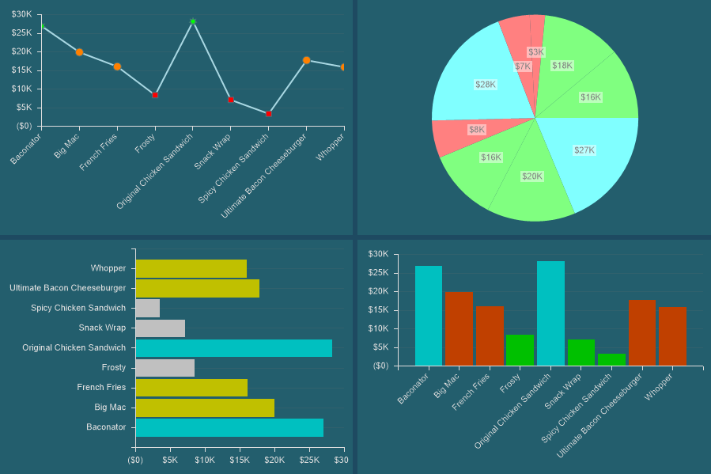
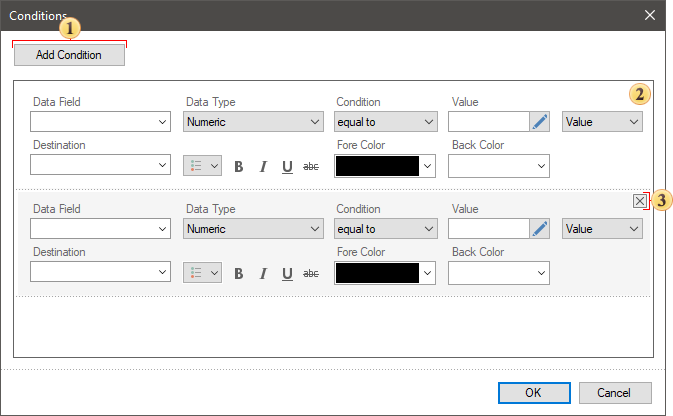
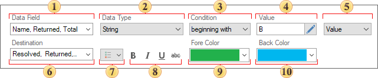
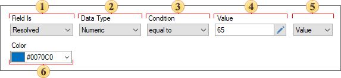
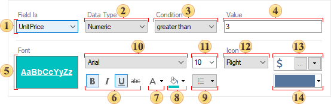
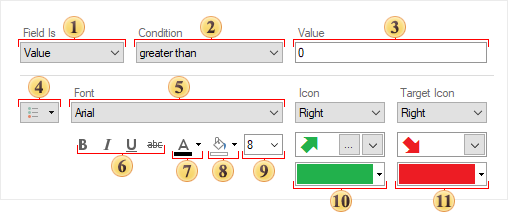
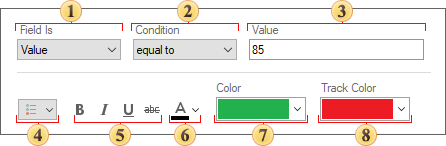
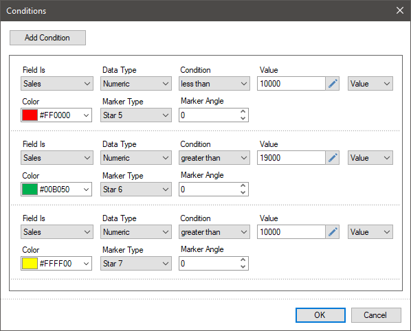
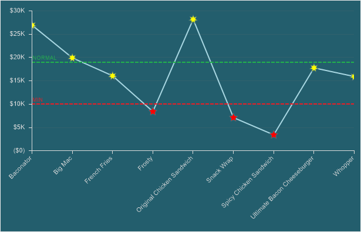

## Conditions

Conditional formatting is used to highlight information in a certain color.

This chapter will cover the following:
* [Condition editor](#conditioneditor);

* [Condition parameters of Table](#conditionparametersoftable);

* [Condition parameters of Chart](#conditionparametersofchart);

* [Condition parameters of Pivot Table](#conditionparametersofpivottable)

* [Condition parameters of Indicator](#conditionparametersofindicator)**;**

* [Condition parameters of Progress](#conditionparametersofprogress);

* [Terms of using conditions](#termsofusingconditions);
* [Table of condition operations](#tableofoperations).

Conditional formatting can be applied to the following elements of the dashboards:

* [Chart](Chart.md);

* [Pivot](Pivot_Table.md);

* [Indicator](Indicator.md).

Conditional formatting is configured in the condition editor. To call this editor, you should:

* Select an element on the dashboard panel;

* Click the **Condition** button on the **Home** tab in the report designer.

**Condition editor**

In the editor, conditions can be added, configured, moved and deleted.

 The **Add Condition** button is used to add a new condition to the list of conditions.

 The **Remove Condition** button is used to remove the selected condition from the list.

 Buttons to move up or down the selected condition in the list of conditions.

> **Information**
>
> All conditions are processed sequentially in the direction from top to bottom - the higher is the condition in the list, the earlier it is processed and applied. To move a condition above or below the others, you should place the cursor, hold down the left cursor button and drag the cursor up or down. See the details [how to apply the conditions](#termsofusingconditions).

**Condition parameters of Table**

For each new condition, you should specify the parameters of its applying. The color will be applied to the specific value of the selected data columns if the condition is executed.

 The **Field Is** parameter is used to specify the data field from which the source values will be obtained.

 The **Data Type** parameter is used to specify the type of condition values.

 The **Condition** parameter is used to specify the [condition operation](#tableofoperations), which means the operation of logical comparison of the initial value of the series and the value of the condition.

 The **Value** parameter is used to specify a condition value.

 The parameter, which allows you to initialize a condition value as **Value** or **Expression**. If this parameter is defined as **Expression**, the condition value will be the result of calculation this expression.

 The **Destination** parameter allows you to define table columns which values should be formatted, if a condition is executed.

 The menu of formatting settings. In this menu, you should check the conditional formatting options to be applied to the table values, in case the condition is executed.

 The commands that allow you to define a font style in a table cell, if the condition is executed.

 The parameter, that allows you to specify text color for values when a condition is executed.

 The parameter, that allows you to specify back color for table cells when a condition is executed.

**Condition parameters of Chart**

For each new condition, you should specify the parameters of its applying. The color will be applied to the specific value of the element if the condition is executed.

 The **Field Is** parameter is used to specify the data field from which the source values will be obtained.

 The **Data Type** parameter is used to specify the type of condition values.

 The **Condition** parameter is used to specify the [condition operation](#tableofoperations), which means the operation of logical comparison of the initial value of the series and the value of the condition.

 The **Value** parameter is used to specify a condition value.

 The parameter, which allows you to initialize a condition value as **Value** or **Expression**. If this parameter is defined as **Expression**, the condition value will be the result of calculation this expression.

 The **Color** parameter is used to specify the color that will be applied to the value of the element when the condition is executed.

> **Information**
>
> For line charts, two additional options will be displayed:
>
> * Marker Type is used to change the type of a marker when the condition is executed;
>
> * Angle is used to rotate the marker to the right (positive value) or left (negative value).

**Condition parameters of Pivot Table**

For each new condition, you should specify the parameters of its application and design settings. Design settings will be applied to the cells of the pivot table, if the condition will be executed.

 The **Field Is** parameter. It is used to specify the field from which the initial values ​​will be taken – from the field of rows, columns or totals. You should know that, depending on the selected field, conditional formatting will be applied to its values. If the total field is selected, formatting will be applied to the values ​​of the current field in the pivot table. If a row or column field is selected, formatting will be applied to the row or column headings, respectively.

 The **Data Type** parameter. It is used to specify the type of condition values. This parameter affects how the report engine handles the condition. Also, the list of condition operations depends on this parameter.

 The **Condition** parameter. It is used to specify the [condition operation](#tableofoperations), the operation of a logical comparison of the initial value from the data field, and the value from the condition.

 The **Value** parameter. It is used to specify a condition value.

 The preview panel for the conditional formatting value, when the condition is executed.

 Commands with which you can specify the font style in the cell of the pivot table when the condition is executed.

 The **Fore Color** option. It is used to specify the text color of the cell in the pivot table to which conditional formatting will be applied.

 The **Back Color** parameter. It is used to specify the background color of the cell in the pivot table to which conditional formatting will be applied.

 Formatting settings menu. You should check the conditional formatting parameters that must be applied to the values of the pivot table if the condition is executed.

 The **Font** parameter. It is used to specify the font family for the pivot table cell to which the conditional formatting will be applied.

 The **Font Size** parameter. It is used to set the font size in the cell of the pivot table to which the conditional formatting will be applied.

 The **Icon** parameter. It is used to enable and locate the icon relative to the value in the cell in the pivot table to which the conditional formatting will be applied.
 The **Icon Type** parameter. It is used to select a value icon from the list of Stimulsoft icons. You can also load a custom value icon. To do this, click the **Browse** button and select the icon from the repository.

 The **Icon Color** option. It is used to specify the color of the icon for values.

Also, when using the conditions of the pivot table, you should take into account the procedure for applying conditions. Below is a step-by-step example of using conditional formatting in a pivot table.

**Condition parameters of Indicator**

For each new condition, you should specify the parameters of its application and design settings. Design settings will be applied to the indicator values if the condition is executed.

 The **Field Is** parameter is used to specify the field from which the initial values will be taken: from the value field, target, series etc.

 The **Condition** parameter is used to specify the [condition operation](#tableofoperations). This is the operation of logical comparison of the initial value from the data field and the value from the condition.

 The **Value** parameter is used to specify a condition value.

 Format settings menu. In this menu, you should check the conditional formatting parameters that must be applied to the indicator, if the condition is executed.

 The **Font** parameter is used to specify a font family for indicator values.

 Commands using which you can specify the font style in the indicator.

 The **Fore Color** option is used to specify the color of the indicator value.

 The **Back Color** parameter is used to specify the background color of the indicator.

 The **Font Size** parameter is used to set the font size of indicator values.

 The **Icon group** of parameters is used to change the appearance of the value icon, its position and color.

 The **Target Icon** group of parameters is used to change the appearance of the relative value icon, its position and color. You should know that the color of the target icon will also be applied to the deviation value.

Also, when using the indicator conditions, the procedure for [applying the conditions](#termsofusingconditions) should be considered. Below is a [step-by-step example of using conditional formatting for an indicator](#conditionparametersofindicator).

**Condition parameters of Progress**

For each new condition, you should specify the parameters of its application and design settings. Design settings will be applied to the progress values if the condition is executed.

 The **Field Is** parameter is used to specify the field from which the initial values will be taken: from the value field, target, series etc.

 The **Condition** parameter is used to specify the [condition operation](#tableofoperations). This is the operation of logical comparison of the initial value from the data field and the value from the condition.

 The **Value** parameter is used to specify a condition value.

 Format settings menu. In this menu, you should check the conditional formatting parameters that must be applied to the progress, if the condition is executed.

 Commands using which you can specify the font style in the progress.

 The **Fore Color** option is used to specify the color of the progress value.

 The **Color** parameter allows you to define the color of the progress value, which will be applied when a condition is executed.

 The **Track Color** parameter allows you to define progress track color, which will be applied when a condition is executed.

**Terms of using conditions**

All conditions are processed sequentially, in the "from top to down" direction in the list of conditions. When creating multiple conditions for a single element, logical operations should be considered.

Considering the [logical operation](#tableofoperations) of the condition and the value of the condition, a range of element values is formed to which formatting will be applied. For example, a condition operation is less than, a condition value is 3. Therefore, formatting will be applied to all element values that are less than 3.

For the [example discussed bottom](#conditionparametersofchart), change the order of the conditions - move the condition of maximum values ​​(green color) above the average values ​​(yellow color).

And then, there will be no values indicated in green on the chart.

This will happen because:

**Step 1**: The report engine will analyze all the values of the selected data field;

**Step 2**: Apply a red color to all values that are less than 10,000.

**Step 3**: Apply a green color to all values that are greater than 19,000.

**Step 4**: Apply a yellow color to all values that are greater than 10,000. Values greater than 19,000 fall into the range of values of the last condition, and formatting will be applied to them.

Therefore, when using conditions in the elements of the dashboard, it is important to track the logical operations of the conditions and their order in the list of conditions.

**Table of Operations**

The list of available operations depends on the data type. Below is a list of operations for each data type and their description. The operation is performed on the value from the data field and the condition value (the value that is specified in the condition).

| **Name** | **Data Type is** **String** | **Data Type is** **Number** | **Data Type is** **Data** | **Data Type is** **Boolean** | **Description** |
| --- | --- | --- | --- | --- | --- |
| equal to | + | + | + | + | If the data field value is equal to the condition value, then the condition is true. |
| not equal to | + | + | + | + | If the data field value is not equal to the condition value, then the condition is true. |
| between | + | + | + |  | If the data field value is in the specific range of condition values, then the condition is true. |
| not between | + | + | + |  | If the data field value is not in the specific range of condition values, then the condition is true. |
| greater than | + | + | + |  | If the data field value is greater then the condition value, then the condition is true. |
| greater than or equal to | + | + | + |  | If the data field value is greater then the condition value of equal to the filter value, then the condition is true. |
| less than | + | + | + |  | If the data field value is less then the condition value, then the condition is true. |
| less then or equal to | + | + | + |  | If the data field value is less then the condition value of equal to the filter value, then the condition is true. |
| containing | + |  |  |  | If the data field value contains the condition value, then the condition is true. |
| not containing | + |  |  |  | If the data field value does not contain the condition value, then the condition is true. |
| beginning with | + |  |  |  | If the data field value starts with the condition value, then the condition is true. |
| ending with | + |  |  |  | If the data field value ends with the condition value, then the condition is true. |
| is blank | + |  |  |  | If the data field value is blank, then the condition is true. |
| is not blank | + |  |  |  | If the data field value is not blank, then the condition is true. |
| is null | + | + | + |  | If the data field value is null, then the condition is true. |
| in not null | + | + | + |  | If the data field value is not null, then the condition is true. |
