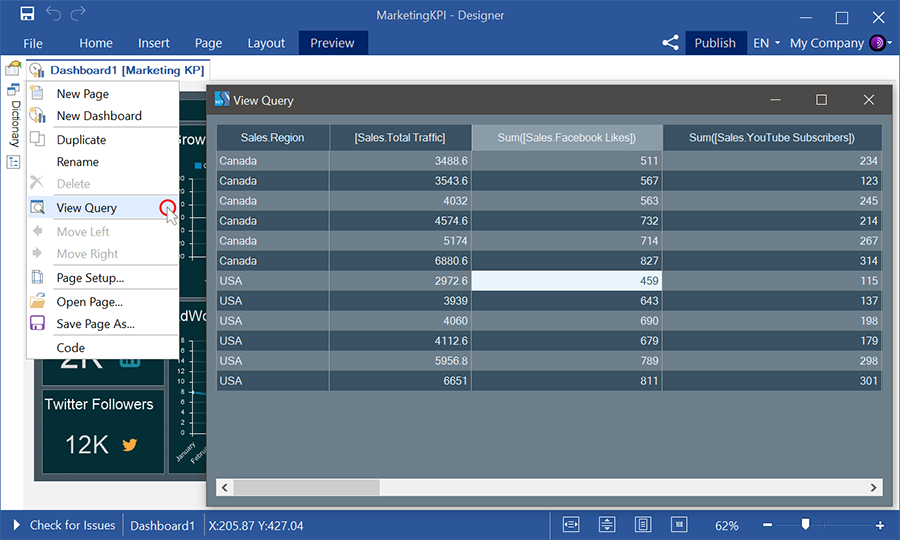
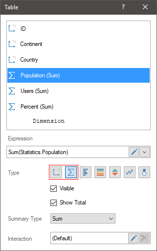
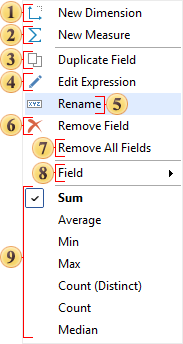
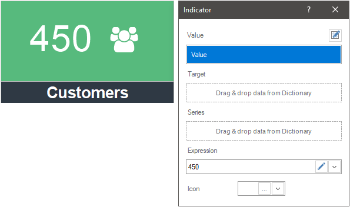
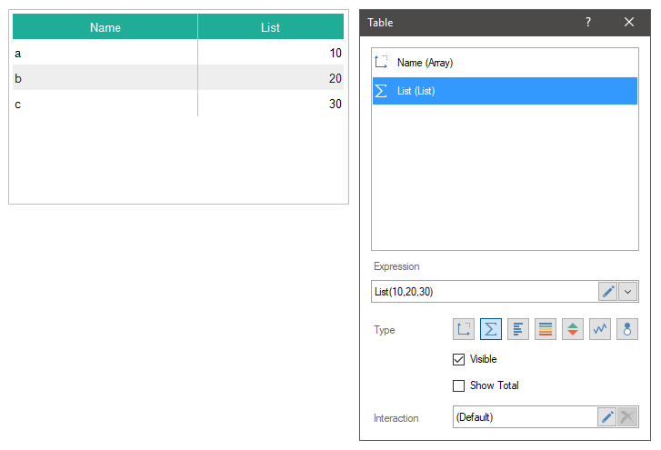
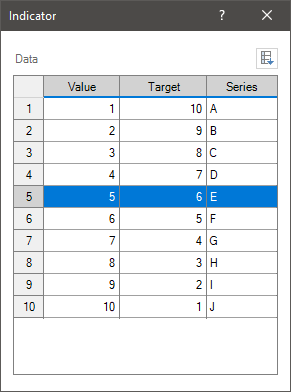
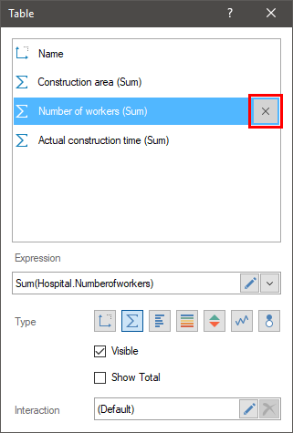

## Data

Elements of data analysis can work with different data sources. Before starting the design of the dashboard, you should read the following chapters:
* [Data Sources](../Data/Data_Dictionary/DataSources/Creating_Data_Source.md);

* [Relations](../Data/Data_Dictionary/Relation/Creating_Relation/index.md) between data sources;
* Data transformation.

This chapter will cover the following:

* [Data fields](#DataFields);

* [Data filed expression](#Expression);

* [Adding data to an element](#AddingDataField);

* [Putting values manually](#EnterValuesManual);

* [Enter data manually](#enterdatamanually);

* [Removing data from elements](#RemoveData);

* [Table of Functions](#TableOfFunctions).

All data sources of dashboard elements form a virtual data table for the current dashboard. This is necessary for the interaction of the dashboard elements with each other.

> **Information**
>
> When designing a dashboard, data from various sources can be used in the elements. In this case, for correct analysis and comparison of data between these sources, relationships should be established. Otherwise, interactive actions with the elements of the dashboard may lead to incorrect data processing and incorrect displaying of the result.

You can view the virtual table of a dashboard by selecting the View Query command in the context menu of the dashboard header.

**Data fields**

There are fields in which data fields are indicated in the editor of the dashboard elements. Each data field has an expression which results of processing are the data values ​​for the current dashboard item. The data field expression can be a reference to a data column or a variable.

* If a reference to a data column is specified, the values ​​of the data column will be the values ​​of the data field on the basis of which the current element of the dashboard will be rendered.

* If a reference to a variable is specified, the value of the variable will be the value of the current data field. You should know that at this moment we support the variable of the [Value](../Data/Data_Dictionary/Variables/New_Variable.md) is specified.

* Also, you can manually specify the values ​​of the data field. To do this, enter a value or a list of values in the **Expression** field of the current data field. To enter values ​​manually, you should use the **List()** or **Array()** functions using the "," separator between values.

A function can be applied to the expression of data fields. In that case, the values of the data field will be the values processed using this function.

You can add a new data field using on of the ways below:

* Drag and drop a data column into an item field. In this case, a new data field will be created with reference to the data column you dragged.

* Select the **New Field** command from the context menu of the element editor.

In the Table element, the data fields can be of the following types:

* **Measure**. By default, this field type applies to all numeric data types. Also, this type of data field is used if it is necessary to group the values of the current data field by the values of another data field.

* **Dimension**. This type of field is used by default for non-numeric data types. When grouping data, the values of this data field will be a condition of grouping for the values of other data fields.

Changing the type of data field is carried out in the **Table** element editor, using the **Measure** and **Dimension** buttons:

**Data field expression**

The data fields of the element have the **Expression** field. In this field, you can see the expression of the current data field, and there is also a drop-down menu with a list of commands:

 The command is used to create a field of the **Dimension** type.

 The command is used to create a field of the **Measure** type.

 The command is used to create a duplicate of the current data field.

 The command calls the expression editor for the current data field.

 The command is used to change the name of the current field. Also, you can select a field in the list and press the F2 key.

 The command is used to delete the current field.

 The command is used to remove all data fields from the current item field.

 The command contains menus and submenus with a list of data sources from the report dictionary and data columns in these sources. With this command, you can select the data column for the current field.

 A list of the most frequently used functions that can be applied to the expression of the current field. Depending on the type of data, this list of functions may vary.

**Adding data to an element**

Drag and drop the data source or columns from the dictionary to the element or its editor. In this case, data fields will be created with references to data columns.

> **Information**
>
> When you drag a data source into the dashboard, a **Table** element with all columns of this data source will be added.

* Select the data field in the element editor, using the **Field** command, select a data column. In this case, the expression of the data field will be a reference to the selected data column.
* Select the data field, call the Expression editor to create an expression for this field;
* Select the data field and change the expression manually.

**Putting values manually**

In the elements of the dashboard, you can enter one value for the current data field or you can specify a list of values. To enter a single value, you should:

* Call the item editor;

* Create a new data field;

* In the Expression field you should enter the value for the current data field;

* In addition to this data, which entered manually.

To enter a list of values, you should to the following:

* Call the item editor;

* Create a new data field;

* In the Expression field you should enter the **List()** or **Array()** function with the list of values with the "," separator.

Enter data manually

There is the mode of element data manual input for the following elements: [Chart](Chart.md), [Indicator](Indicator.md), [Progress](Progress.md), and [Gauge](Gauge.md). In this mode, each element data field is a column with cells. You can specify one value of an element in each cell. A list of entered values in various columns will form a data table for this element. The number of element data rows is not limited.

To go to the manual value input mode, you should click the Enter Data Manually control. After that, the grid of value input, where you should specify element data will be displayed. You can specify expressions in the cells. For example, specify a link to the - {Variable1}. In this case, the result of the expression processing will be a value for the current cell.

> **Information**
>
> When you enter data manually, this element is not interconnected with the others and it`s a stand-alone analytical element. The data manually entered are not displayed in the View Query menu of a dashboard too.

The commands of row control are placed in the context menu and allow you to:

* Move a selected row upper or bottom;

* Insert a row or rows upper or bottom than the current one;

* Delete a selected row or rows from the grid of element data.

Pay attention to the fact that:

* The cells in the grid of manual input can be selected using the Ctrl button.

* The range of cells can be selected using the Shift button.

* You can entirely select a column or row having clicked a column or row header;

* You can select entirely the grid of manual input having clicked the upper left cell, which is located at the intersection of row and column headers.

To go back to the data from columns mode, you should click the Use Data Fields in the element editor.

Links to data columns can be specified in a dashboard element and entered manually. However, the analysis and display of data depends on the mode you select (manual or data fields) in the element editor.

**Removing data from elements**

* Select the field in a specific field of the element editor, and click the **Remove Field** button (see the picture below).

* Select the **Remove Field** command in the context menu of the current data field.

* Select the **Remove All Fields** command in the context menu of the field of the dashboard element, .

If the manual mode is enabled you can:

* Delete rows from a table. To do this, you should select the rows or cells in the rows that should be deleted and select the Delete command from the context menu of the value input grid.

* Also, you should clear the content of the cells. To do this, you should select the cells that should be cleared and click the Delete key on the keyboard.

**List of functions**

Depending on the type of values, the list of functions used may vary. The table below contains a complete list of functions that can be applied to data fields.

| **Function** | **Description** |
| --- | --- |
| Functions that are available from the menu of the Expression field |  |
| Count() | Calculates the number of values in the current data field. |
| DistinctCount() | Calculates the number of unique values in the current data field. |
| First() | Shows the first value of the current data field. |
| Last() | Shows the last value of the current data field. |
| Sum() | Shows the result of the sum of values in the current data field. |
| Avg() | Calculates the arithmetic average for the values of the current data field. |
| Min() | Shows the minimum value from the current data field. |
| Max() | Shows the maximum value from the current data field. |
| Median() | Shows the average (non arithmetic) value from the current data field. |
| Year() | Shows the year from date encoding. |
| Quarter() | Shows the quarter from the date encoding. |
| Month() | Shows the month from date encoding. |
| Day() | Shows the day from date encoding. |
| PercentOfGrandTotal() | It shows the specific gravity of a value from the sum of all values of the current data column. If you apply the percent formatting to this data field, percentage of the value of 100 percent will be displayed |
| Functions that can be added from the data dictionary or entered manually |  |
| CountIf(,) | It allows you to calculate the number of values in the current data field by a condition. For example, CountIf(DataSource.Column1, DataSource.ColumnID &gt; 5). |
| SumIf(,) | It shows the result of the sum of values in the current data field by a certain condition. For example, SumIf (DataSource.Column1, DataSource.ColumnID &gt; 5). |
| Mode() | Shows the most frequently repeating values in the current data field. |
| List() | Enters a list of values for the current data field of an item. |
| Array() | Enters an array of values for the current data field of an item. |
| ToUpperCase() | Converts all data field values to uppercase. |
| ToLowerCase() | Converts all data field values to lowercase. |
| ToProperCase() | Sets the first character value to uppercase, and the remaining characters to lowercase. |
| Insert(,,) | Inserts text into data field values, after a specific character. Three arguments are specified through the "," delimiter:  Data field;  The ordinal number of the character after which another value will be inserted.  The value to be inserted. |
| Replace(,,) | Replaces certain characters in values. Three arguments are specified through the "," delimiter:  Data field;  A character or combination of characters that needs to be replaced.  The value to be replaced. |
| Remove(,,) | Removes the specified number of characters in the values. Three arguments are specified through the "," delimiter:  Data field;  The ordinal number of the character from what the removal starts.  Number of characters to remove. |
| DayOfWeek() | Shows day of week from date encoding. |
| DayOfWeekIdent() | It shows the days of the week from the date encoding, sorted in the order from Sunday to Saturday. Also, this function is used to sort the days of the week, if data field type is defined as string. |
| DaysInMonth() | Shows the number of days in a month. |
| DaysInYear() | Shows the number of days per year. |
| Month() | Shows the number of the month. |
| MonthIdent() | It shows the names of months from the date encoding, sorted in the order from January to December. Also, this function is used to sort months, if data field type defined as string. |
| FiscalMonthIdent(,) | This function allows to sort data by months starting from a different month in a fiscal year. Example of using: FiscalMonthIdent(DataSource.DataColumn, "September") or FiscalMonthIdent(DataSource.DataColumn, 9). |
| Quarter() | It shows the abbreviated names of the quarters of the year, sorted in the order from the first quarter to the fourth. |
| ISO2() | Shows the two-letter code of the geographical object. |
| ISO3() | Shows the three-letter code of the geographical object. |
| NormalizeName() | Shows the names of the geographical objects by default. |
| Left(,) | Shows the specified number of characters from the left side of the value. Two arguments are specified through the "," delimiter:  Data field;  The number of characters to show. |
| Mid(,,) | Shows characters from a value. Three arguments are specified through the "," delimiter:  Data field;  The ordinal number of the character with which to start the display.  The number of characters to show. |
| Right(,) | Shows the specified number of characters from the right side of the value.. Two arguments are specified through the "," delimiter:  Data field;  The number of characters to show. |
| Substring(,,) | Shows characters from a value. Three arguments are specified through the "," delimiter:  Data field;  The ordinal number of the character with which to start the display.  The number of characters to show. |
| Subtotal(,) | Can take two arguments:  Data field whose values are summed. If only one parameter is specified, it works similarly to the GrandTotal() function;  Data field used to filter the selection of values. For example, if you specify SubTotal(Products.UnitsInStock, Suppliers.Country), it returns the sum by the Suppliers.Country field. |
| Image() | It allows you to get images from URL and display them in the ranges of the  Table element. You should also specify height and width in arguments of the function for SVG images. For example, Image(DataSource.DataColumn1, 10, 15), where the DataSource.DataColumn1 contains URL for SVG images. |
