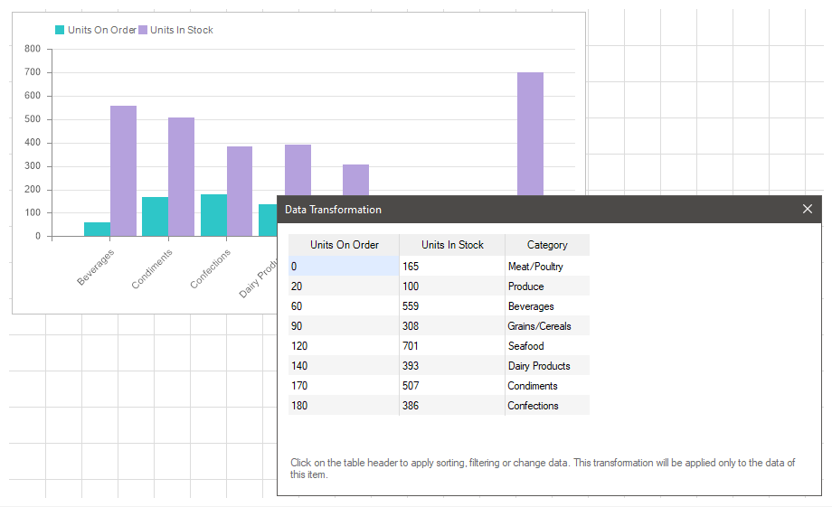
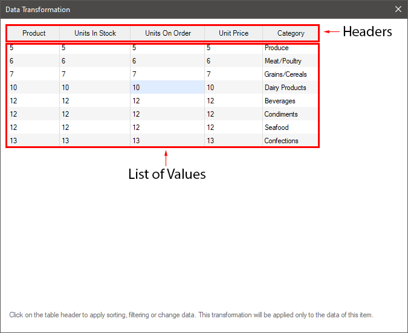
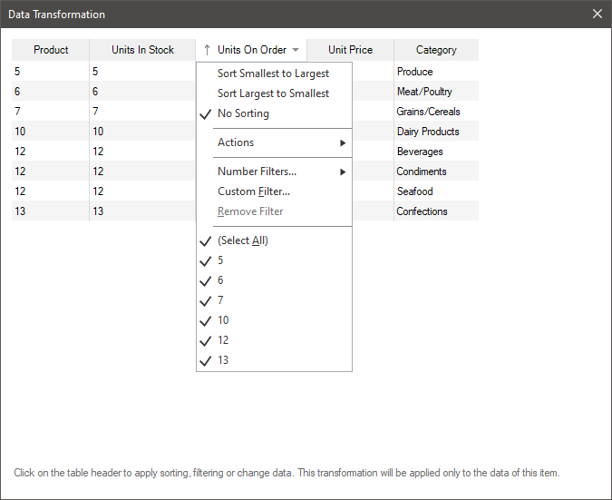
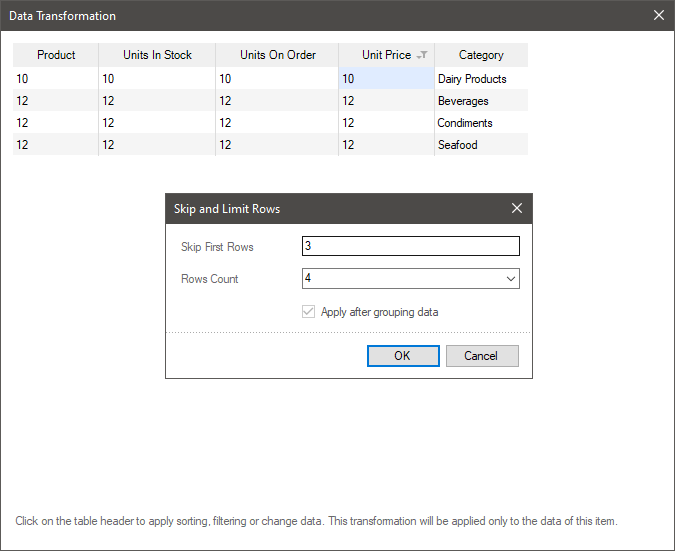
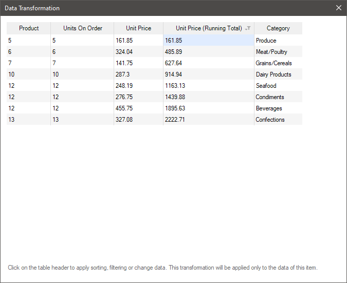
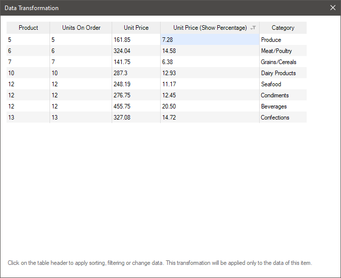
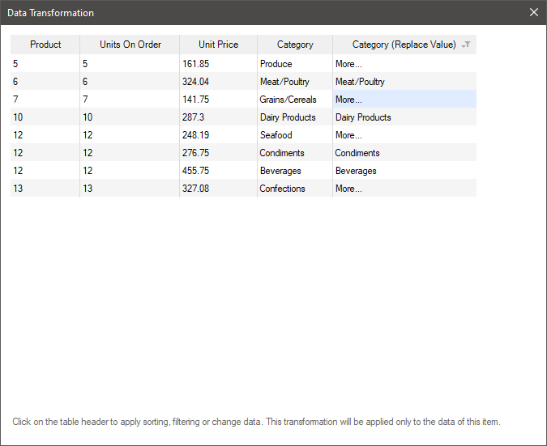
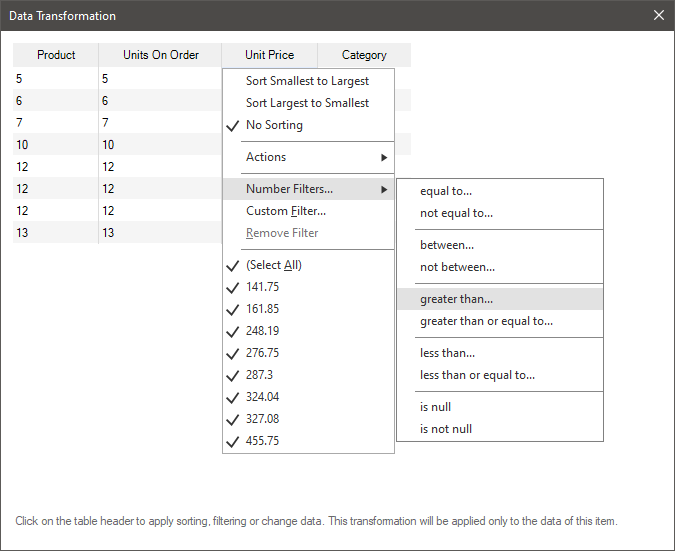
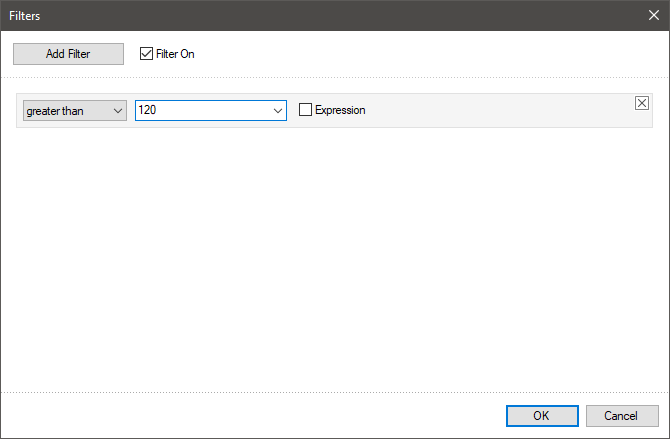
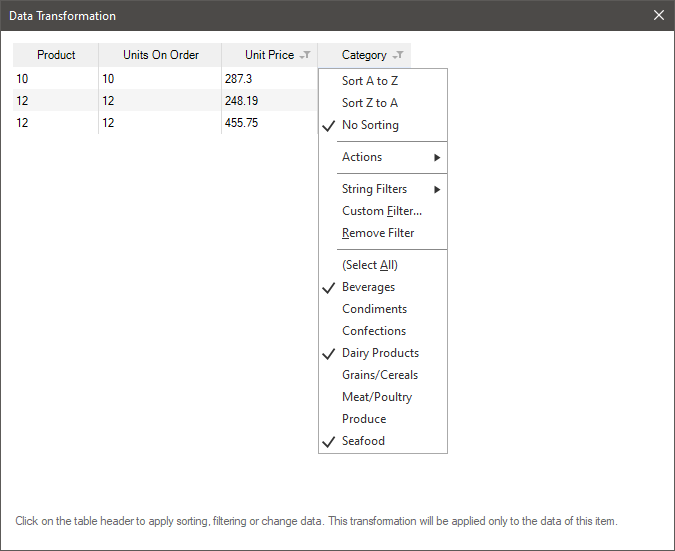

## Data Transformation

All data that is used in any dashboard is a data column in the virtual table of the dashboard panel. For example, if three data fields are specified in a chart, the chart uses three columns from the virtual data table of the dashboard.

This chapter will cover the following:

* [Data Transformation Editor](#DTEditor);

* [Sorting Data](#DTSorting);
* [Skip and Limit Rows](#SkipAndLimitRows);

* [Running total](#RunningTotal);

* [Show percentage](#ShowPercentage);

* [Replace value](#ReplaceValue);

* [Filtering by type of values](#TypeFilter)**;**

* [Custom filter](#CustomFilter);

* [Selecting values](#SelectFilter).

> **Information**
>
> There are always two additional columns of data: Max and Min in the data transformation of the [Gauge](../Gauge.md) element.

Filtering using the **Data Transformation** tool is:

* Prior and customizable in the report designer.

* Resetting filter settings are also carried out in the report designer.

* The already filtered data for the current element of the dashboard is displayed in the viewer.

To configure **Data Transformation** you should:

* Select the dashboard element;

* Click the Browse button of the Data Transformation property on the property panel.

> **Information**
>
> Data transformation is configured only for a specific element of the dashboard. All data transformation settings are applied only to the current element and are not applied to the data of the other elements of the dashboard.

**Data Transformation editor**

Every column in the data transformation consists of:

* Header;

* List of values.

All data transformation settings are located in the command menu. To call this menu, left-click on the header of the data column.

> **Information**
>
> Depending on the type of values (numeric, string, Boolean, etc.), the list of commands and actions for the values of the data column may differ.

Consider the commands that can be applied to the values of the data column.

**Data sorting**

By data sorting we mean the order of the element values in a certain direction.

In the Data Transformation element, the values can be:

* Sorted in ascending order. In the case of string values, the sorting is performed From A to Z, and for numeric values From Smallest to Largest;

* Sorted in descending order. In the case of string values, the sorting is From Z to A, and for numeric values From Largest to Smallest;

* Without sorting, values are transferred to the report in the order that they are contained in the data storage.

**Skip and Limit Rows**

One of the ways to filter data when converting data is to skip and set the limit rows in the data table element. For example, defining a range from 3 to 7 lines, or only the first three lines, or only the first four lines, starting from the 3rd line.

To skip lines and (or) set their limit, you should:

* Click on the title of the data column in the **Data Transformation** editor of the element;

* In the menu of the **Actions** item, select the **Skip and Limit Rows** command;

* In the dialog that opens, specify the number of lines to skip. The default value is 0, no rows in the table are skipped.

* Select a predefined number of rows or enter an integer that will be the number of rows in the data table of the element. By default, all rows are selected.

**Running total**

When designing a report, it is often necessary to calculate the cumulative total. The cumulative total is the calculation of a new value, as a result of adding the current string value to the sum of the previous values. You can enable the function to calculate the cumulative total for the item data field in the Data Transformation of the element.

To enable the calculation of the cumulative total for a column, you should:

* Click on the title of the Data Transformation editor;

* Select the **Running total** command in the **Actions** menu.

* Set the initial value. The default value is 0, the cumulative total is calculated only from the data column values. However, if necessary, you can set the initial value. Then the specified value will be added to the first value.

To disable the calculation of the cumulative total you should:

* Click on the title of the element in the Data Transformation editor;

* Select the **Remove Actions** command in the **Actions** menu.

* Delete the value in the cumulative total dialog and click **OK**.

**Displaying percent**

When designing reports, the situations may occur when it is necessary to output a specific weight (percentage) of a value from the list of values of a data column. For example, when analyzing sales, to identify the most profitable regions, it is necessary to calculate the percentage of sales in a particular region in relation to sales in all regions.

To display the percentage of the value from all the values in the data column, you should:

* Click on the title of the element in the Data Transformation editor;

* Select the **Show Percentage** command from the **Actions** menu.

**Replacing values**

You can replace some value with another one or add text to the current value in the Data Transformation.

To replace the value in the Data Transformation editor:

* Click on the title of the data column;

* Select the **Replace Values** command in the **Actions** menu;

* In the editor that opens, you should specify the value to be replaced and the value to be replaced. Also, you can configure the replacement of several values at once.

**Filtering by type of values**

By filtering data we mean the selection of data by any condition. For example, the statistics of visits for the last day, or sales in a certain category, etc.

Data filtering in data conversion can be done the following way:

* Click on the title of the data column;

* Go to the filter (the name depends on the type of the element, i.e. for numeric elements - Number Filter, for string elements - String Filter, etc.);

* In the define logical operation sub-menu.

* Then, an editor will be opened in which you need to specify a value for the [logical operation](Filters.md#OperationsOfTable). When this filter is triggered, fulfilling a certain logical condition, the values will be displayed.

**Custom filter**

A custom filter can be applied to any data column of an element.

To add a custom filter, you should:

* Click on the title of the data column;

* Select the **Custom** filter command in the drop-down menu.

* The filter editor will be called. You should add filters, define a [logical operation](Filters.md#OperationsOfTable) and value. When this filter is triggered, the values will be displayed.

**Selecting values**

Also, you can filter the data simply by selecting values.

* Click on the title of the data column in the Data Transformation editor.

* In the drop-down menu, check the values that you want to leave, remove flags from values that are not needed.

> **Information**
>
> You should know that more than one command can be applied to a single data column. For example, sorting of values, restriction of lines and filtering by the type of values.
>
>
> Also you should know that if a dashboard element has more than one data column, different commands may be applied to each of them. In this case, the commands of one data column affect the other. For example, if the first data column contains a filter by product category, and the second one has prices for these products, then the first column filter will be applied to the values of these columns, and then the second one will be applied.
