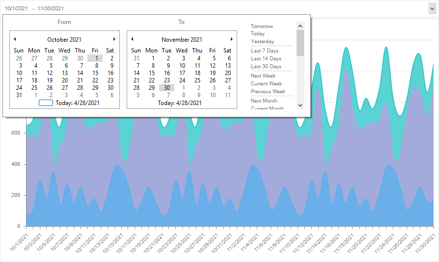
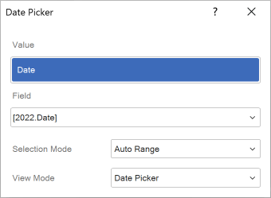

## Date Picker

**Date Picker** is a filtering element on the dashboard panel that is used to determine the calendar range and filter the data for the analysis in the viewer, taking into account the specified range. It can be located anywhere on the dashboard panel. Depending on the size of the dashboard panel in the viewer, it can grow or shrink by width only.

This chapter will cover the following:

* [Date Picker editor](#DatePickerEditor);

* [Table Of Properties](#TableOfProperties).

The **Date Picker** element can only be the main filtering element for other filtering elements and cannot depend on the values of other filtering elements. The **Date Picker** can have the following selection modes:

* **Single**. By default, the current date of the operating system and the subsequent range will be determined depending on the value of the **Condition** parameter.

* **Range**. By default, the current day range will be set.

* **Auto Range**. By default, the range will be set from an earlier date in the data source to the latest date. In other words, the original date range will correspond to the data range of the data source.

You may setup the **Date Picker** element in the editor. To call the editor, you should to the following in the report designer:

* Double-click on the **Date Picker** element;

* Select the **Date Picker** and choose the Design command in the context menu.

**The Date Picker editor**

In this editor you can add elements with data, set up the mode for selecting values, select the main filtering element.

 The **Key** field. The data element is specified in it, according to the values of which the data will be filtered.

 The **Field** field. Displays the expression of the selected item data field.

 The **Selection Mode** field. It selects the mode of the Date Picker item. The following values can be selected:

* **Single**. The current date of the operating system and the subsequent range will be determined depending on the value of the **Condition** parameter.

* **Range**. By default, the current day range will be set.

* **Auto Range**. By default, the range will be set from an earlier date from the data source to the latest. In other words, the original date range will correspond to the data range of the data source.

 The **Condition** field. Depending on the selected item mode, the following parameters may be present:

* The **Condition** parameter is available only if the **Single** mode is selected. The value of this parameter is a logical operation that determines the continuation of the date range from the current date. For example, if **Greater then** is selected, then the default element range will include all subsequent dates from the current date of the operating system.

* The **Initial Selection** parameter is available only if **Range** is selected. You can specify the default element range. For example, you can select the previous week. Then when you open the dashboard in the viewer, the range of the **Date Picker** item will be set to the previous week.

 The View Mode parameter provides the ability to set the operating mode of the filtering element. The following values can be selected:

* Date Picker. A mode in which the user selects the start and end dates using a calendar, and the data is displayed within the specified time range.

* Slider. A mode in which the user sets the start and end dates by moving markers along a timeline, and the data is displayed within the selected range.

Get acquainted with the step-by-step instruction in the [Dashboards with Date Picker](../../Getting_Started/Dashboard_with_Date_Picker.md) chapter.

**List of properties**

The list shows the name and description of the properties of the element which you may find in the properties panel of the report designer.

| **Name** | **Description** |
| --- | --- |
| Group | Adds the current item to a specific [group of items](../Groups.md). |
| Back Color | Changes the background color of the element. By default, this property is set to **From Style**, i.e. the color of the element will be obtained from the settings of the current element style. |
| Border | A group of properties that allows you to customize the borders of the element - color, sides, size, and style. |
| Corner Radius | It allows you to define the rounding radius for the corners of an element on the dashboard. You can round each corner of the element separately: Top - Left, Top - Right, Bottom - Right, Bottom - Left. The property can be set to a value between 0 and 30, where 0 is no rounding angle and 30 is the maximum value of the rounding radius. |
| Font | A group of properties defines the font family, its style, and size for the values of the element. |
| Fore Color | Specifies the color of the values of the element. By default, this property is set to **From Style**, i.e. the color of the values will be obtained from the settings of the current element style. |
| Shadow | A group of properties that allows configuring the shadow of an element: The Color property allows you to specify the color that will be used to display the shadow of the element. The properties in the Location group allow you to define the offset of the shadow along the X and Y coordinates, relative to the element's position on the indicator panel. The Size property allows you to set the size of the shadow from the element's borders. It can be set to a value from 1 to 10, where 1 is the minimum size and 10 is the maximum size. The Visible property allows you to enable or disable the display of the element's shadow on the indicator panel. |
| Style | Selects a style for the current element. The default it is set to **Auto**, i.e. the style of this element is inherited from the style of the dashboard. |
| Enabled | Enables or disables the current item on the dashboard. If the property is set to **True**, the current item is enabled and will be displayed when previewing the dashboard in the viewer. If this property is set to **False**, this element is disabled and will not be displayed when previewing the dashboard in the viewer. |
| Fixed Height | Allows setting the mode of fixed or change height. |
| Margin | A group of properties that allows you to define margins (left, top, right, bottom) of the value area from the border of this element. |
| Padding | A group of properties that allows you to define padding (left, top, right, bottom) of the columns from the range of values. |
| Text Format | Sets the formatting of values for the element. |
| Name | Changes the name of the current element. |
| Alias | Changes the alias of the current item. |
| Restrictions | Configures the permissions to use the current item in the dashboard: The **Allow Change** option enables or disables changes of the element. If checked, the current item can be changed. The **Allow Delete** option enables or disables the deletion of an element. The **Allow Move** option allows or prohibits moving an element. The **Allow Resize** option enables or disables resizing of an element. The **Allow Select** option enables or disables the element selection. |
| Locked | Locks or unlocks resizing and replacement of the current element. If the property is set to **True**, the current element cannot be moved or resized. If this property is set to **False**, then this element can be moved and resized. |
| Linked | Binds the current location to the dashboard or another element. If the property is set to **True**, then the current item is bound to the current location. If this property is set to **False**, then this element is not tied to the current location. |
