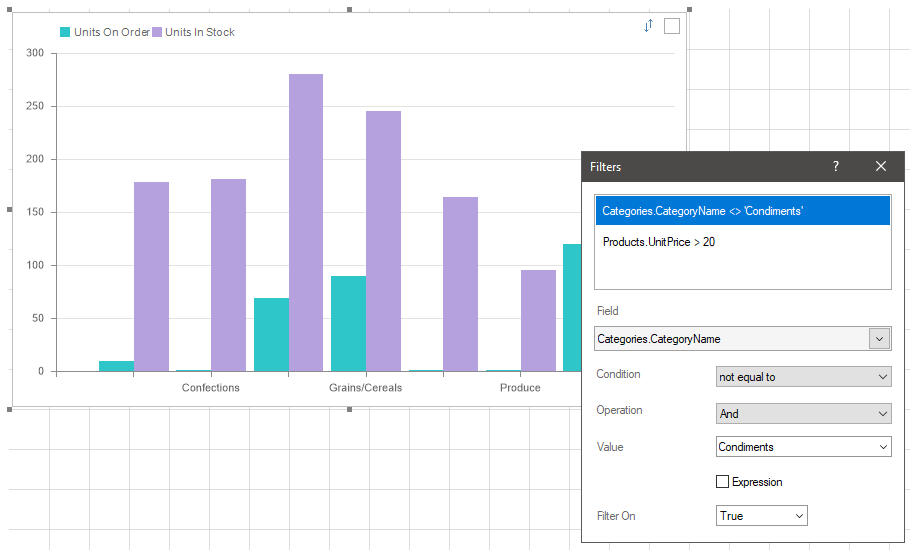
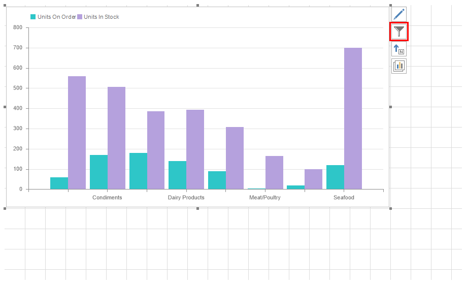
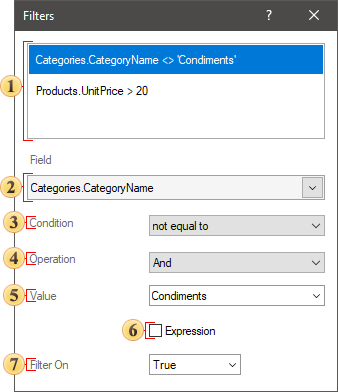
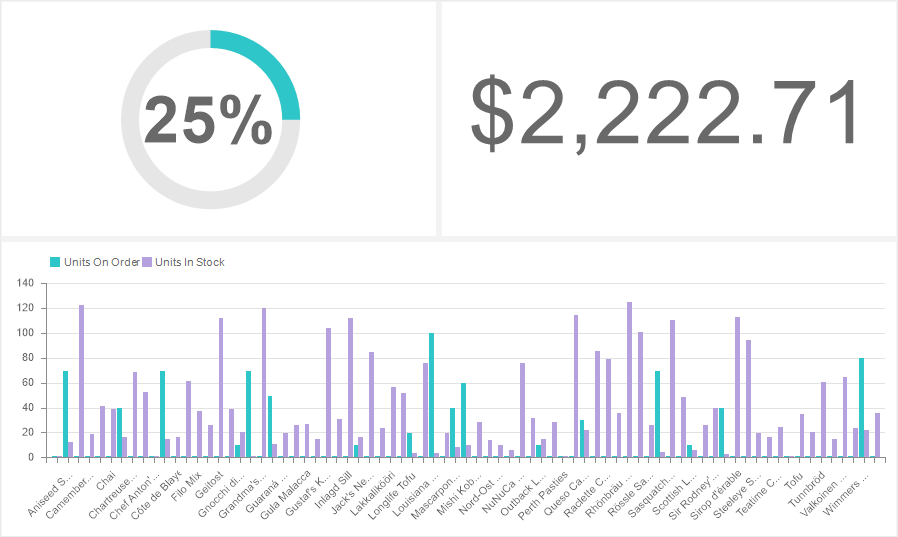
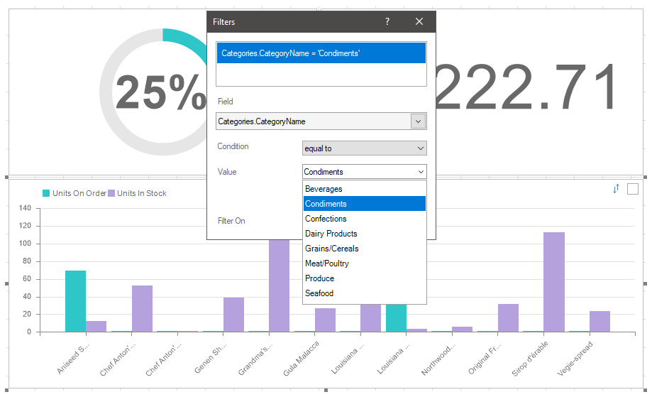
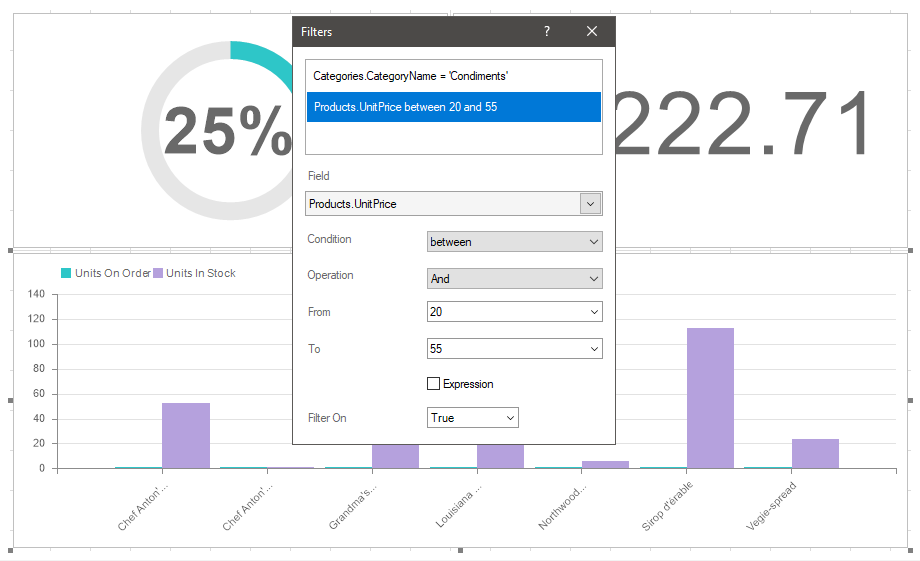
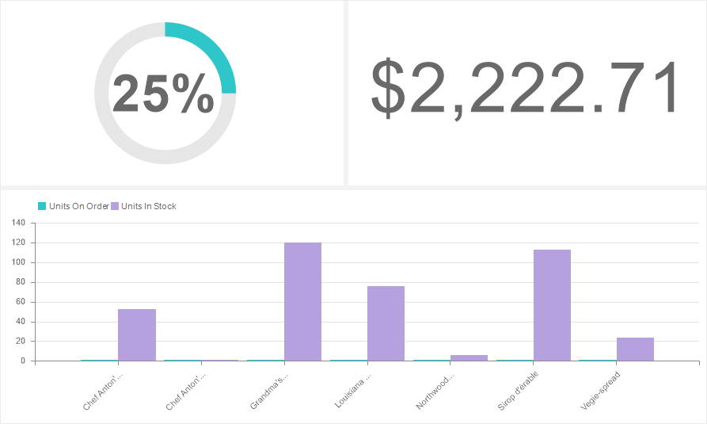

## Filters

All data that is used in any element of the dashboard is a data column in the virtual table of the dashboard panel. For example, if three data fields are specified in a chart, the chart uses three columns from the virtual data table of the dashboard. Unlike the [Data Transformation](Data_Transformation.md) tool, the Filters tool is used to filter data of an element not only by the used fields, but also by other data fields it is related to.

This chapter will cover the following:

* [Filter editor](#FilterEditor);

* [Example of setting the filters of an element](#Sample).

* [Table of filter operations](#OperationsOfTable).

> **Information**
>
> You may configure filters only for a specific element of the dashboard and apply them only to it. The data of the remaining elements of the current dashboard panel is not filtered.

Filtering using the **Filters** tool is:

* Prior and customizable in report designer;

* Reset filter settings are also carried out in the report designer;

* In the viewer, the already filtered data for the current element of the dashboard is displayed.

To set up Filters you should:

* Select the element on the dashboard panel;

* Click the **Filters** button.

And specify the settings for filtering data in the editor.

**Filter editor**

The editor is setting up data filters. Every filter is a data field, a logical operation, and a data filtering value. All added filters work through the logical "AND", the data will be filtered first by the first filter, then by the second, and so on. In other words, only data that matches all filter conditions will be displayed in the element. The order of applying filters is determined by their order in the Filter editor. The higher is the filter in the list, the higher is its order of application.

 This field indicates any related data fields.

 The field, where an expression of a selected data column is displayed.

 This parameter is used to determine the [logical operation](#OperationsOfTable) in the data filtering condition.

 The parameter is used to determine the logical operation of adding And or Or filters. This parameter is displayed only if several different data columns are specified. The AND operation means that data will be displayed that matches all of the enabled filters. If the OR operation is selected, this means that data will be displayed that match at least one filter from the list of all enabled filters.

 This field indicates the value of the filter condition.

 The parameter defines the algorithm of processing the value of the filtering condition. If a checkbox is set, the value of the filtering condition will be processed as an expression. The result of calculation this expression will be the value of the filtering condition. If a checkbox is not set, the value of the filter condition will be processed as a normal value.

 The parameter defines whether the current filter is enabled or disabled. If the Filter On parameter is set to True value, the filter is enabled and takes part in data processing for the current item. If the current parameter is set to False value this filter is disabled and does not take part in data processing for the current element.

An example of setting the filters of an element

Suppose there are three elements on the dashboard:

* Progress - displays the number of orders in relation to the quantity of goods in stock;

* Indicator - displays the total value of goods in stock;

* Chart - displays the quantity in stock and the number of orders for each product.

Set up filtering of data in a chart. Display products only from a certain category, the price of which is in the required range.

Step 1: Select the **Chart** element in the report designer;

Step 2: Click the **Filters** button to open the Filter editor;

Step 3: Add a data field with a list of product categories;

Step 4: Define a [logical filter operation](#OperationsOfTable). In this case, select the **equal to** operation.

Step 5: Select or enter the value of the filter condition. In this example, the category **Condiments** will be selected.

Products related to the category **Condiments** will be displayed. The relationship of categories and products is defined in the data dictionary. Now add a second filter. We display products from the category **Condiments**, which prices are in a certain range.

Step 6: Add a data field with product prices to the Filter editor;

Step 7: Select this data field and select a [logical operation](#OperationsOfTable) **between**;

Step 8: Select or set the price range values.

> **Information**
>
> Pay your attention to the fact that the filter addition operation is set to And value. A chart displays the products which data matches the conditions of all filters.

Now, the product list in the chart will first be filtered by the category **Condiments**. After that, products will be filtered by prices and displayed only those which prices are in range within the specified prices.

> **Information**
>
> Note that data filtering using filters:
>
> It is performed on data fields that are not used in the **Chart** element;
>
> It is applied only to the element of the dashboard where filters are set, in our example, only to the chart.

**Table of Operations**

The list of available operations depends on the data type. Below is a list of operations for each data type and their description. The operation is performed on the value from the data field and the filter value (the value or expression that is specified in the filter).

**Name**

**Data Type is**
**String**

**Data Type is**

**Number**

**Data Type is**

**Data**

**Data Type is**

**Boolean**

**Description**

equal to

+

+

+

+

If the data field value is equal to the filter value, then the condition is true.

not equal to

+

+

+

+

If the data field value is not equal to the filter value, then the condition is true.

between

+

+

+

If the data field value is in the specific range of filter values, then the condition is true.

not between

+

+

+

If the data field value is not in the specific range of filter values, then the condition is true.

greater than

+

+

+

If the data field value is greater then the filter value, then the condition is true.

greater than or equal to

+

+

+

If the data field value is greater then the filter value of equal to the filter value, then the condition is true.

less than

+

+

+

If the data field value is less then the filter value, then the condition is true.

less then or equal to

+

+

+

If the data field value is less then the filter value of equal to the filter value, then the condition is true.

containing

+

If the data field value contains the filter value, then the condition is true.

not containing

+

If the data field value does not contain the filter value, then the condition is true.

beginning with

+

If the data field value starts with the filter value, then the condition is true.

ending with

+

If the data field value ends with the filter value, then the condition is true.

is blank

+

If the data field value is blank, then the condition is true.

is not blank

+

If the data field value is not blank, then the condition is true.

is null

+

+

+

If the data field value is null, then the condition is true.

in not null

+

+

+

If the data field value is not null, then the condition is true.
