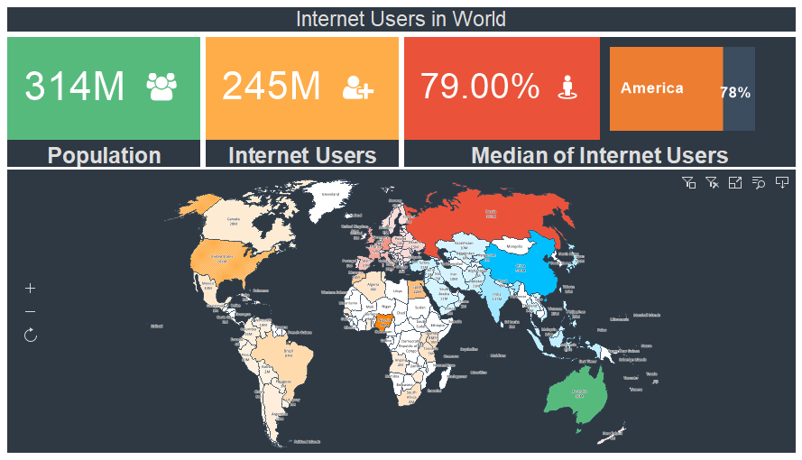
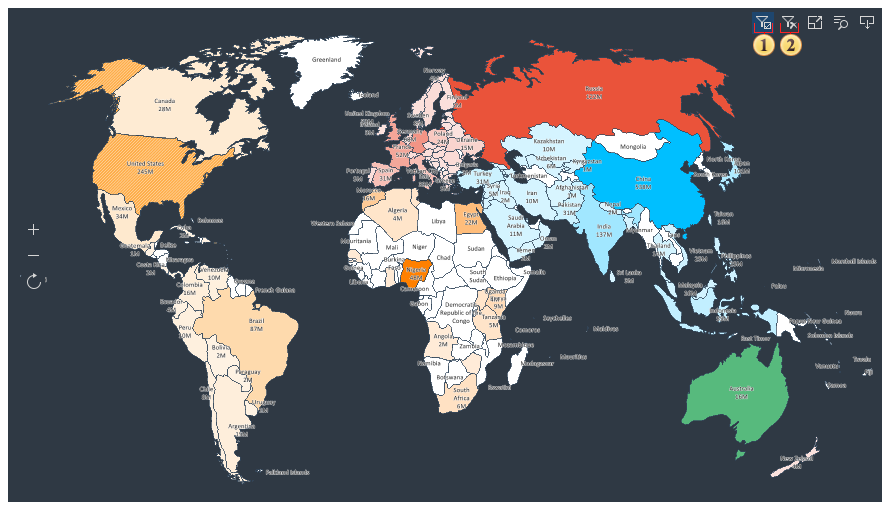

## Relationship of Elements

Interaction means filtering data in the viewer of an analysis element on the dashboard panel, depending on the selected value of another analysis element on this panel. For example, depending on the selected segment on the map, the gauge will display the population size, and the progress will be the population growth rate.

In order filtering through interaction to occur, the following conditions must be met:

* Data items on the dashboard should be related to each other;

* Items on the dashboard panel should belong to the same group.

All elements of data analysis depend on the values of other elements within their group. However, not all elements can be interactive.

The elements that can affect the values of other elements of the dashboard panel include:
* [Table](../Table.md);
* [Some types of charts](../Chart.md);
* [Region Map](../Maps/Region_Map.md).

Every element (a chart and regional map) on the dashboard that can filter data have data filtering control buttons. These buttons are displayed when you hover over the element of the dashboard:

 The button is used to enable and disable the filtering mode by several segments.

* If this button is enabled, then for filtering data, you should select several segments on one dashboard element.

* If this button is disabled, then when selecting the next segment, the previous filter will be reset.

For example, when filtering by map, by clicking on each segment in the single mode, other elements of the dashboard will display the associated data only with the current map segment. In the multi-segment filtering mode, other elements of the dashboard will display the associated data with all selected map segments.

 The button is used to remove all filters. When you click it, all filters of the current item in the dashboard will be deleted.
