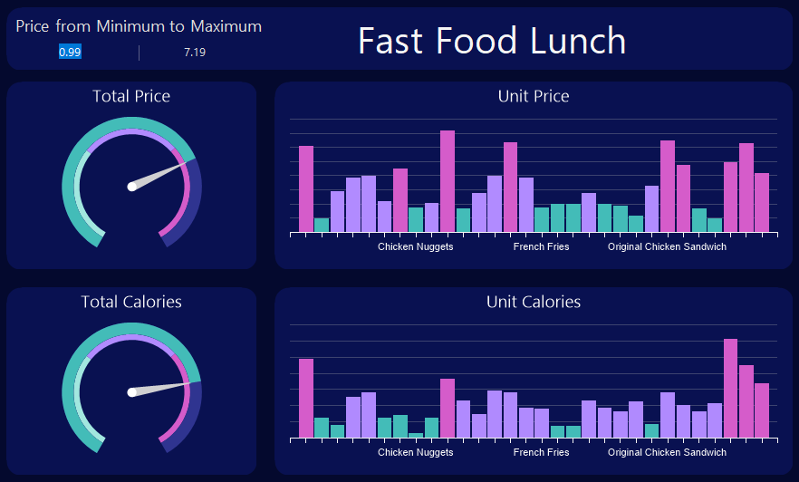
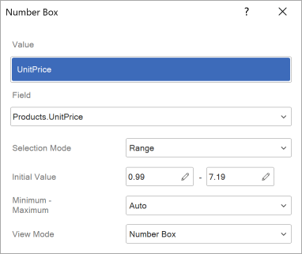

## Number Box

The **Number Box** is a filtering element on the dashboard that is utilized to specify either a numeric value or a range of values. It serves to filter data for analysis elements within the viewer. This element can be positioned anywhere on the dashboard. Its width is capable of adjusting, either expanding or contracting, depending on the dimensions of the dashboard in the viewer.

This chapter will cover the following questions:

* [Number Box editor](#numberboxeditor);

* [Switching Values](#step);

* [List of properties](#properties).

The **Number Box** element can function only as the primary filter element among other filter elements, and it cannot rely on the values of other filter elements. The **Number Box** element can operate in the following selection modes:

* **Single**. In this mode, a single numeric value is defined, and the filter is applied to the dashboard elements based on the value of the Condition parameter.

* **Range**. In this mode, both the minimum and maximum numeric values are determined.
The configuration of the **Number Box** element takes place within its editor. To access the editor in the report designer, follow these steps:

* Double-click on the **Number Box** element.

* Select the **Number Box** element, then choose the **Design** command from the context menu.

**The Number Box editor**

In the **Number Box** editor, you can add elements with data, configure the value selection mode, and designate the primary filtering element.

 The **Value** field designates the data element whose values will be utilized for data filtration.

 The **Field** displays the expression of the selected data field for the element.

 The **Selection Mode** parameter determines the operating mode of the filtering element. The following values are available for selection:

* **Single**. In this scenario, an initial value is specified, and the filtering of these elements in the indicator panel will be conducted based on the Condition parameter.

* **Range**. In this scenario, it will be possible to establish both the minimum and maximum values, which will constitute the range of values for filtering these dashboard elements.

 The **Condition** parameter is accessible only when the **Single** mode is chosen. The value of this parameter represents a logical operation that determines the extension of the value range from the current one. For instance, if "**Greater than…**" is selected, the element's default range will encompass all values greater than the current value of the element.

 The **Initial Value** parameter is utilized to designate a starting value for the **Number Box** element. In single mode, only one value can be specified, whereas in range mode, both minimum and maximum values can be provided. If the parameter value is left unspecified, the initial value will default to the minimum value from the data element.

 The **Minimum/Maximum** value parameter is used to restrict the range of valid values that can be entered into the **Number Box** element. By default, the **Auto** mode is utilized, meaning the range of valid input values is automatically calculated based on the specified data. In the **Custom** mode, you have the option to manually define the minimum and maximum values permissible for input in the **Number Box** element.

 The **View Mode** parameter provides the ability to set the operating mode of the filtering element. The following values can be selected:

* **Number Box**. A mode in which the user manually enters the minimum and maximum values of the range, and the data is displayed within the specified interval.

* **Slider.** A mode in which the user defines the range boundaries by moving markers along a scale, and the data is displayed within the selected interval.

**Switching Values**

When viewing the dashboard, you can input values into this element, paste them from the clipboard, or use controls to switch them. When using controls to switch values, an essential consideration for data filtering is the switching step. By default, the toggle step is an integer that increments or decrements by one. Nonetheless, if you wish to make fractional adjustments, you need to modify the value of the **Decimal Digits** property.

The value of this property indicates the quantity of decimal places. By default, the property value is 0, signifying a whole number. The switching step is defined by the smallest digit. Put differently, for example, if the **Decimal Digits** property is set to 1, the switching step will involve decimal values. If the **Decimal Digits** property is set to 2, the step will involve hundredths, and so forth.

**List of properties**
The list below contains the name and description of the properties of the Number Box element, which you may find on the properties panel of the report designer.

| **Name** | **Description** |
| --- | --- |
| Group | Adds the current item to a specific [group of items](../Groups.md). |
| Decimal Digits | Adjusts the number of decimal places for values within the **Number Box** element. The increment at which values change within the Number Box element is determined by the value of this property. |
| Back Color | Changes the background color of the element. By default, this property is set to **From Style**, i.e. the color of the element will be obtained from the settings of the current element style. |
| Border | A group of properties that allows you to customize the borders of the element - color, sides, size, and style. |
| Corner Radius | It allows you to define the rounding radius for the corners of an element on the dashboard. You can round each corner of the element separately: **Top - Left**, **Top - Right**, **Bottom - Right**, **Bottom - Left**. The property can be set to a value between 0 and 30, where 0 is no rounding angle and 30 is the maximum value of the rounding radius. |
| Font | A group of properties defines the font family, its style, and size for the values of the element. |
| Fore Color | Specifies the color of the values of the element. By default, this property is set to **From Style**, i.e. the color of the values will be obtained from the settings of the current element style. |
| Horizontal Alignment | Horizontally aligns values within the **Number Box** element to the **Left**, **Center**, or **Right**. |
| Shadow | A group of properties that allows configuring the shadow of an element: The **Color** property allows you to specify the color that will be used to display the shadow of the element. The properties in the **Location** group allow you to define the offset of the shadow along the X and Y coordinates, relative to the element's position on the indicator panel. The **Size** property allows you to set the size of the shadow from the element's borders. It can be set to a value from 1 to 10, where 1 is the minimum size and 10 is the maximum size. The **Visible** property allows you to enable or disable the display of the element's shadow on the indicator panel. |
| Style | Selects a style for the current element. The default it is set to **Auto**, i.e. the style of this element is inherited from the style of the dashboard. |
| Enabled | Enables or disables the current item on the dashboard. If the property is set to **True**, the current item is enabled and will be displayed when previewing the dashboard in the viewer. If this property is set to **False**, this element is disabled and will not be displayed when previewing the dashboard in the viewer. |
| Margin | A group of properties that allows you to define margins (left, top, right, bottom) of the value area from the border of this element. |
| Padding | A group of properties that allows you to define padding (left, top, right, bottom) of the columns from the range of values. |
| Name | Changes the name of the current element. |
| Alias | Changes the alias of the current item. |
| Restrictions | Configures the permissions to use the current item in the dashboard: The **Allow Change** option enables or disables changes of the element. If checked, the current item can be changed. The **Allow Delete** option enables or disables the deletion of an element. The **Allow Move** option allows or prohibits moving an element. The **Allow Resize** option enables or disables resizing of an element. The **Allow Select** option enables or disables the element selection. |
| Locked | Locks or unlocks resizing and replacement of the current element. If the property is set to **True**, the current element cannot be moved or resized. If this property is set to **False**, then this element can be moved and resized. |
| Linked | Binds the current location to the dashboard or another element. If the property is set to **True**, then the current item is bound to the current location. If this property is set to **False**, then this element is not tied to the current location. |
