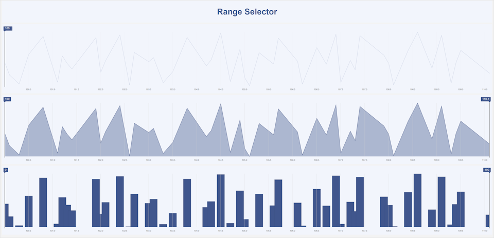
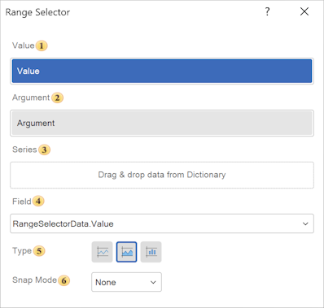

## Range Selector

**Range Selector** - this component is used to select a range of values on a scale or a timeline. It allows users to visually define the minimum and maximum boundaries of the range.

Configuration of the Range Selector element is performed in its editor. To open the editor in the report designer, you should:

* Double-click the **Range Selector** element with the left mouse button;
* Select the Range Selector element and choose the **Editor** command from the context menu.

The Range Selector element allows selecting a range of values (for example, dates or numbers). It can act as either a dependent or a master element in relation to other filtering elements. The selected range limits the dataset used by other elements of the dashboard panel.

**Range Selector Element Editor**
In the Range Selector editor, data items are added, the value selection mode is configured, and the master filtering element is selected.

 In the **Value** field, the data item whose values will be used for filtering is specified.
 In the **Argument** field, the data item used as the X-axis for visualizing the mini-chart inside the slider is specified.

 In the **Series** field, numeric fields are placed to build the chart inside the slider (mini sparkline or columns). This is an additional visualization, for example: number of events, metric values.

 The **Field** displays the expression of the selected data field of the element.

 The **Type** parameter allows setting the operating mode of the filtering element. The following values are available:

* **Line**. Displays data as a line chart;

* **Area.** Displays data as a line chart with the area under the line filled;

* **Column.** Displays data as columns. Each value is represented as a vertical bar.

 **Snape Mode**

* **None.** No snapping, the slider moves freely;
* **Step.** Moves by specific X values;

* **Tick.** Moves by scale intervals (for example, every 7 days).

**Properties Table**
The table contains the names and descriptions of the properties of the **Range Selector** element located in the Properties panel of the report designer.

| **Name** | **Description** |
| --- | --- |
| Group | Provides the ability to add the current element to a specific [group of elements](../Groups.md). |
| Corner Radius | Provides the ability to define the corner radius for the element on the dashboard panel. Each corner can be rounded individually: **Top - Left**, **Top - Right**, **Bottom - Right**, **Bottom - Left**. The property can be set from 0 to 30, where 0 means no rounding and 30 is the maximum radius value. |
| Font | A group of properties that allows defining the font family, style, and size for the values of the **Numeric Field** element. |
| Shadow | A group of properties that allows configuring the element shadow: The **Color** property defines the color used to display the shadow; The **Location** group properties define the shadow offset along the X and Y axes relative to the element position on the dashboard panel; The **Size** property defines the shadow size relative to the element boundaries. It can be set from 1 to 10, where 1 is the minimum size and 10 is the maximum; The **Visible** property enables or disables the display of the element shadow on the dashboard panel. |
| Style | Provides the ability to select a style for the current element. By default, the value is set to **Auto**, meaning the style is inherited from the dashboard panel style. |
| Back Color | Provides the ability to change the background color of the **Numeric Field** element. By default, this property is set to From Style, meaning the color is taken from the current element style settings. |
| Fore Color | Provides the ability to define the color of the **Numeric Field** element values. By default, this property is set to **From Style**, meaning the color is taken from the current element style settings. |
| Border | A group of properties that allows configuring the element borders: color, sides, size, and style. |
| Enabled | Provides the ability to enable or disable the current element on the dashboard panel. If set to **True**, the element is enabled and will be displayed in the viewer. If set to **False**, the element is disabled and will not be displayed in the viewer. |
| Inclusion Mode | Defines how values are included in the selected range (for example, whether boundary values are included or excluded). |
| Margin | A group of properties that allows defining outer spacing (left, top, right, bottom) of the value area relative to the element boundaries. |
| Padding | A group of properties that allows defining inner spacing (left, top, right, bottom) of the values relative to the value area boundaries. |
| Text Format | Specifies the display format of the range values (for example, numeric, date, or custom format). |
| Name | Provides the ability to change the name of the current element. |
| Alias | Provides the ability to change the alias of the current element. |
| Restrictions | Provides the ability to configure usage permissions for the current element on the dashboard panel: **The** **Allow Change** option enables or disables modification of the element. If selected, the element can be modified, otherwise it cannot be changed. **The** **Allow Delete** option enables or disables deletion of the element. If selected, the element can be deleted, otherwise it cannot be removed. **The** **Allow Move** option enables or disables moving the element. If selected, the element can be moved, otherwise it cannot be moved. **The** **Allow Resize** option enables or disables resizing of the element. If selected, the element size can be changed, otherwise it cannot be resized. **The** **Allow Select** option enables or disables selecting the element. If selected, the element can be selected, otherwise it cannot be selected. |
| Locked | Provides the ability to prevent or allow resizing and moving of the current element. If set to **True**, the element cannot be moved or resized. If set to **False**, the element can be moved and resized. |
| Linked | Provides the ability to link the current position to the dashboard panel or another element. If set to **True**, the element is bound to its current position. If set to **False**, the element is not bound to its current position. |
