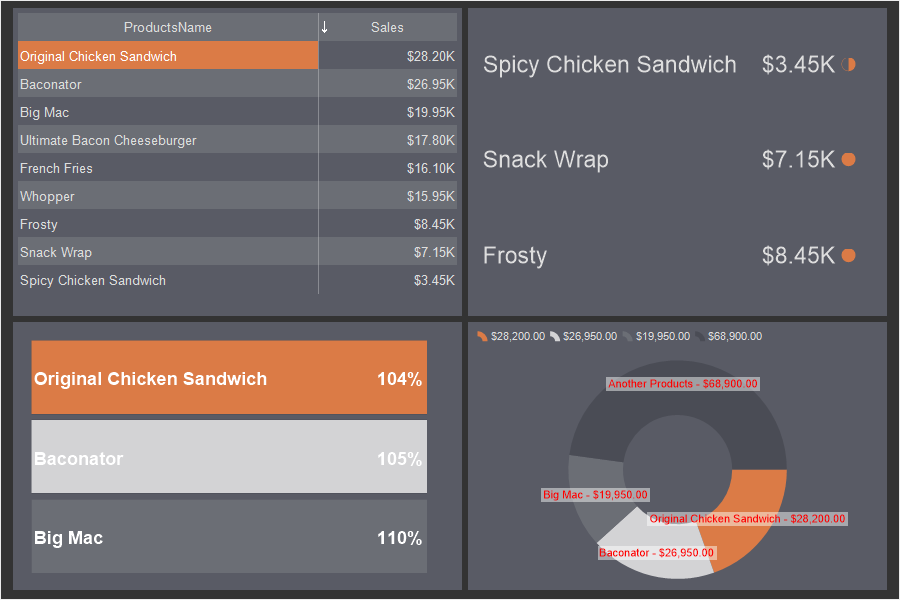
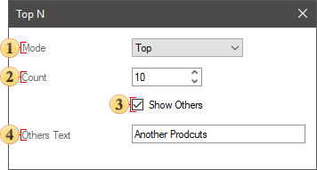
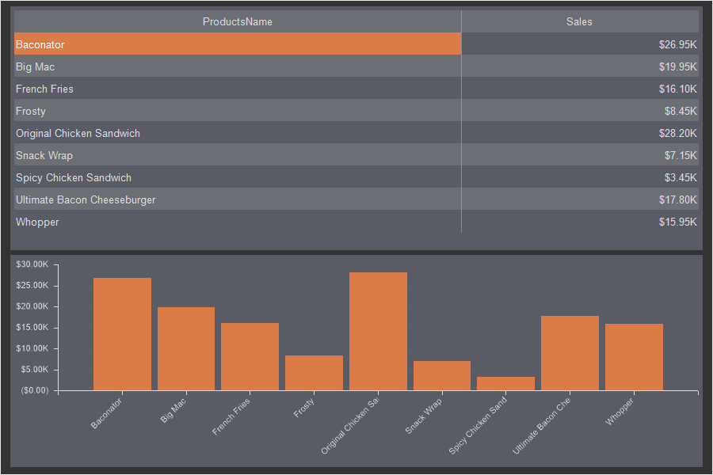
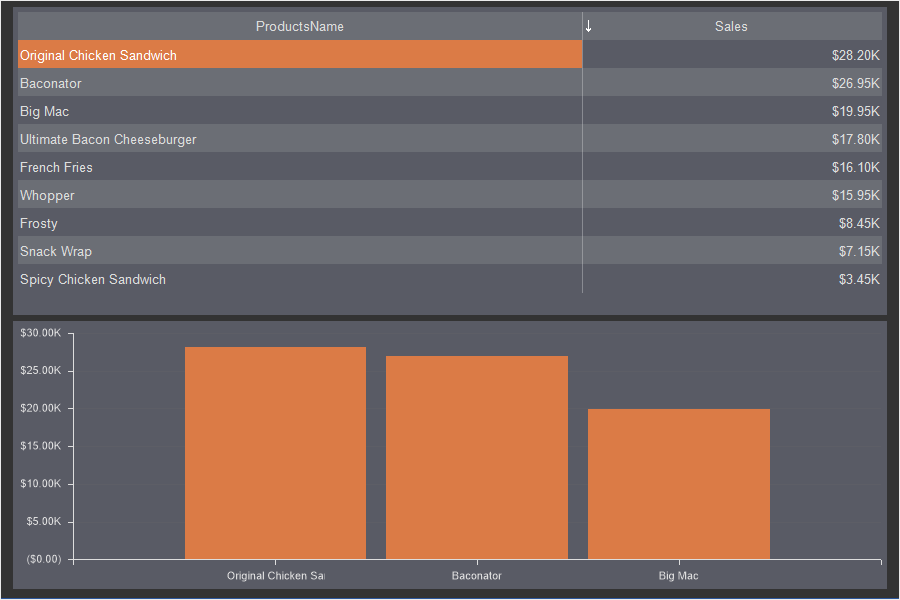
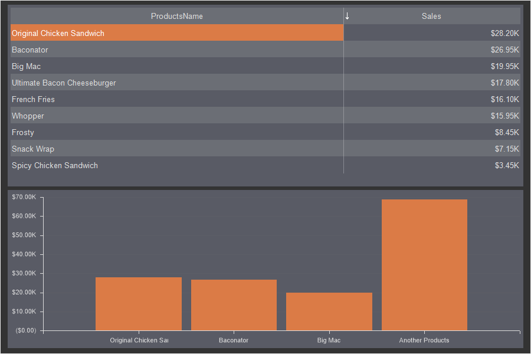
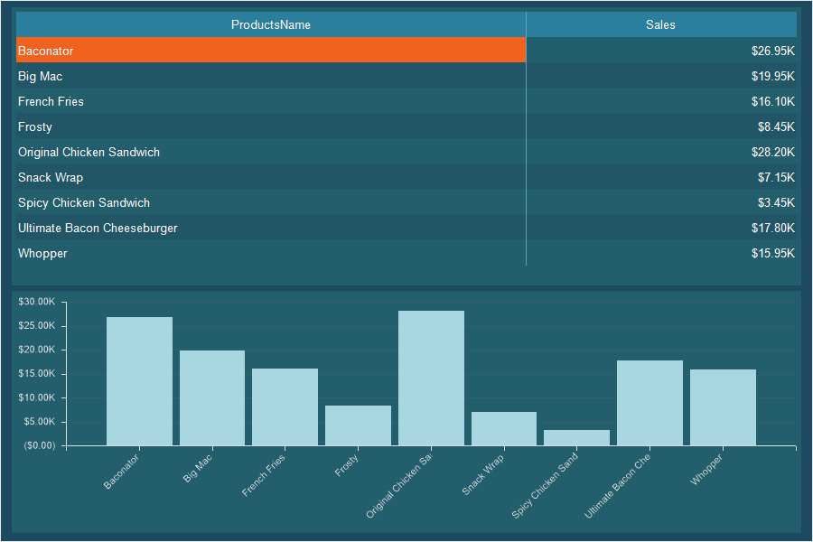
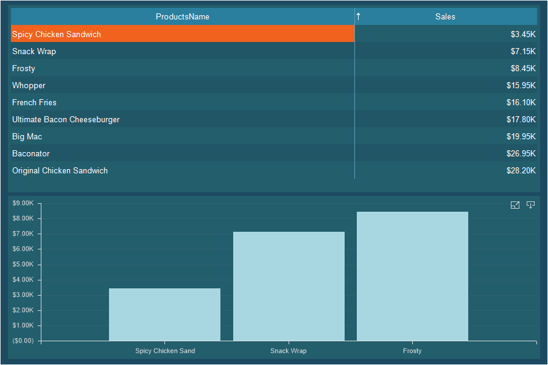
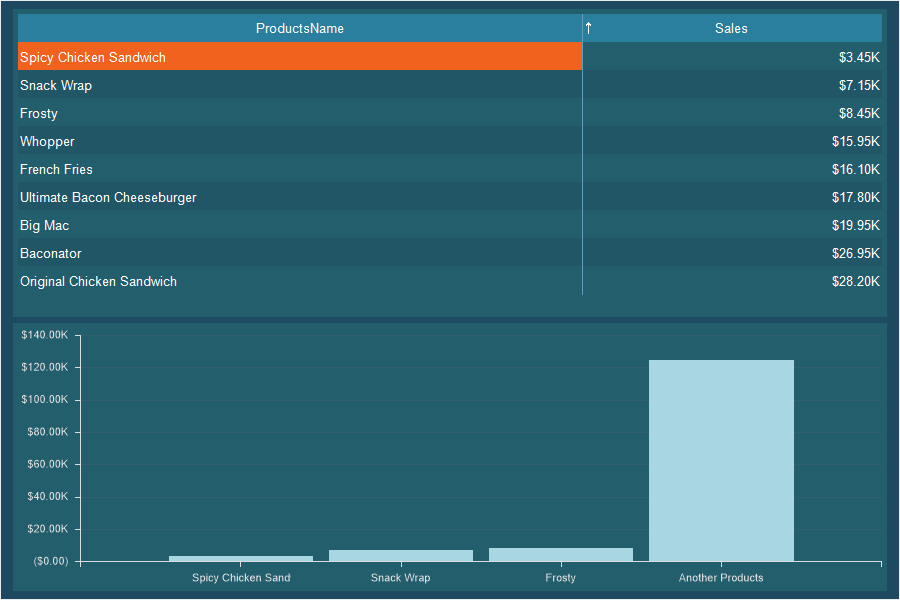

## Top N

One of the options for filtering data for the elements of the dashboard panel is the ability to display a certain number of maximum or minimum values. This can be applied with the **Top N** tool. This feature applies to pre-filtering and only to the current element.

This chapter will cover the following:

* [Top N Editor](#TopNEditor);
* [An example of Top values](#Maximum);
* [An example of minimum Top values](#Minimum).

> **Information**
>
> The top values can be setup only for a specific element of the dashboard and are applied only to it. The data of the remaining elements of the current dashboard is not filtered.

Filtering using the Top N tool is:

* Prior and you customize it in the report designer.

* Reset filter settings are also carried out in the report designer.

* In the viewer, the already filtered data for the current element of the dashboard is displayed.

To customize the Top values you should:

* Select the element on the dashboard;

* Click the **Browse** button for the **TopN** property on the property panel.

You can specify the top values for the elements of the dashboard panel:
* [Chart](../Chart.md);

* [Indicator](../Indicator.md);

* [Progress](../Progress.md);

* [Pivot](../Pivot_Table.md).

> **Information**
>
> The Top values for the **Pivot** element are configured in the editor of this element.

**Top N editor**

In the Top N editor you may define the type of the values (maximum or minimum), the number of the best values, actions with the rest of the element data.

 The **Mode** parameter allows you to define the type of values that you want to display:

* **None** - all values of the current item are displayed. This mode is set by default.

* **Top** - a list of maximum values will be displayed. The first value is the maximum value from the list of values. Depending on the number of values, the values in the direction from the maximum to the minimum will be sequentially displayed.

* **Bottom** - a list of minimum values will be displayed. The first value is the minimum value from the list of values. Depending on the number of values, the values in the direction from the minimum to the maximum will be sequentially displayed.

 The **Count** parameter is used to determine the number of maximum or minimum values. For example, if this parameter is set to 10, then 10 maximum or minimum values from the list of values will be displayed.

> **Information**
>
> When setting the top values for the [Pivot](../Pivot_Table.md) element, you should also define the **Measure** parameter. The value for this parameter will be one of the data fields specified in the **Summary** field.

 The **Show Other** option is used to display a sum of values that were not included in the list of top values:

* If the **Show other** option is enabled, then all values that were not included in the list of top values will be summed up and displayed as a separate value.

* If the **Show other** option is disabled, then only values that appear on the list of top values will be displayed on the item.

 The **Other Text** parameter is used to specify a title for the sum of other values. This parameter is applicable only if the **Show other** option is enabled. If the **Text** parameter of other values is not filled, the default value **Other** is used for the sum of other values.

**An example of Top values**

For example, we have a table and a chart that display the sales volume for every product.

Let's show three products with maximum sales on the chart:

**Step 1**: Select a chart in the dashboard panel in the report designer;

**Step 2**: Click the **Browse** button on the **Top N** property on the property panel;

**Step 3**: Select the **Top** mode in the **Top N** editor;

**Step 4**: Set the number to 3;

**Step 5**: Uncheck the box next to **Show others**.

As you can see in the picture, three products with maximum sales will be displayed in the chart. In this case, this filtering does not affect the lists of values of other elements.

**Step 6**: Go back to the report designer;

**Step 7**: Click the **Browse** button on the **Top N** property on the property panel;

**Step 8**: Check the box next to **Show other**.

**Step 9**: Define text for general value. For example, Another Products.

Now, the chart will display three products with maximum sales. All other values will be summed up and displayed on the chart as a separate graphic element, with the Another Products argument.

**An example of minimum Top values**

For example, in the dashboard panel, a table and a chart are displayed with the sales volume for every product.

Let's show three products on the chart with minimal sales volumes:

**Step 1**: Select a chart in the dashboard panel in the report designer;

**Step 2**: Click the **Browse** button on the **Top N** property on the property panel;

**Step 3**: Select the **Bottom** mode in the **Top N** editor;

**Step 4**: Set the number to 3;

**Step 5**: Uncheck the box next to **Show other**.

As can be seen in the picture, three products with minimal sales volumes will be displayed on the chart. In this case, this filtering does not affect the lists of values of other elements.

**Step 6**: Return to the report designer;

**Step 7**: Click the **Browse** button on the **Top N** property on the property panel;

**Step 8**: Check the box next to **Show other**.

**Step 9**: Define text for a general value. For example, **Another Products**.

Now, the chart will display three products with minimal sales. All other values will be summed up and displayed on the chart as a separate graphic element, with the Another Products argument.
