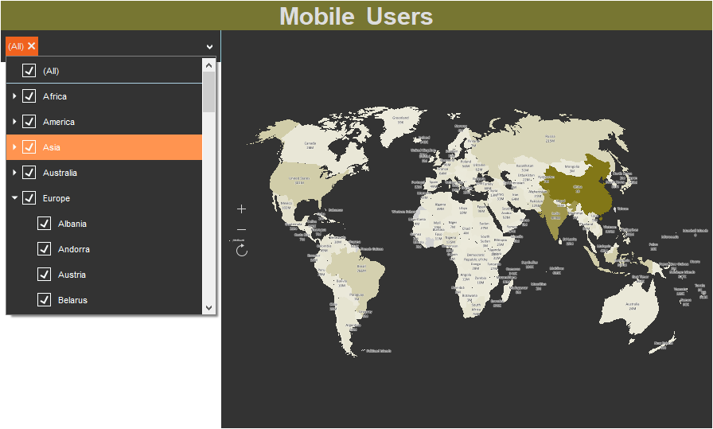
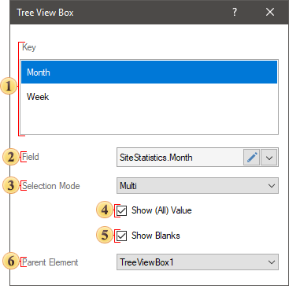

## Tree View Box

**Tree View Box** is a filtering element on the dashboard, which is used to create a hierarchy of values and filter data for analysis in the viewer by these values. It can be located anywhere on the dashboard panel. Depending on the size of the dashboard in the viewer, it can grow or shrink by width only.

This chapter will cover the following:

* [Tree View Box editor](#TreeViewBoxEditor);

* [Table Of Properties](#TableOfProperties).

The **Tree View Box** can be subordinate to other filtering elements, or be the main filtering element for them. The **Tree View Box** can work in two selection modes:

* **One**. In the viewer, you can select only one value within one level of the hierarchy of values. Accordingly, data filtering for the elements of the dashboard will be performed only by one value.

* **Multi**. In the viewer, you can select multiple values within the same level of the hierarchy of values. Accordingly, data filtering for the elements of the dashboard will be performed by all selected values.

You may setup the **Tree View Box** element in the editor. To call the editor, you should do the following in the report designer:

* Double-click the **Tree View Box** element;

* Select the **Tree View Box** element and select the **Design** command in the context menu.

> **Information**
>
> The search string for elements will be displayed automatically, if the number of values of the element will be 10.

The Tree View Box editor

In the **Tree View Box** editor, you can add items with data, set up the value selection mode, select the main filter item.

 The **Key** field. The data item is specified, the values of which will form the hierarchy and be displayed in the **Tree View Box** item.

 The **Field** field. Displays the expression of the selected item data field.

 The **Selection Mode** parameter. Specifies the number of simultaneously selected values of the element. A **Tree View Box** is one element or many elements.

 The **Show (All) Value** option. Enables the option to select all values in the **Tree View Box** element. If this option is enabled, the **Select (All) Value** value will be present in the Tree View Box element.

 The Show Blanks parameter allows you to display or not to display blank values from a data source in the list of the values of the current element.

 The **Parent Element** parameter. It is used to define the main filtering element for the current element. The data of these filter elements will be interrelated, and depending on the selected value of the main element, the list of values of the current element will be filtered.

Get acquainted with the step-by-step instruction in the [Dashboards with Tree View Box](../../Getting_Started/Dashboard_with_Tree_View_Box.md) chapter.

**List of properties**

The list shows the name and description of the properties of the element which you may find in the properties panel of the report designer.

**Name**

**Description**

Data Transformation

Customizes [the data transformation](Data_Transformation.md) of the current item.

Group

Adds the current item to a specific [group of items](../Groups.md).

Back Color

Changes the background color of the element. By default, this property is set to **From Style**, i.e. the color of the element will be obtained from the settings of the current element style.

Border

A group of properties that allows you to customize the borders of the element - color, sides, size, and style.

Corner Radius

It allows you to define the rounding radius for the corners of an element on the dashboard. You can round each corner of the element separately: Top - Left, Top - Right, Bottom - Right, Bottom - Left. The property can be set to a value between 0 and 30, where 0 is no rounding angle and 30 is the maximum value of the rounding radius.

Font

A group of properties defines the font family, its style, and size for the values of the element.

Fore Color

Specifies the color of the values of the element. By default, this property is set to **From Style**, i.e. the color of the values will be obtained from the settings of the current element style.

Shadow

A group of properties that allows configuring the shadow of an element:

The Color property allows you to specify the color that will be used to display the shadow of the element.

The properties in the Location group allow you to define the offset of the shadow along the X and Y coordinates, relative to the element's position on the indicator panel.

The Size property allows you to set the size of the shadow from the element's borders. It can be set to a value from 1 to 10, where 1 is the minimum size and 10 is the maximum size.

The Visible property allows you to enable or disable the display of the element's shadow on the indicator panel.

Style

Selects a style for the current element. The default it is set to **Auto**, i.e. the style of this element is inherited from the style of the dashboard.

Enabled

Enables or disables the current item on the dashboard. If the property is set to **True**, the current item is enabled and will be displayed when previewing the dashboard in the viewer. If this property is set to **False**, this element is disabled and will not be displayed when previewing the dashboard in the viewer.

Fixed Height

Allows setting the mode of fixed or change height.

Margin

A group of properties that allows you to define margin (left, top, right, bottom) of the value area from the border of this element.

Padding

A group of properties that allows you to define padding (left, top, right, bottom) of values from the range of values.

Text Format

Sets the formatting of values for the element.

Name

Changes the name of the current element.

Alias

Changes the alias of the current item.

Restrictions

Configures the permissions to use the current item in the dashboard:

The **Allow Change** option enables or disables changes of the element. If checked, the current item can be changed.

The **Allow Delete** option enables or disables the deletion of an element.

The **Allow Move** option allows or prohibits moving an element.

The **Allow Resize** option enables or disables resizing of an element.

The **Allow Select** option enables or disables the element selection.

Locked

Locks or unlocks resizing and replacement of the current element. If the property is set to **True**, the current element cannot be moved or resized. If this property is set to **False**, then this element can be moved and resized.

Linked

Binds the current location to the dashboard or another element. If the property is set to **True**, then the current item is bound to the current location. If this property is set to **False**, then this element is not tied to the current location.
