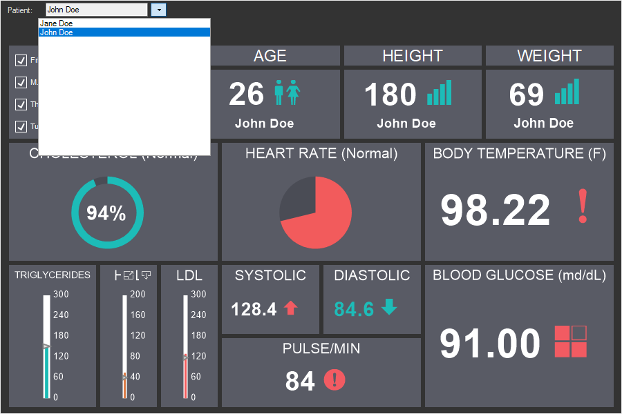
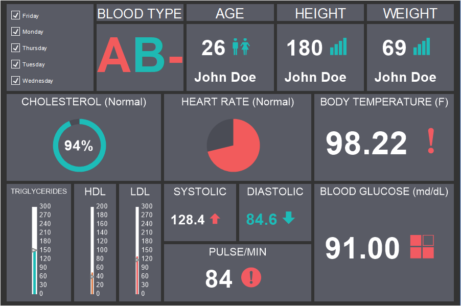
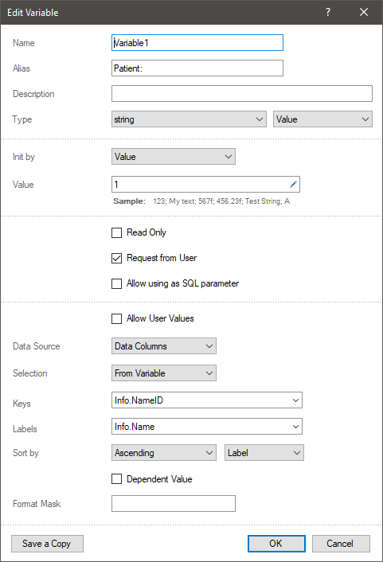
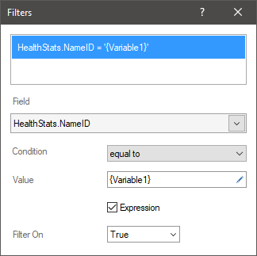
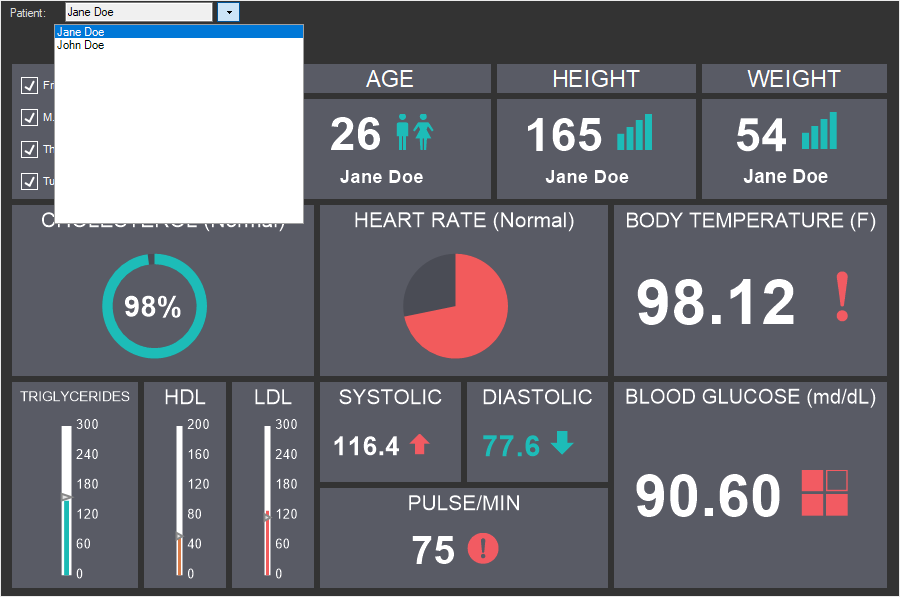

## Variables

Variables are used to pass a value to the elements of the dashboard panel, while filtering the data of these elements.

Variables can be:

* With user-selectable value, the user selects or enters a value, and the data of the elements of the dashboard panel will be filtered based on this value;

* Without user selection, the user does not select a value, but the elements of the dashboard panel are filtered by the value of the variable.

To create an dashboard with variables, you should:

* Create a variable in the data dictionary;

* Open or create a dashboard;

* Set filters for this item using a variable.

An example of a dashboard with a variable

Suppose there is a dashboard that displays the results of the examination of patients in a clinic.

At the same time, since there are more than one patients, it is necessary, when choosing a patient, to display the results of the his/her examination. In this case, it is necessary to create a variable with a list of patients, as well as provide the user to select the value of the variable. To do this:

Step 1: Go to the Data Dictionary;

Step 2: Select the New Variable command from the New Item menu or from the context menu of the dictionary;

Step 3: Specify the name, alias, description of the variable;

Step 4: Specify the data type of the variable. It should match the data type of the column by which the element data will be filtered;

Step 5: Specify the type of variable.

> **Information**
>
> At this moment, the dashboard panel only works with Value variables. If you need to use the selection of several values, then you can use such filter elements of the dashboard panel as the List and the Drop-down list.

Step 6: Select the method of initializing the variable as Value or Expression;

Step 7: Select the Request from User parameter if the user needs to select a value;

Step 8: Select the Allow User Values if you want to allow user input;

Step 9: Create a list of variable elements or select data columns with values;

Step 10: Specify whether the first value is obtained using the Select parameter.

Next, you need to set filters for elements that will be affected by the selected variable value. To do this:

Step 1: Select an item;

Step 2: Click the [Filters](Filters.md) button for this item;

Step 3: Indicate the data field by which the data will be filtered for the current element;

Step 4: Set the operation of the filter condition;

Step 5: Set the check box next to Expression;

Step 6: Provide a reference to the variable by name. For example, {Variable1}.

> **Information**
>
> Despite the fact that the Range variable is not supported when filtering on the dashboard panel, if you need to filter a range of values in elements, this can be done using variables. To do this, you should:
>
> Create two Value variables, where the first variable will represent the value of the range, and the second - its end.
>
> When creating an element filter, the operation of the filter condition is defined as Between.
>
> Indicate the first variable in the initial value field, and the second variable - in the end value field.
>
>
> So, in the report viewer, changing the values of variables will change the data filtering range.

Now, when viewing the dashboard panel, data can be filtered by the value of the variable. To do this:

Step 1: Open the dashboard panel in the preview panel or in the viewer;

Step 2: Select or enter a value if the variable provides for the selection or input of values;

Step 3: Click the Submit button on the options bar.

> **Information**
>
> You should know that when filtering data by variable values, you can also use several variables, including dependent variables. In addition, after filtering the data of the dashboard panel, you can filter the data using the elements [List Box](List_Box.md), [Combo Box](Combo_Box.md), [Date Picker](Date_Picker.md), [Tree View](Tree_View.md), [Tree View Box](Tree_View_Box.md).
