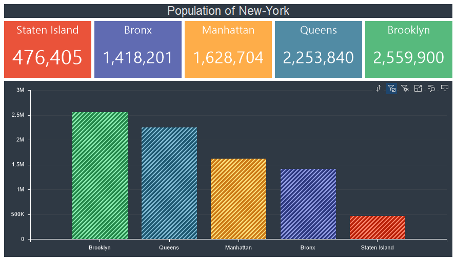

## Filtering data

One of the main principles of creating and using dashboards is the principle of the interaction of all elements for analysis and displaying data related between them. Thus, all data sources of the dashboard elements form virtual data tables for the current dashboard. This is necessary for the interaction of the dashboard elements with each other.

Data filtering is a selection of values from data sources by a specific condition. As a rule, the condition for selecting data is any value of a certain element in the dashboard panel.

Data filtering using the dashboard panel can be:

* Prior - filtering settings are defined in the report designer using the [Data Transformation](Data_Transformation.md), [Filters](Filters.md), [Top N](Top_N.md) and tools.

* [Interactive](Items_Correlation.md) - filtering settings are performed in the viewer through the interaction of the dashboard elements, the choice of the value of one element affects the values of other elements. For example, if in the viewer a certain segment is clicked on the map, the data from the virtual data table will be compared with the value of this segment, and filtered for other elements of this dashboard.

* Using data filtering elements: [List Box](List_Box.md), [Combo Box](Combo_Box.md), [Tree View](Tree_View.md), [Tree View Box](Tree_View_Box.md), [Date Picker](Date_Picker.md).
