## Gauge

**Gauge** is an element of the dashboard panel using which you can display the processed value from the data field.

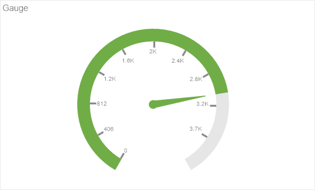

This chapter will cover the following:

* [Gauge Editor](#GaugeEditor);

* [Gauge Values](#GaugeValues);

* [Gauge Series](#GaugeSeries);
* [Gauge Types](#GaugeTypes);
* [Range of Values](#GaugeRange);
* [Colored Ranges](#ColorRange);
* [Table of Properties](#TableOfProperties).

You may adjust the **Gauge** element in its editor. To call the editor, you should:

* Double-click the mouse left button on the item;

* Select the **Gauge** element, and select the **Design** command in the context menu;

* Select the **Gauge** element, and, on the property panel, click the **Browse** button of the **Value** or **Series** properties.

**Gauge Editor**

In the this editor adjusts the gauge.

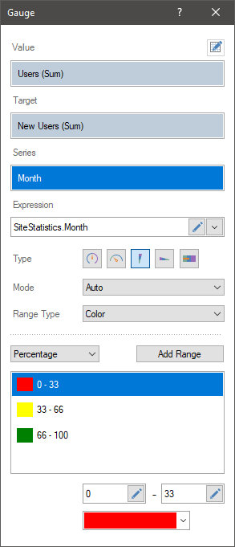

In the Gauge editor you can:

* Specify a data field with values for the gauge;

* Specify the series of the gauge;

* Specify a data field with target values for the gauge;

* Select **Type** of the gauge;

* Modify **Expression** of the selected element;

* Select and adjust the range of the gauge;

* Set the color palette of the gauge scale.

**Gauge values**

To create a gauge on the dashboard panel, you need a data field in the **Value** field. To do this:

* Drag and drop the data column from the dictionary to the **Value** field, and for newly added items, drag it into the editor or the gauge area.

* Create **New Field**. Set the expression for this element, the processing result of which will be the value for the gauge.

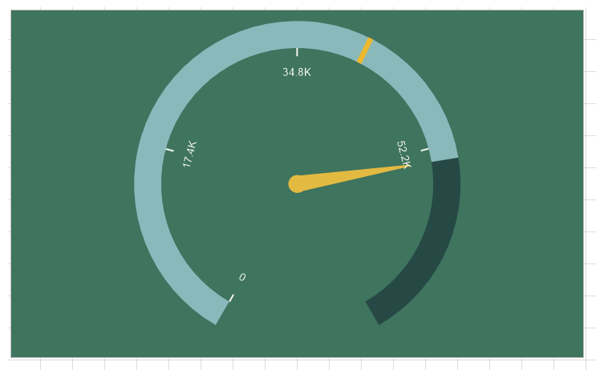

**Series of gauge**

A gauge series is a separate graphic element for a specific segment of values selected by a specific condition. The condition in this case will be the values of the data field which is indicated in the **Series** field.

For example, a data field with product prices is specified in the **Gauge** field. Without specifying the series one graphic element will be displayed, the value of which will be the sum of the prices of all products.

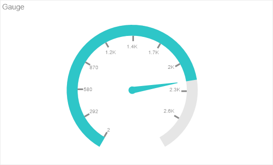

If you specify a data field with a list of products in series then, for every product, a graphic element will be displayed, the value of which will be the price of this product.

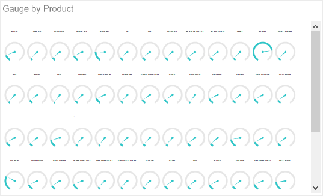

If you specify a data field with a list of product categories in series, then a graphic element will be displayed for every category. The value of this graphic element will be the sum of the prices of products included into this category.

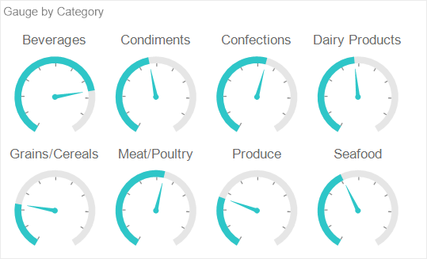

To specify the series of the gauge, you should do the following:

* Double-click the mouse left button on the gauge;

* In the element editor, drag and drop the data column from the dictionary to the **Series** field.

* Create **New Field** in the **Series** field. Set the expression for this element, the processing of which will be series for the gauge.

**Gauge types**

The gauge can be of the following types:

* Full Circular;

* Half-Circular;

* Vertical Linear;

* Horizontal Linear;

* Bullet.

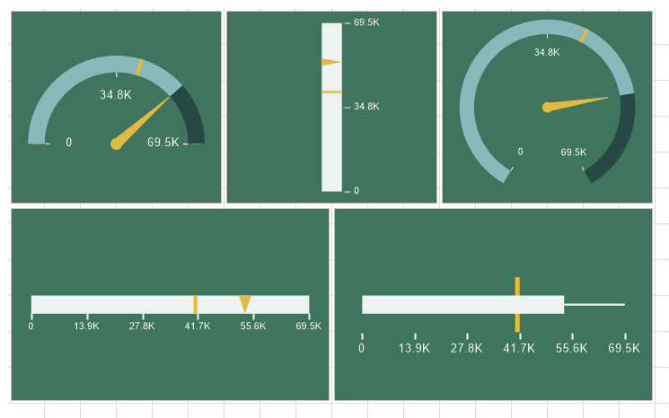

To change the type of a gauge, you should:

* Double-click the mouse left button on the gauge;

* Using the control buttons, select one of the types of a gauge.

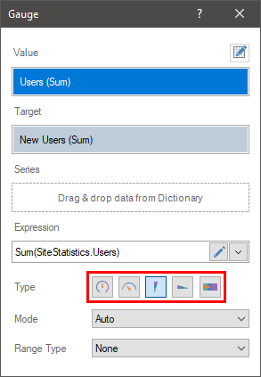

> **Information**
>
> Within the limits of one **gauge** element it is possible to use only one type of a gauge. Even in the case of multiple series, the type of the gauge will be the same for all values.

**Gauge range of values**

Regardless of the gauge type, its values and series, you can define a range of values. By default, the **AutoRange** mode is used. In this case, the initial and final value of the gauge scale is calculated automatically. However, if you need to specify a specific range of values, you should do the following:

* Double-click the mouse left button on the gauge;

* In the **Mode** field, left-click on the menu.

* Select **Custom** in the drop-down list.

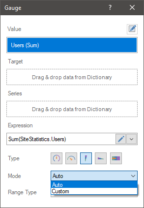

* In the **Minimum** field you should set the initial value of the gauge scale;

* In the **Maximum** field you should set the maximum value of the gauge scale;

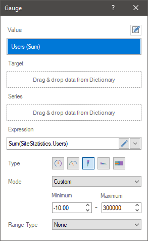

Select the **Auto** value in the **Mode** field to enable the automatic mode for calculating the range of values of the gauge scale.

**Multi-colored scale**

By default, the gauge scale is monochromatic. However, you can adjust the color for a specific range of the scale. To do this:

* Double-click the mouse left button on the gauge;

* Left-click in the **Range Type** field.

* Select **Color** in the drop-down list.

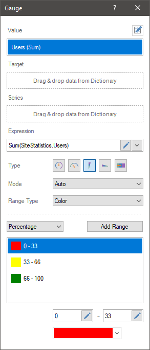

Then you should:

* Determine the type of values for the scale range - **Percentage** or **Value**;

* Customize the list of ranges;

* Customize every range by specifying the start - end values of the range and its color.

**List of properties**

The list shows the name and description of the properties of the element which you may find in the properties panel of the report designer.

| **Name** | **Description** |
| --- | --- |
| Cross-Filtering | It allows you to enable or disable the cross-filtering mode for the current element. |
| Data Transformation | Customizes the data transformation of the current item. |
| Group | Adds the current item to a specific [group of items](Groups.md). |
| Labels | The group of properties that allows you to set labels of values: The **Visible** property allows you to enable or disable the display of the value labels in the gauge; The **Placement** property allows you to change the placement of labels relative to the gauge scale – **Inside** or **Outside**. |
| Target | The group of properties, which allows you to customize the display of target value in an element: The **Show Label** property allows you to enable or disable the display of target value signature in an element; The **Placement** property allows you to define the placement of target value signature in an element - **Inside** or **Outside****.** |
| Back Color | Changes the background color of the element. By default, this property is set to **From Style**, i.e. the color of the element will be obtained from the settings of the current element style. |
| Border | A group of properties that allows you to customize the borders of the element - color, sides, size, and style. |
| Corner Radius | It allows you to define the rounding radius for the corners of an element on the dashboard. You can round each corner of the element separately: **Top - Left**, **Top - Right**, **Bottom - Right**, **Bottom - Left**. The property can be set to a value between 0 and 30, where 0 is no rounding angle and 30 is the maximum value of the rounding radius. |
| Font | A group of properties defines the font family, its style, and size for the values of the element. |
| Fore Color | Specifies the color of the values of the element. By default, this property is set to **From Style**, i.e. the color of the values will be obtained from the settings of the current element style. |
| Shadow | A group of properties that allows configuring the shadow of an element: The **Color** property allows you to specify the color that will be used to display the shadow of the element. The properties in the **Location** group allow you to define the offset of the shadow along the X and Y coordinates, relative to the element's position on the indicator panel. The **Size** property allows you to set the size of the shadow from the element's borders. It can be set to a value from 1 to 10, where 1 is the minimum size and 10 is the maximum size. The **Visible** property allows you to enable or disable the display of the element's shadow on the indicator panel. |
| Style | Selects a style for the current element. The default it is set to **Auto**, i.e. the style of this element is inherited from the style of the dashboard. |
| Enabled | Enables or disables the current item on the dashboard. If the property is set to **True**, the current item is enabled and will be displayed when previewing the dashboard in the viewer. If this property is set to **False**, this element is disabled and will not be displayed when previewing the dashboard in the viewer. |
| Interaction | Sets [interaction](Interaction.md) of the current element. |
| Margin | A group of properties that allows you to define margin (left, top, right, bottom) of the value area from the border of this element. |
| Padding | A group of properties that allows you to define padding (left, top, right, bottom) of the graphic element area from the margin of the value area. |
| Show Blanks | Allows displaying or hiding the label "Show (blank)" in the dashboard element when there is no data available for that element. |
| Title | A group of properties that allows you to customize the title of the element: The **Back Color** property provides the ability to change the background color of the title of the current item. By default, this property is set to **From Style**, i.e. the background color will be obtained from the style settings of the current element. **Fore Color** allows you to change the text color of the title of the current item. By default, this property is set to **From Style**, i.e. the text color of the title will be obtained from the settings of the current element style The group property **Font** that allows you to define the font family, its style and size for the title of the current element. The **Horizontal Alignment** property provides the ability to change the title alignment relative to the element - Left, Center, Right. The **Text** property is used to set the title text of the current element. The **Visible** property is used to enable or disable displaying of the title of the current item. If the property is set to **True**, then the element title will be included. If this property is set to **False**, then the element header will be disabled. |
| Value Format | It allows you to set  the formatting of labels of scales for the current element. |
| Name | Changes the name of the current element. |
| Alias | Changes the alias of the current item. |
| Restrictions | Configures the permissions to use the current item in the dashboard: The **Allow Change** option enables or disables changes of the element. If checked, the current item can be changed. The **Allow Delete** option enables or disables the deletion of an element. The **Allow Move** option allows or prohibits moving an element. The **Allow Resize** option enables or disables resizing of an element. The **Allow Select** option enables or disables the element selection. |
| Locked | Locks or unlocks resizing and movement of the current element. If the property is set to **True**, the current element cannot be moved or resized. If this property is set to **False**, then this element can be moved and resized. |
| Linked | Binds the current location to the dashboard or another element. If the property is set to **True**, then the current item is bound to the current location. If this property is set to **False**, then this element is not tied to the current location. |
