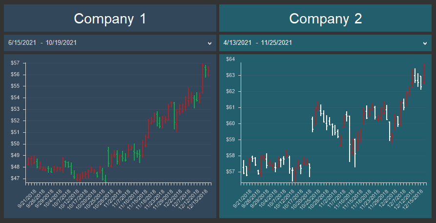

## Groups

By default, all elements on the dashboard are related to each other, which means that data filtering of one element affects the data filtering of other elements. However, when designing a dashboard, it is possible to split the elements of the dashboard into groups. For example, you want to display statistics for two unrelated companies in one dashboard. In this case, the elements of the dashboard should be split into groups, where the first group is one company and the second group is another company.

This chapter will cover the following:

* [Creating groups](#CreatingGroup);

* [Removing elements from the group](#RemoveItems).

The belonging of an element to a group can be determined using the **Group** property. By default, this property is empty for an element, and it does not belong to any group. The group of elements in the dashboard is a set of elements for which the value of the **Group** property matches.

> **Information**
>
> You should know that using the **Group** property, you can also create relationships between elements that are located on different dashboards within the same report. For this, those elements must belong to the same group, the values of the **Group** property of those elements must be identical.

**Creating groups**

Do the following to create a group of items on the dashboard:

* Select the elements;

* Specify any value in the **Group** property .

To add an element to a group, you should do the following:

* Select an element in the dashboard;

* In the **Group** property, specify the group value that is the same as for other elements in this group.

**Removing elements from the group**

* To remove an element from the group you should select it in the dashboard;

* Delete a specified value from the **Group** property.

You can also select several elements in the dashboard and delete the value from the **Group** property.
