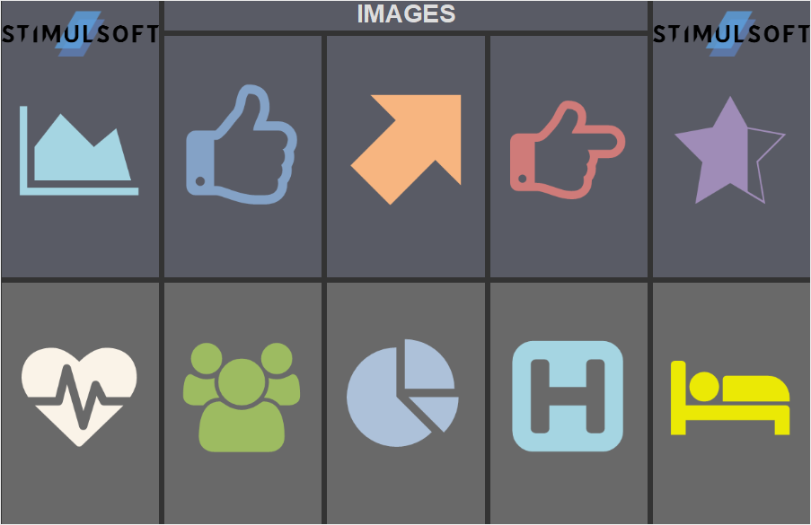
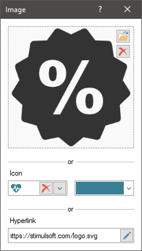

## Image

**Image** is an element with which you can display various graphical objects (photo, logo, picture, etc.) on the dashboard. The Image element supports the following types of graphics - BMP, PNG, JPEG, TIFF, GIF, PNG, ICO, EMF, WMF, SVG.

This chapter will cover the following:

* [Image editor](#ImageEditor);

* [Element settings](#Settings);

* [Table of properties](#TableOfProperties).

> **Information**
>
> [Interaction](Interaction.md) can be applied to the current element.

The image can be placed anywhere on the dashboard. Setting up the source for the image element is carried out in its editor. To call the editor, you should:

* Double-click on the Image element;

* Select the Image item, and select the Design command in the context menu;

* Select the Image item, and, on the property panel, click the **Browse** button of the Image, Hyperlink properties of the image.

To resize an image element you should:

* Select it in the dashboard;

* Increase or decrease the size of the element vertically, horizontally or diagonally.

**Image editor**

In the editor you can indicate the source of the image for the current element. Within one element, you can display only one graphic object (picture, logo, photo, an image by hyperlink).

* In the **Image** field you can upload an image from the local storage.

* In the Icon field, you can select an icon for the Image element and the color of this icon.

* In the **Hyperlink** field, the link to the graphic object is indicated. This can be either a URL or a link to a report resource (resource://logo). In addition, you can specify a link to the datacolumn://DataSource.DataColumn data column which contains an image in the base64 encoding or variable - variable://variablename.

> **Information**
>
> Since only one graphic object can be displayed in one element, the image can have only one source. The order in which the object is shown in the image element is as follows:
>
> An image uploaded from the local storage has the highest priority. This image will overlap the selected icon or image by hyperlink;
>
> An icon has a medium priority. It will be displayed in the current element if the image from the local storage is not loaded, but regardless of the specified hyperlink.
>
> An image by a hyperlink has the lowest priority. The hyperlink will upload the image in the current element if the image from the local storage is not loaded, and the icon is not selected.
>
>
> Thus, if a graphic object is loaded directly in the Image element, the image receiving hyperlink or the selected icon will not work.

**Element settings**

Any graphic object added to the element is stretched to the entire area of ​​the element, with the exception of the specified margins and padding. The setting of the graphic object in the element is carried out using buttons on the ribbon panel or using properties on the property panel. All these properties are located in the Image additional group:

* The **Aspect Ratio** property. When stretching an image, its proportions may be broken. To stretch the Image element while maintaining the proportions of the graphic object, you should set the Aspect Ratio property to **true**.

* The **Horizontal Alignment** property is relevant if the **Aspect Ratio** property is set to **true**. Horizontal alignment of the graphic object within the Image element. You can also specify the horizontal alignment using the buttons on the Ribbon panel.

* The **Vertical Alignment** property is relevant if the **Aspect Ratio** property is set to **true**. Vertical alignment of the graphic object within the Image element. You can also specify the vertical alignment using the buttons on the Ribbon panel.

**List of properties**

The list shows the name and description of the properties of the element which you may find in the properties panel of the report designer.

**Name**

**Description**

Aspect Ratio

Provides the option of the aspect ratio of the image in the current element. If the property is set to **True**, then the aspect ratio of the image in the current element will be saved. If this property is set to **False**, then the aspect ratio will not be taken into account and the image will not stretch proportionally.

Cross-Filtering

It allows you to enable or disable the cross-filtering mode for the current element.

Group

It allows you to add the current element to a definite group of elements.

Horizontal alignment

Changes the horizontal alignment of the image in the current element.

Vertical alignment

Changes the vertical alignment of the image in the current element.

Back Color

Changes the background color of the element. By default, this property is set to **From Style**, i.e. the color of the element will be obtained from the settings of the current element style.

Border

A group of properties that allows you to customize the borders of the element - color, sides, size, and style.

Corner Radius

It allows you to define the rounding radius for the corners of an element on the dashboard. You can round each corner of the element separately: Top - Left, Top - Right, Bottom - Right, Bottom - Left. The property can be set to a value between 0 and 30, where 0 is no rounding angle and 30 is the maximum value of the rounding radius.

Shadow

A group of properties that allows configuring the shadow of an element:

The Color property allows you to specify the color that will be used to display the shadow of the element.

The properties in the Location group allow you to define the offset of the shadow along the X and Y coordinates, relative to the element's position on the indicator panel.

The Size property allows you to set the size of the shadow from the element's borders. It can be set to a value from 1 to 10, where 1 is the minimum size and 10 is the maximum size.

The Visible property allows you to enable or disable the display of the element's shadow on the indicator panel.

Style

Selects a style for the current element. The default it is set to **Auto**, i.e. the style of this element is inherited from the style of the dashboard.

Enabled

Enables or disables the current item on the dashboard. If the property is set to **True**, the current item is enabled and will be displayed when previewing the dashboard in the viewer. If this property is set to **False**, this element is disabled and will not be displayed when previewing the dashboard in the viewer.

Interaction

Sets [interaction](Interaction.md) of the current element.

Margin

A group of properties that allows you to define indents (left, top, right, bottom) of the value area from the border of this element.

Padding

A group of properties that allows you to define indents (left, top, right, bottom) of the columns from the range of values.

Title

A group of properties that allows you to customize the title of the **Table** element:

The **Back Color** property provides the ability to change the background color of the title of the current item. By default, this property is set to **From Style**, i.e. the background color will be obtained from the style settings of the current element.

Fore Color allows you to change the text color of the title of the current item. By default, this property is set to **From Style**, i.e. the text color of the title will be obtained from the settings of the current element style

The group property **Font** that allows you to define the font family, its style and size for the title of the current element.

The **Horizontal Alignment** property provides the ability to change the title alignment relative to the element - Left, Center, Right.

The **Text** property is used to set the title text of the current element.

The Visible property is used to enable or disable displaying of the title of the current item. If the property is set to **True**, then the element title will be included. If this property is set to **False**, then the element header will be disabled.

Name

Changes the name of the current element.

Alias

Changes the alias of the current item.

Restrictions

Configures the permissions to use the current item in the dashboard:

The **Allow Change** option enables or disables changes of the element. If checked, the current item can be changed.

The **Allow Delete** option enables or disables the deletion of an element.

The **Allow Move** option allows or prohibits moving an element.

The **Allow Resize** option enables or disables resizing of an element.

The **Allow Select** option enables or disables the element selection.

Locked

Locks or unlocks resizing and movement of the current element. If the property is set to **True**, the current element cannot be moved or resized. If this property is set to **False**, then this element can be moved and resized.

Linked

Binds the current location to the dashboard or another element. If the property is set to **True**, then the current item is bound to the current location. If this property is set to **False**, then this element is not tied to the current location.
