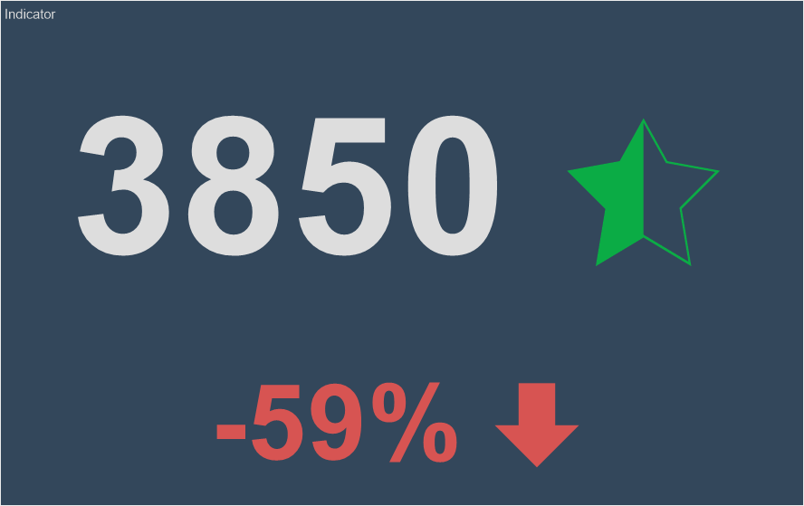
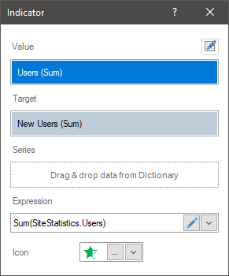
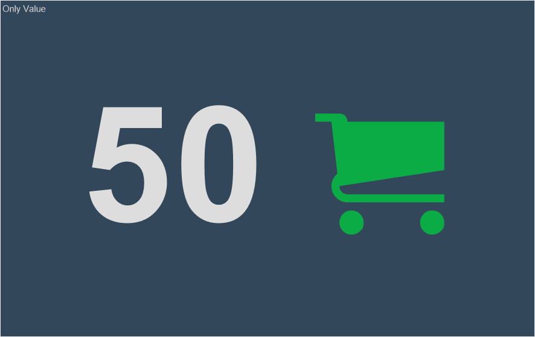
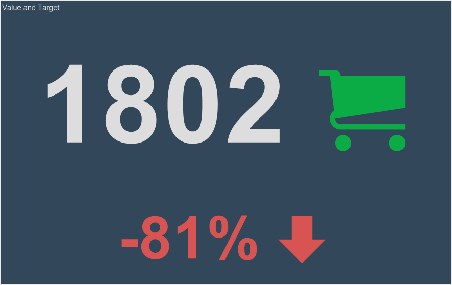
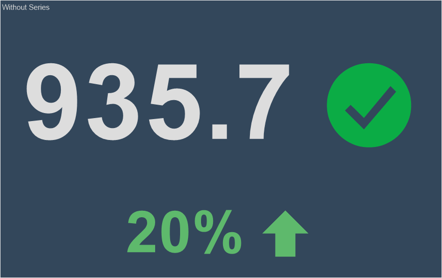
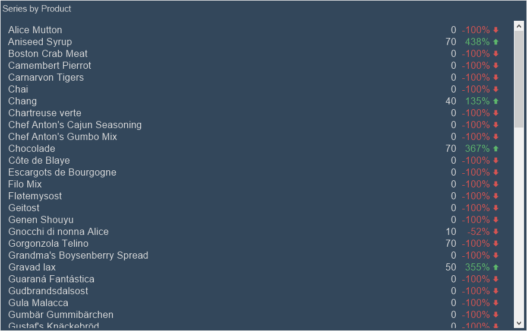
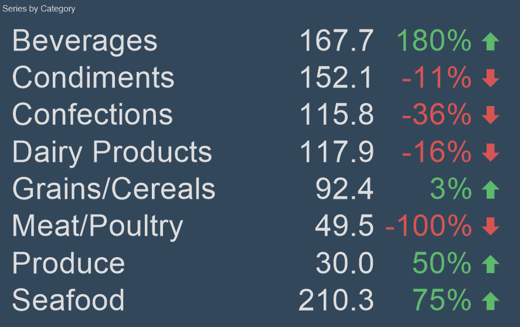
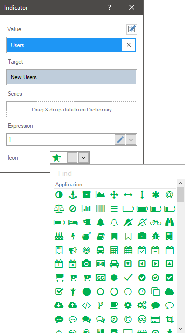
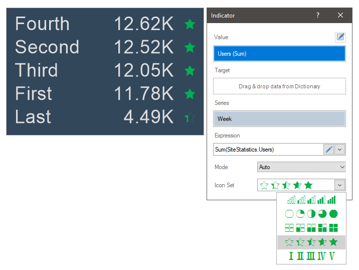

## Indicator

**Indicator** is an element of the dashboard that represents the ability to display the aggregated value of the data field, as well as the rate of increase of this value to the target. In addition, the growth rate and the aggregated value of the indicator can be grouped by a condition.

This chapter will cover the following:

* [Indicator Editor](#IndicatorEditor);

* [Indicator Value](#IndicatorValue);

* [Indicator Target Value](#IndicatorTarget);
* [Indicator Series](#IndicatorSeries);
* [Indicator Icon](#IndicatorIcon);

* [Glyph Color](#glyphcolor);
* [Table of Properties](#TableOfProperties).

To display the **Indicator**, you should add a data item in the **Value** field. In this case, the value will be displayed with a specific graphic element. Also to display the growth rate, it is necessary to set the data element in the **Target** field. The settings of the **Indicator** element can be done in the element editor. To call the editor, you should:

* Double-click on the **Indicator** element;

* Select the **Indicator** element and select the **Design** command in the context menu;

* Select the **Indicator** element, and, on the property panel, click the **Browse** button of the Value, Target, and Series properties.

> **Information**
>
> [Text formatting](Appearance.md#TextFormat) can be applied to the values of the current element.

**Indicator editor**

In the **Indicator** editor, you can add elements with data, edit the expressions of these elements, select a graphic element to indicate the value.

In the **Indicator** editor you can:

* Specify the data field for the Indicator value;

* Specify the data field for the target value of the Indicator;

* Specify the data field for the series of the Indicator;

* Select a graphic element to display the value.

**Indicator value**

In the value field, you can specify only one data field. All values of this field will be aggregated, i.e. a function will be applied to them. By default, this is a summation function for numeric values. If a field with non-numeric values is added, then by default the function of the number of rows in this data field is applied to them.

> **Information**
>
> In the **Indicator** element, you can specify only the value. In this case, the aggregated value of the data field will be displayed with a specific graphic element, without a growth rate.

**Target value**

To use the indicator to display the growth rate, besides the value in the indicator, it is necessary to indicate the target value. The target value is the aggregated value of the data field specified in the **Target** field of the indicator. In the **Target** field, you can specify only one data field. By default, the summation function for numeric values is applied to the data field in the **Target** field. If a data field with non-numeric values is added, then, by default, the function of counting the number of rows in this data field is applied to it.

> **Information**
>
> If only the target value is specified in the **Indicator** element but the value of this indicator is not indicated, then the growth rate in the indicator will be -100 percent.

The target value is not displayed in the indicator, but it is involved in the calculation of the **Variation** value. The variation value is expressed as a percentage and can display either the percentage of the value from the target value or the variation of the value from the target value. The variation display mode depends on the value of the **Target Mode** property.

**Indicator series**

The indicator series is a separate indicator for a specific segment of values selected by a specific condition. The condition in this case will be the values of the data element that is specified in the **Series** field.

For example, in the **Value** field on the indicator, a data field with the number of orders issued is set, and in the Target field you set the planned number of orders. Without a series, only one indicator will be displayed. The indicator value will be the aggregated value of the data field specified in the Value field. All data field values form the **Target** field will also be aggregated. Based on the value and the target value, the indicator will be displayed with the growth rate.

If you specify a data field with a list of products in series, then the indicator will be displayed for every product, i.e. for each product, the number of orders issued and the rate of growth of orders for each product will be displayed.

If you specify a data field with a list of product categories in series, then an indicator will be displayed for each category, i.e. the indicator value and growth rate will be calculated by processing the values and growth rate of all products included into this category. In other words, the values and growth rate of each product will be grouped into categories to which they relate.

To set the series of the indicator, you should:

* Double-click the left mouse button on **Indicator**;

* Drag and drop the data column from the dictionary to the **Series** field.

* Create **New Field** in the **Series** field. Set the expression for this element, the processing of which will be the values of the series of the indicator.

**Graphic element of value**

When creating an indicator for a value, you can select a graphic element. To do this:

* Call the editor of the element;

* Click the **Browse** button in the **Icon** field, and select the icon in the drop-down list.

If rows and target value are specified in an indicator, you can`t specify an icon for the indicator. However, if values and rows are specified in an indicator, you can specify a set of icons for indicators or ranges of values for each icon. Let's have a look at the example.

Let`s specify rows for an indicator. In this case, you can select a set of icons for the indicator. The minimum value of the indicator will be assigned to the first icon from the set, the maximum - to the last one. The value range will be divided into the number of icons in the set, and depending on which part of the value range the value of the row belongs to, one or another icon from the set will be assigned. By default, the **Mode** property is set to the **Auto** value, i.e. the calculation of the range of values by parts is performed automatically.

Also, you can divide the range of values manually, and for each part of the range, you can assign a different icon. To do this, you should set the **Mode** property to the **Custom** value. This will display additional controls that can be used to customize each part of the indicator values range. You should click the **Add Range** button, define its numerical boundaries, select an icon for each part of the range. It is worth considering that parts of the range can be defined as absolute or relative. This depends on the range type parameter - **Percentage** or **Value**.

If you select a type as **Percentage**, the boundaries of the value range part is the percentage size of the current part from the relative value of the range. For example, from 0 to 50 percent means that it will be a part from the beginning to the average number of the range values. If you select a type as **Value**, the range part boundaries are absolute range boundaries. For example, from 0 to 50 means that it will be the portion from the numeric value 0 to the numeric value 50.

**Glyph Color**

By default, icon color is assigned from the element style. You can change it using the **Glyph Color** property of the indicator. When using a set of icons for indicator series, the color of these icons will be the same. However, you can change the color of the icon depending on the value using [Conditional Formatting](Conditions.md#conditionparametersofindicator).

**List of properties**

The list shows the name and description of the properties of the element which you may find in the properties panel of the report designer.

| **Name** | **Description** |
| --- | --- |
| Cross-Filtering | It allows you to enable or disable the cross-filtering mode for the current element. |
| Data Transformation | Customizes the data transformation of the current element. |
| Group | Adds the current item to a specific [group of items](Groups.md). |
| Target Mode | It allows you to calculate target indicator: **Variation** or **Percentage**. |
| Back Color | Changes the background color of the element. By default, this property is set to **From Style**, i.e. the color of the element will be obtained from the settings of the current element style. |
| Border | A group of properties that allows you to customize the borders of the element - color, sides, size, and style. |
| Conditions | Customizes the [conditions element of the indicator](Conditions.md#conditionparametersofindicator). |
| Corner Radius | It allows you to define the rounding radius for the corners of an element on the dashboard. You can round each corner of the element separately: **Top - Left**, **Top - Right**, **Bottom - Right**, **Bottom - Left**. The property can be set to a value between 0 and 30, where 0 is no rounding angle and 30 is the maximum value of the rounding radius. |
| Font | A group of properties defines the font family, its style, and size for the values of the element. |
| Font Size Mode | It allows you to define mode, size for the font of an indicator value or deviation value. The following values are available: **Auto**. In this case, the font size of an indicator values is automatically changed depending on the size of the current element; **Value**. In this case, you can change the size of an indicator value using the **Size** property from the **Font** group of properties; **Target**. In this case, you can change the size of an indicator deviation value using the **Size** property from the **Font** group of properties. |
| Fore Color | Specifies the color of the values of the element. By default, this property is set to **From Style**, i.e. the color of the values will be obtained from the settings of the current element style. |
| Glyph Color | Changes the color of the glyph. |
| Shadow | A group of properties that allows configuring the shadow of an element: The **Color** property allows you to specify the color that will be used to display the shadow of the element. The properties in the **Location** group allow you to define the offset of the shadow along the X and Y coordinates, relative to the element's position on the indicator panel. The **Size** property allows you to set the size of the shadow from the element's borders. It can be set to a value from 1 to 10, where 1 is the minimum size and 10 is the maximum size. The **Visible** property allows you to enable or disable the display of the element's shadow on the indicator panel. |
| Style | Selects a style for the current element. The default it is set to **Auto**, i.e. the style of this element is inherited from the style of the dashboard. |
| Enabled | Enables or disables the current item on the dashboard. If the property is set to **True**, the current item is enabled and will be displayed when previewing the dashboard in the viewer. If this property is set to **False**, this element is disabled and will not be displayed when previewing the dashboard in the viewer. |
| Icon Alignment | Changes alignment of the element icon. |
| Interaction | Sets [interaction](Interaction.md) of the current element. |
| Margin | A group of properties that allows you to define margin (left, top, right, bottom) of the value area from the border of this element. |
| Padding | A group of properties that allows you to define padding (left, top, right, bottom) of the columns from the range of values. |
| Show Blanks | Allows displaying or hiding the label "Show (blank)" in the dashboard element when there is no data available for that element. |
| Text Format | Sets the [formatting values](../Report_Internals/Text_Formatting/index.md) of the element. |
| Target Format | Sets the formatting targets of the element. |
| Title | A group of properties that allows you to customize the title of the element: The **Back Color** property provides the ability to change the background color of the title of the current item. By default, this property is set to **From Style**, i.e. the background color will be obtained from the style settings of the current element. Fore Color allows you to change the text color of the title of the current item. By default, this property is set to **From Style**, i.e. the text color of the title will be obtained from the settings of the current element style The group property **Font** that allows you to define the font family, its style and size for the title of the current element. The **Horizontal Alignment** property provides the ability to change the title alignment relative to the element - Left, Center, Right. The **Text** property is used to set the title text of the current element. The **Visible** property is used to enable or disable displaying of the title of the current item. If the property is set to **True**, then the element title will be included. If this property is set to **False**, then the element header will be disabled. |
| Name | Changes the name of the current element. |
| Alias | Changes the alias of the current item. |
| Restrictions | Configures the permissions to use the current item in the dashboard: The **Allow Change** option enables or disables changes of the element. If checked, the current item can be changed. The **Allow Delete** option enables or disables the deletion of an element. The **Allow Move** option allows or prohibits moving an element. The **Allow Resize** option enables or disables resizing of an element. The **Allow Select** option enables or disables the element selection. |
| Locked | Locks or unlocks resizing and movement of the current element. If the property is set to **True**, the current element cannot be moved or resized. If this property is set to **False**, then this element can be moved and resized. |
| Linked | Binds the current location to the dashboard or another element. If the property is set to **True**, then the current item is bound to the current location. If this property is set to **False**, then this element is not tied to the current location. |
