## Interaction

When viewing the dashboard, its elements may have certain interactive features. In other words, depending on the impact of users on the elements of the dashboard, various actions can be carried out.

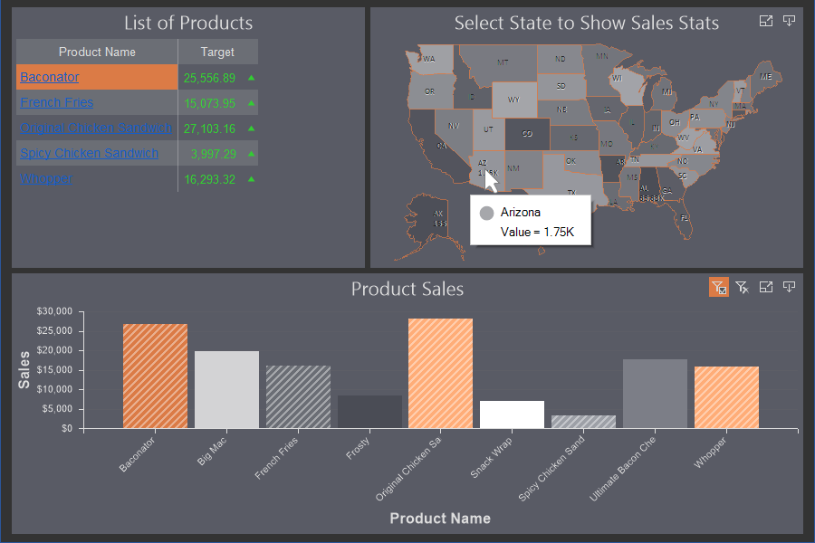

This chapter will cover the following:

* [Interaction editor](#InteractionEditor);

* [Table element interaction](#TableInteraction);

* [The Interaction editor for Table data fields](#InteractionEditorForTableFields);

* [Tool tips](#ToolTips);

* [Showing dashboard](#ShowDashboard);

* [Parameters](#Parameters);

* [Drill Down](#DrillDown);

* [Drill down with filtering](#DrillDownWithFilters);

* [Drill down without filtering](#DrillDownWithOutFilters);

* [Drill down order for data fields](#OrderDataFields).

* [The table of parameters in the editor interaction](#tableofinteractionparameters).

The user actions for viewing the dashboard include:

* Cursor hover over the value of the dashboard element;

* Single click with the left button of the mouse or touch the element value of the dashboard.

The interactive actions of the dashboard panel include:

* Displaying additional information on the values of the dashboard element as a **Tool Tip**. It can occur only when the user hovers the cursor.

* Filtering data. It can occur only when a user clicks on an element or when a user touches an element value.

* Following the hyperlink. It can occur only when a users clicks on an element or when a user touches an element value.

* [Showing dashboard](#ShowDashboard) can occur only with a single left-click on the input cursor or when a user touches an element value.

* [Drill-down](#DrillDown) of values of a dashboard element.

In addition to this, an element can have the following features when viewing:

* Sorting data of element;

* View data of element;

* Element view in full screen;

* Export of element;

* Disable data columns for the Table element.

You can specify interactive element actions in the **Interaction** editor. To call the editor you should:

* Select an element on the dashboard in the report designer;

* Click the **Interaction** button on the **Home** tab of the Ribbon panel of the report designer.

Interactive actions are not available for the following items:

* Panel;

* Shape;

* Filtering elements: [List Box](Data_Filtering/List_Box.md), [Combo Box](Data_Filtering/Combo_Box.md), [Tree View](Data_Filtering/Tree_View.md), [Tree View Box](Data_Filtering/Tree_View_Box.md), [Date Picker](Data_Filtering/Date_Picker.md).

**Interaction editor**

In this editor, every action is represented as a separate group of parameters with which you can customize an interactive action.

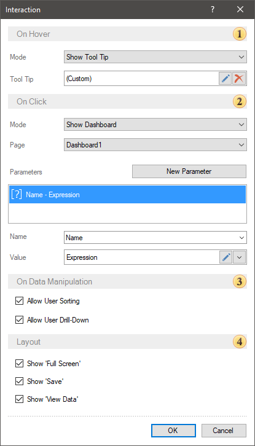

 The **On Hover** group of parameters is used to define settings for an interactive action when hovering the cursor over the value of a dashboard element. The **Mode** parameter allows you to select the type of the interactive action:

* **None** - when you hover the cursor over the value of the dashboard element, no action will occur

* **Show Tool Top** - when the user hovers the cursor over the value of the element of the dashboard, certain information will be displayed. Also, if you select this type of action, the **Tool Tip** option will be available. You can create and design a custom tool tip. By default, a standard tool tip is used for every element.

* **Show Hyperlink** - when the user hovers the cursor over the value of the element, the hyperlink specified in the **On Click** group will be displayed.

 The **On Click** group of parameters allows you to define an interactive action when you click the left button of the mouse or touch the value of a dashboard element. The **Mode** parameter allows you to select the type of interactive action:

* **None** - when clicking on the value of the dashboard element, no action will occur;

* **Apply Filter** - when you click on the value of the dashboard item, the dashboard data will be filtered through the [interrelation of its elements](Data_Filtering/Items_Correlation.md).

* **Open Hyperlink** - when you click on the value of the dashboard item, the follow by the hyperlink will occur. Also, when this type of action is selected, the **Hyperlink** parameter will be displayed, in the value field of which you should specify a hyperlink.

* Show Dashboard. When clicking on the value of a dashboard element, another specified dashboard will open.

* Drill Down. When clicking on the value of an element, a transition to the lower level of the data hierarchy will occur. You should enable the data drill down mode using the Allow User Drill Down option.

 The On Data Manipulation group of parameters is used to customize the data management of the current item.

* The Allow User Sorting parameter is used to enable/disable interactive sorting when viewing dashboards.

* The Allow User Drill Down parameter is an item of the dashboard that enables data drill down mode.

 This group of parameters can be used to enable or disable the Full Screen, View Data and Save buttons in the viewer or in the preview panel for the current dashboard element.

**Information**

Drill down of element data can be carried out [with the Apply Filter](#DrillDownWithFilters) action or [without it](#DrillDownWithOutFilters).

**Table element interaction**

In the **Table** element, you can configure interaction both for each column of this table, and for the entire element. You can setup interactive actions in the **Interaction** editor.

For a column of the **Table** element you can:

* Specify a hyperlink for all values of this column. Only for the fields of the Dimension type. You should define a hyperlink in the Table element having set a check next to the Show Hyperlink parameter and having set an address in an appropriate field.

* Display a tool tip or a hyperlink when you hover over a column value;

* Filter by value by a single click.

For the entire **Table** element, you can:

* Enable or disable sorting in value column titles;

* Enable or disable data filtering commands in value column titles.

To invoke the **Interaction** editor for a column of values, you should:

* Select the data field in the **Table** element editor;

* Click the **Edit** button of the **Interaction** parameter.

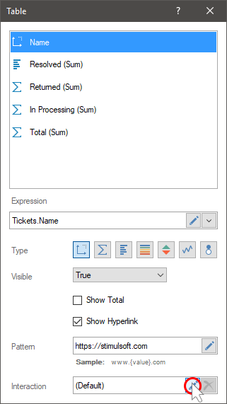

To invoke the **Interaction** editor of the **Table** element you should:

* Select an item on the dashboard panel;

* Click the **Browse** button on the **Interaction** property in the property panel.

**The Interaction editor for Table data fields**

You can configure Interactive actions for every data field. To do this, select the data field and click the **Edit** button in the **Table** editor.

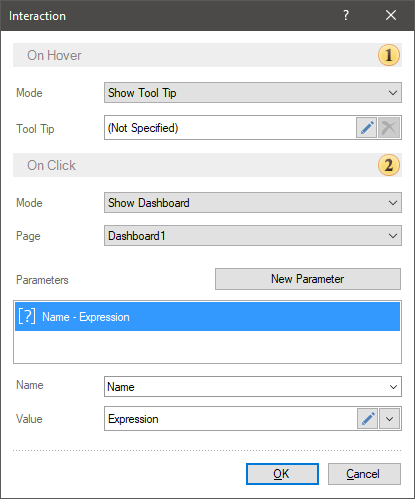

 The **On Hover** group of parameters is used to define settings for the **Interactive** action when you hover over a data field value. The **Mode** parameter allows you to select the type of the interactive action:

* **None** - when you hover the cursor over the value of data fields, no action will occur;

* **Show Tool Top** - when the user hovers the cursor over the value of the data fields of the dashboard, certain information will be displayed. Also, if you select this type of action, the **Tool Tip** option will be available. You can create and design a custom tool tip.

* **Show Hyperlink** - when the user hovers the cursor over the data fields, the hyperlink for this data filed will be displayed. If the hyperlink is not set, then the value itself will be displayed when hovering over the value.

 The **On Click** group of parameters allows you to set an interactive action when you click with the left button of a mouse or touch the value of a data field. The **Mode** parameter allows you to select the type of an interactive action:

* **None** - when you click on the value of the data field, no action will occur. You should know that, if a hyperlink is specified for the values of the data field, then you can follow by this hyperlink.

**Apply Filter** - when you click on the value of the data field, the data of the dashboard will be filtered through [the interrelation of its elements](Data_Filtering/Items_Correlation.md).

* The Show Dashboard, i.e when clicking on a data field value another dashboard will be displayed. Also, the parameters can be transferred.

Tooltips
A tooltip is a message that appears when you hover over the value of an item. The following types of tooltips are available for dashboard elements:

* Value or text, and combinations of them. To do this, set the Mode property to the Show tooltip value.

* The hyperlink that is set for the current values. To do this, you should set the Mode property to the Hyperlink value.

You can setup tooltips (value, text) in the editor. To call the editor, click the Edit button of the Display tooltip action.

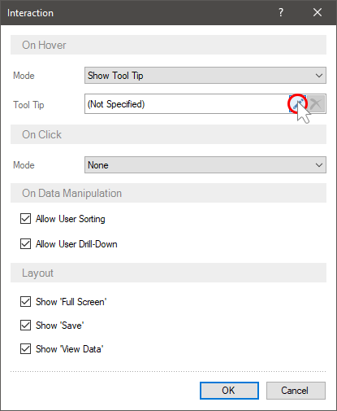

The editor will open and you may configure the tooltip.

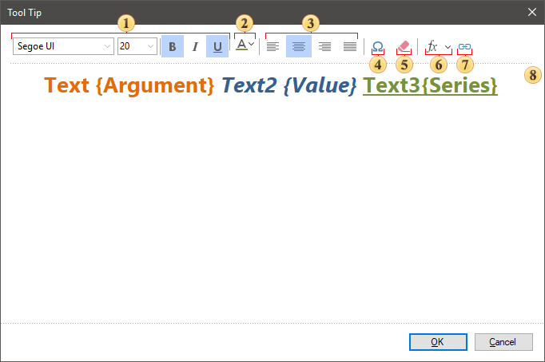

 Options are used to customize text style such as font family, size, style, and color.

 Sets the color of the text or its characters. Each character of the text can select its own color. To do this, select the character in the field and select a color from the palette or enter a color value in the RGBA format.

 Text alignment options - left, center, right, justify.

 The Insert Symbol command calls the menu with a set of various icons, which can be inserted to a tool tip text.

 Command is used to delete text of a tooltip.

 The function menu contains variables. Each variable is an element data field and contains a list of values ​​for this data field. Adding a variable to the tooltip for the item value, the tooltip will display the corresponding value from a specific data field.

 The Insert Link allows you to insert an URL address. In the hyperlink editor you should specify an URL address and the text that wil be displayed instead of this address.

 Tooltip template. In the current example, the tooltip uses the text and variables of the [Chart element](Chart.md).

**Showing dashboard**

When designing dashboards when you click on the values of a table, chart, map, you can display another dashboard. In this case, it is also possible to pass parameters. Thus, you can create drill down dashboard. Consider the example of displaying a drill down dashboard.

Suppose a dashboard displays sales statistics by category.

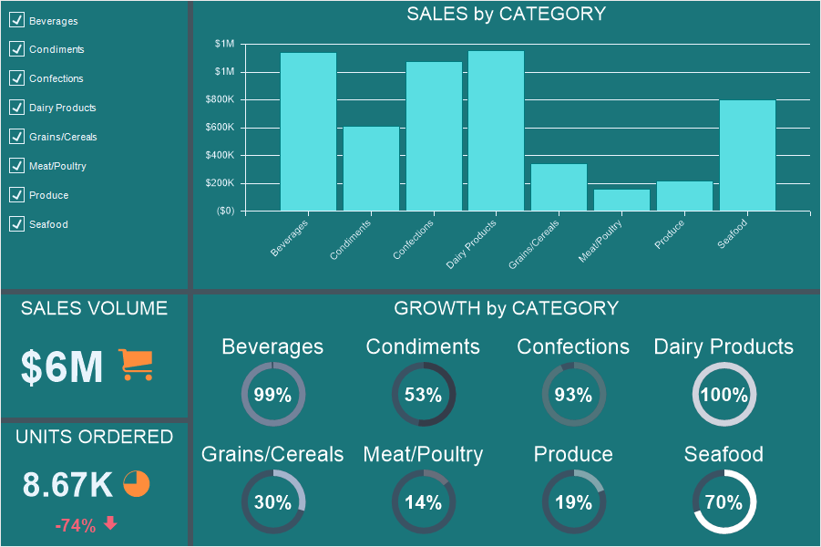

You need to display a drill down dashboard for each category - statistics of products sold and availability for each category. You should do the following:

* Create a new dashboard in the report template;

* Put elements for data analysis and displaying of product statistics;

* Specify data fields for these elements.

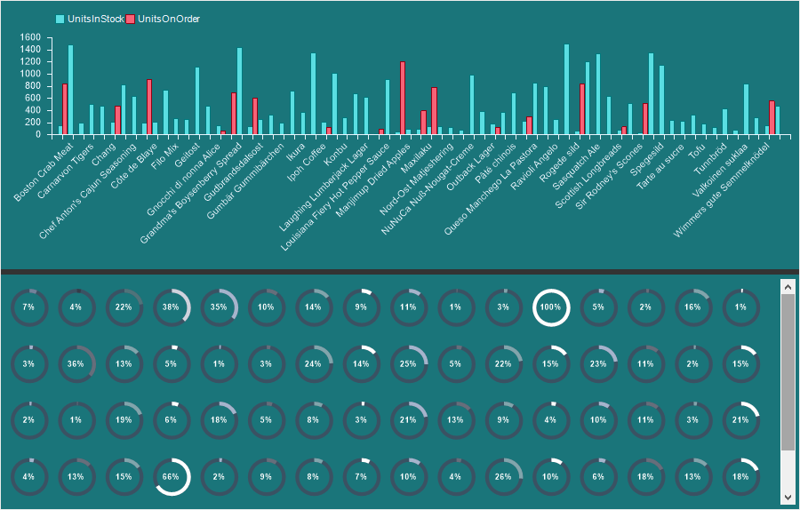

Then do the following:

* Go back to the main dashboard;

* Select an element for which, when you click on a value, a drill down dashboard will be displayed. In our example, this is a [Chart](Chart.md).

* Call the [Interaction editor](#InteractionEditor).

In the Interaction editor, you should:

* Set the Mode parameter to Show Dashboard;

* Select the dashboard with product statistics as the value of the Drill-Down Page parameter.

* Create and configure [drill-down parameters](#Parameters).

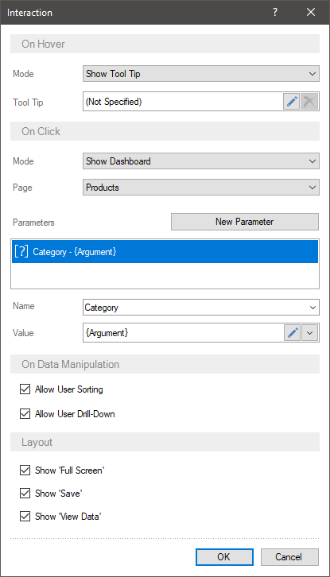

Then:

* Go to the drill down dashboard.

* Specify a filter for the elements of the dashboard panel using the drill down parameters.

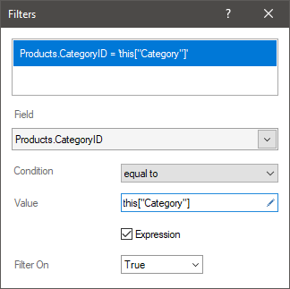

Now, when you preview the dashboard, you can click on the chart value - in any category. After that, a drill down dashboard with filtered data will be displayed in another tab in the report viewer.

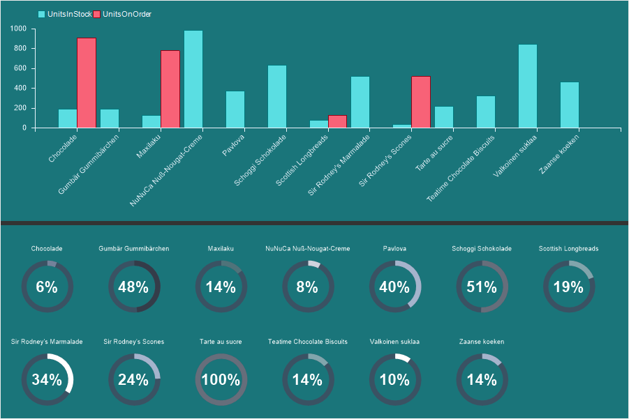

As you can on the picture, a parameter was passed (in the current example, the category name) to the drill down dashboard and the product data was filtered by this parameter. Only data for products in the selected category is displayed.

**Parameters**
A parameter is a value transmitted from the main dashboard to the drill down dashboard. To create a parameter, you should:

* The Mode parameter should be set to Show Dashboard in the interaction editor;

* Press the New Parameter button;

* Specify the parameter name in the Name field;

* Specify the parameter value in the Value field.
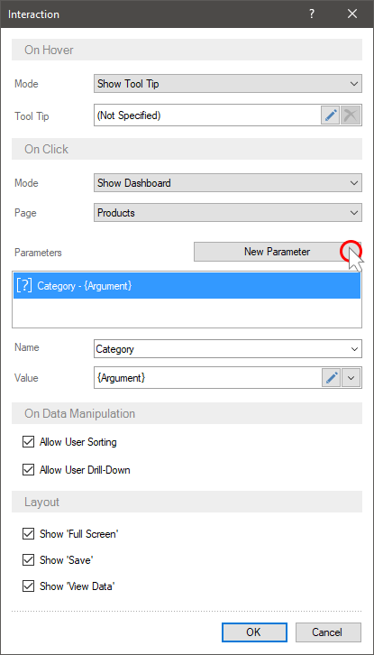

As a parameter value you can specify:

* Any constant - number, text, etc.;

* Variable, for example, {Variable1};

* Link to the item field. In this case, the parameter value will be the value from the specified field of the element. For example, if a chart refers to the Arguments field, the parameter value will be the argument value of the selected graphic element of the chart.

> **Information**
>
> Each element of the dashboard has its own fields. To indicate a link to an element field, you should:
>
> * Click the Edit button in the Value field of the [Interaction editor](#InteractionEditor);
>
> * In the Hyperlink editor, click the Insert Expression button;
>
> * Select what you need from the list of element fields.
>
>
> 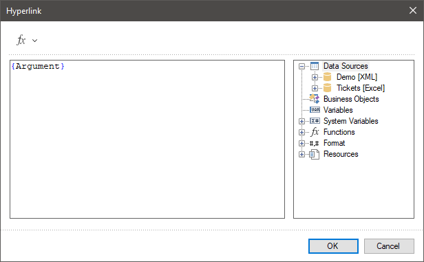

After the parameter has been created, you should specify the filtering condition using the drill down parameters in the drill down dashboard:

* Select an item in the drill down dashboard;

* Press the button to call the [Filters editor](Data_Filtering/Filters.md);

* Specify the data field by which the data will be filtered;

* Set the logical operation of the condition;

* Specify the parameter as the second value of the filter value. If the parameter is passed directly without using a variable in the data dictionary, then this["ParameterName"] must be specified. If a variable is used, then you must specify a link to this variable - {Variable1} in the expression field.

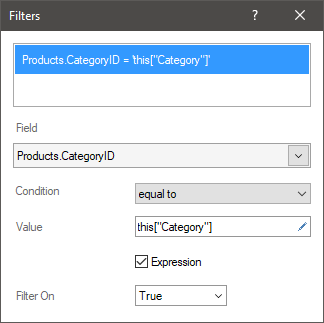

**Drill Down**
Drill down refers to moving to the lower or upper level in the data hierarchy of an element, without rebuilding the dashboard within the current element.

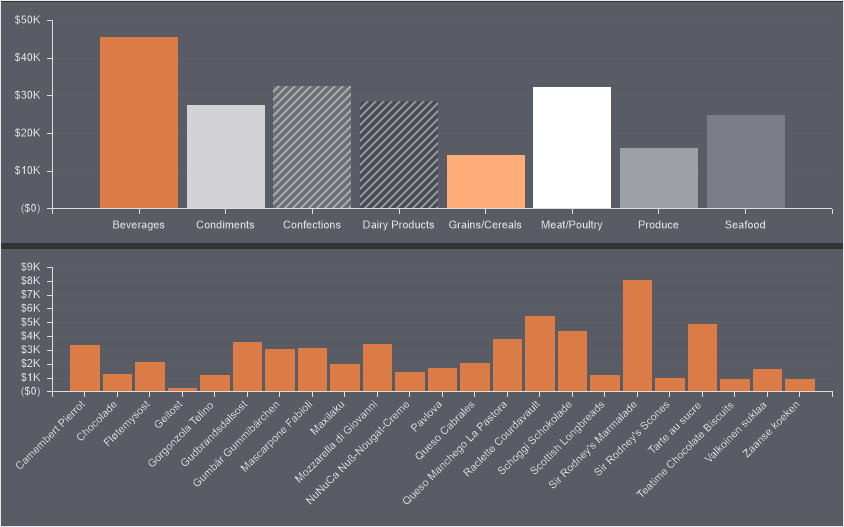

The picture above shows an example of a data hierarchy - the first chart shows sales statistics by category; the second one shows sales statistics of products from selected categories.

Drill down of element data can be done in the following modes:
* [With filters](#DrillDownWithFilters). In this case, when choosing element values, data will be filtered for all connected elements of the dashboard panel. To drill down the element data, you will need to click the Drill Down button on the current element.

* [Without filters](#DrillDownWithOutFilters). In this case, when choosing the element value, you will go to the lower level in the data hierarchy of this element. To drill down to multiple values, you will need to click the Drill Down button on the current element.

> **Information**
>
> When drill down element data, the data of other elements of the dashboard does not change. Data drill down applies only to the current item.

Drill down with filtering

To view hierarchical data within a single element of the dashboard, you can apply drill down on element data. To do this you should:

* Add the main and subordinate data fields to the element in a [specific order](#OrderDataFields). In charts, drill down is carried out according to the data fields of the chart's arguments.

* Select an element in the dashboard;

* Press the call button of the [interaction editor](#InteractionEditor);

* Enable the Allow User Drill Down parameter.

Now, when you choose chart values, the data of all interconnected elements of the dashboard will be filtered, and to drill down to the data of the current element, you should:

* Click the Drill Down button on the dashboard element;

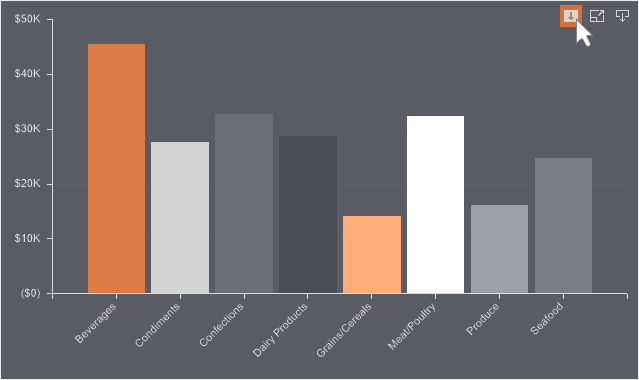

* Select the element values for which you want to display detail;

* Click the Drill Down Selected button;

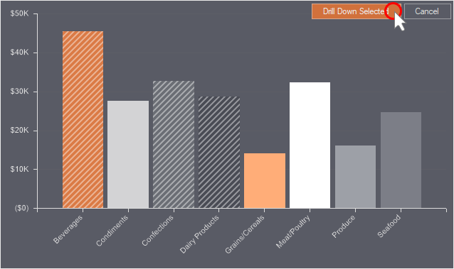

After that, detailed data of the selected element values will be displayed. click the Drill Up button to return to the previous level in the data hierarchy.

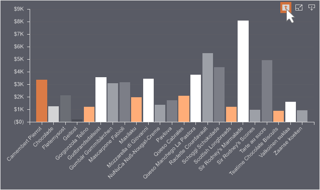

Drill down without filtering

Using this option, it will be impossible to filter data for related elements of the dashboard using the current element, and when you select the element value, it will be drilled down. To do this:

* Add the main and subordinate data fields to the element in a [specific order](#OrderDataFields);

* Select a dashboard element;

* Press the button to invoke the [Interaction editor](#InteractionEditor);

* Enable the Allow User Drill Down parameter.

* Set the Drill Down mode.

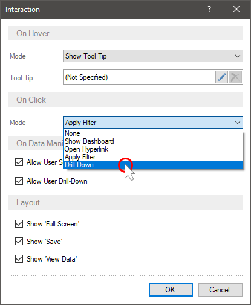

Now, when you select the value of an element, its drill down will be implemented.

To drill down to multiple values, you should:

* Click the Drill down button in the dashboard element;

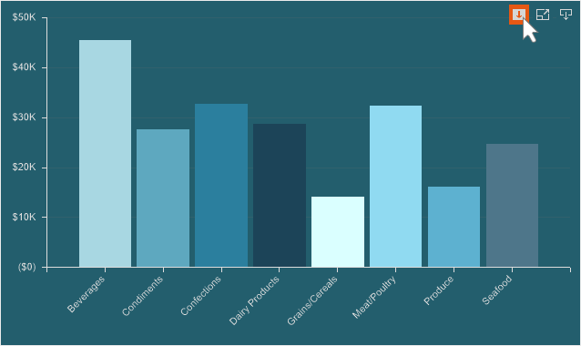

* Select the element values for which you want to display detail;

* Click the Drill Down Selected button;

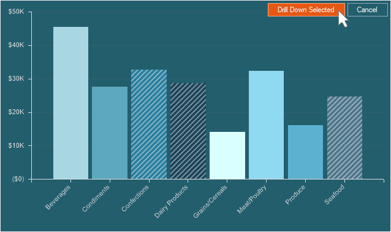

The drill down data of the selected element values will be displayed. Click the Drill Up button to return to the previous level in the data hierarchy.

Drill down order for data fields

The order of the data fields in the chart arguments displays the drill-down hierarchy in a top-down direction. In other words, the top field is processed as the top level of the hierarchy, and each subsequent field is treated as the next level in the item hierarchy.
So, by changing the order of the data fields in the arguments, the hierarchy of the item drill down changes, but the data hierarchy does not change. To correctly displaying the data hierarchy in an element, you should follow the order of the data fields in the arguments: Up is the main data field, then the detailed data fields.

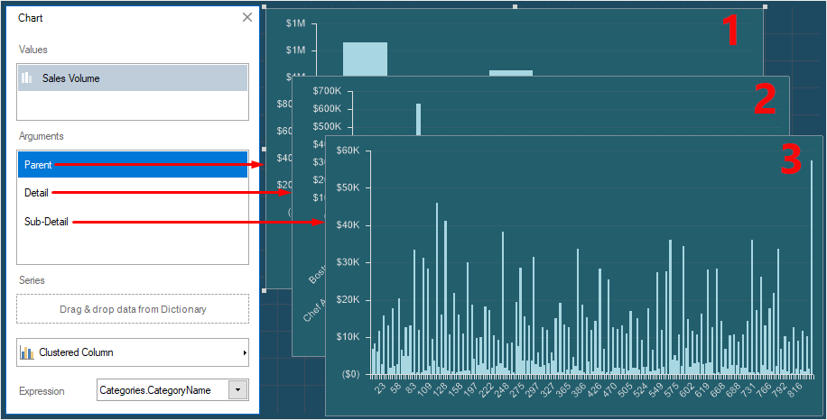

The numbers indicate the drill down levels of the dashboard element:

* 1 - sales by category;

* 2 - products sales from selected categories;

* 3 - sales by region for the selected products.

However, if you need to display detailed data first, and then go to the main ones, you can use any order of the data fields in the chart arguments.

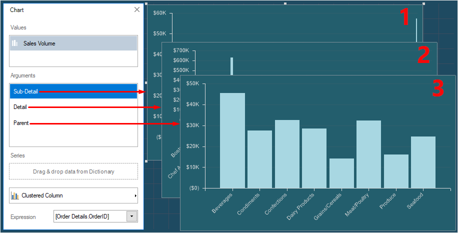

The numbers indicate the drill down levels of the dashboard element:

* 1 – products sales by region;

* 2 – products sales from selected regions;

* 3 - sales volume by categories for the products selected on the previous level.

Table of interaction parameters

Name

Description

On Data Manipulation:

Allow User Sorting

It allows you to select a data column of an element in the viewer by the values of which element data sorting will be carried out. If a box checked next to this parameter, when hovering the cursor over an element, the sorting button will be displayed. If a box unchecked, the sorting button will not be displayed when hovering the cursor over an element.

Allow User Drill-Down

It allows you to enable the drill down mode of element data. If a box checked, data will be drilled. If a box unchecked, drill down will not be carried out.

Allow User Column Selection

It allows you to enable the mode of column disable when viewing the Table item. If a box checked, in the viewer when hovering the cursor over, the control, which allows you to enable and disable columns of the Table item will be displayed. If a box unchecked the control for disabling table columns will not be displayed.

Drill-Down Filtered

It allows you to apply a filter having clicked on a value in the Table item, then drill data.

Full Row Select

It allows you to select a table row entirely using the cursor. If a box checked, a row of an element will be selected entirely. If a box unchecked, only the cell you click will be selected.

Layout:

Show 'Full Screen'

It allows you to display the control, which helps you to view an element in the full screen mode. If a box checked, the current control will be displayed for an element when hovering the cursor over it. If a box unchecked the current control will not be displayed.

Show 'Save'

It allows you to display the menu with the set of file formats into which the current element can be transformed. If a box checked, the current control will be displayed for an element when hovering the cursor over it. If a box unchecked, the current control will not be displayed.

Show 'View Data'

It allows you to display the control, which helps you to view used data columns in the current element. If a box checked, the current control will be displayed for the element when hovering the cursor over it. If a box unchecked, the current control will not be displayed.
