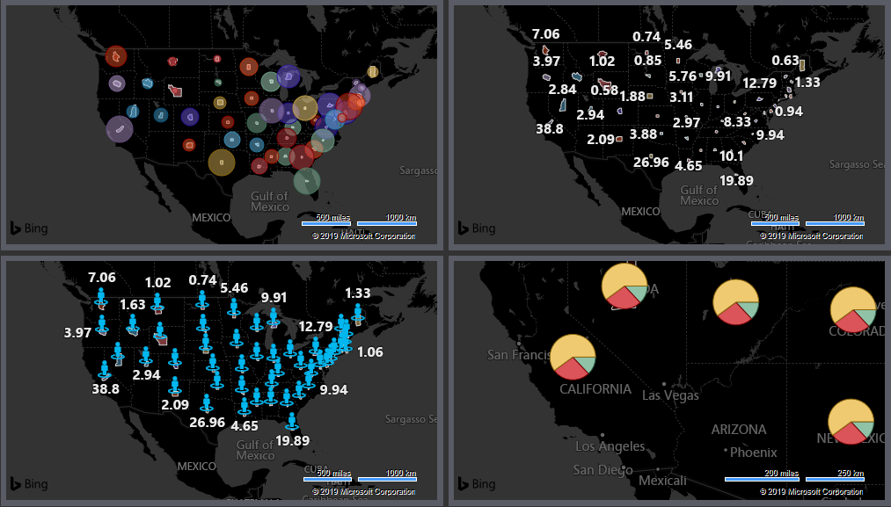
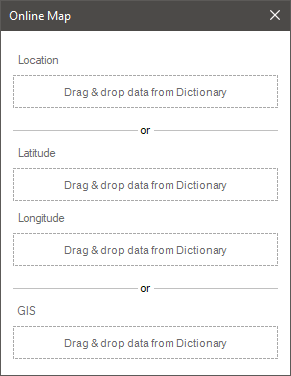
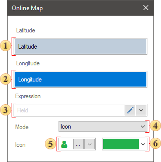
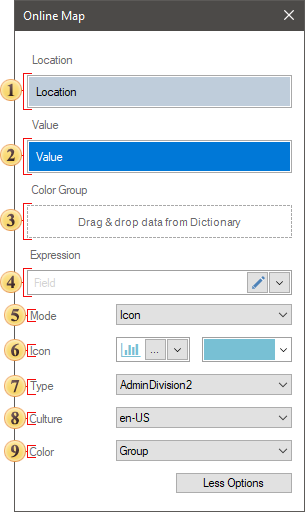
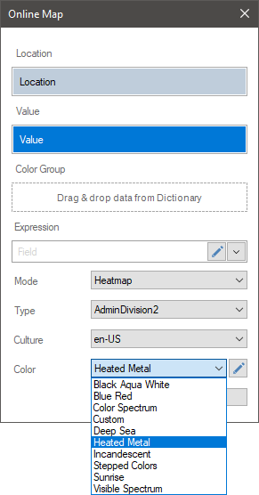
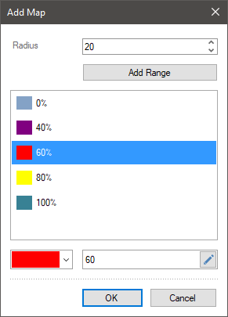
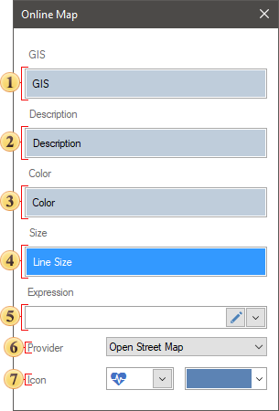
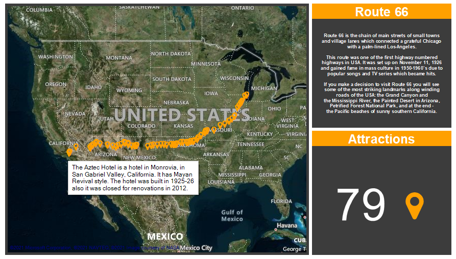

## Online Map

**Online Map** is used to display any object by geographic coordinates on the online map from Bing.

This chapter will cover the following:

* [Editor by coordinates](#MapByCoordinates)**;**

* [Editor by Location](#MapByLocation)**;**

* [Table of Properties](#TableOfProperties).

The **Online Map** element can be placed anywhere on the dashboard. This item is configured in the element editor. To call the editor, you should:

* Double-click on an item;

* Select **Online Map**, and select the **Design** command in the context menu.

To resize an item on the **Online Map**, you should:

* Select an item on the dashboard;

* Increase or decrease the size of the element vertically, horizontally or diagonally.

You can display the Objects on Online Map by:

* Geographic coordinates (Latitude and Longitude);

* Location.

> **Information**
>
> The Online Map editor will contain various parameters depending on the way objects are displayed.

**Editor by coordinates**

Online map is used to display any object by geographic coordinates and works only with data elements.

 The **Latitude** field indicates the data field with the latitude value of the geographical object.

 The **Longitude** field indicates the data field with the longitude value of the geographical object.

 The **Expression** field displays the expression of the selected data field.

 The **Mode** parameter allows you to define the type of geographic objects: **Icon** or **Heatmap**.

 The **Icon** parameter is used to select or load an icon for the value of a geographic object, as well as set the color of this icon.

 The **Color** parameter allows you to define icon color.

**Editor by Location**

If you display the objects by location, then the online map editor will contain the following parameters.

 The **Location** field. It indicates data column with the location of geographic objects. These may be state names, postal codes, etc.

 The **Value** field. It indicates a data column with values of geographic objects.

 In the **Color Group** you can specify a data field, by the values of which geographic objects will be grouped.

 An expression of the selected data field will be displayed in this field.

 The **Mode** parameter. It allows you to determine the option to display the value of a geographical object:

* **Value**. A numerical value will be displayed for each geographic object.
* **Bubble**. A separate bubble will represent the value of every geographic object. The larger is the value; the larger is the bubble in diameter.
* **Icon**. A numerical value with a specific symbol will be displayed for each geographic object. The icon can be selected from the Stimulsoft collection or uploaded from your local storage. Also, for the icons from the collection, you can set its color.
* **Chart**. If you select this value, an additional field called Arguments will be displayed. In this field, you should specify the data field, the values   from which will be the arguments for the chart values   of each geographic object. In other words, each value is a pie chart sliced by arguments.

* The **Heatmap**. When selecting this value, a heatmap of values. Also, additional parameters of the heatmap settings will be displayed.

 The **Icon** parameter is used to select or load an icon for the value of a geographic object, as well as set the color of this icon.

 The **Type** parameter. It allows you to set a location. The Auto type is used by default. The Bing service does not always correctly determine the data type of a location. So if geographic objects location is not found, you should change the type of location.

 The **Culture** parameter. It allows to specify a culture of a map.

 The **Color** parameter. It allows you to specify color of geographic objects. The following values are available:

* The **Color Each**. Each geographic objects will have a unique color;

* The **Value**. The Color Value field will be displayed in the editor. You should specify data field with a color list in this field. These colors will be mapped to the positions of geographic objects and a certain color will be assigned for each object.

* The **Fixed Single**. You should select a color, which can be applied for all  geographic objects.

* The **Group** . The Color Group field will be displayed in the editor. You should specify data fields with colors. Geographic objects will be grouped by value and each group of objects will have a specific color assigned.

**Heatmap**

The Heatmap is a graphical display of values ​​using color. When using the heatmap mode, the entire range of values ​​of a data column is split into parts. Colors are defined along the boundaries of this part. All values ​​that fall within any part of the range will be displayed with the color that is obtained by mixing the colors of the boundaries of this part of the range. The closer the value is to any border, the bigger the proportion of the border color in the value color.

To display a heatmap on an online map, you should set the **Display Mode** parameter in **Heatmap** value. After that, the **Color** parameter will be displayed in the online map editor, and using it you can select one of the preset color schemes for the heatmap.

The color scheme is a ready-made set of parts of a range of values with assigned colors. The preset color scheme can be edited. To do this, you should select the color scheme and click the Edit button. In the **Add Map** menu, you should change the color scheme parameters:

* Add or delete parts of the range;

* Specify a relative value of the border of the current range part;

* Change color for border values;

* Change radius for color glow for the value.

**GIS**

The online map element in GIS mode allows you to display primitives on various map providers. To do this, you should add a data column with a primitive encoding to the GIS field of the online map element editor. Below you can see the editor of the GIS map with the decoding of the parameters.

 The field, where a data column is specified with the encoding of primitives;

 The field, where a data column with a description for a primitive is specified. It`s topical only for primitives as points;

 The field, where a data column with colors for primitives is specified;

 The field, where a data column with sizes for primitives is specified;

 The field, where an expression of a selected data field is displayed;

 The Provider allows you to select a different provider of online maps to display primitives;

 The Icon parameter allows you to select an icon for points of a primitive and change the color of this icon.

**List of properties**

The list shows the name and description of the properties of the element which you may find in the properties panel of the report designer.

| **Name** | **Description** |
| --- | --- |
| Cross-Filtering | It allows you to enable or disable the cross-filtering mode for the current element. |
| Data Transformation | Customizes the data transformation of the current item. |
| GIS Settings | The group of properties allows you to define settings for an online map of GIS type, such as: **Color** of a primitive; **Icon** for a primitive; **Icon Color** for primitives; **Language** provider maps; **Size** of a primitive. |
| Group | Adds the current item to a specific [group of items](../Groups.md). |
| Back Color | Changes the background color of the element. By default, this property is set to **From Style**, i.e. the color of the element will be obtained from the settings of the current element style. |
| Border | A group of properties that allows you to customize the borders of the element - color, sides, size, and style. |
| Corner Radius | It allows you to define the rounding radius for the corners of an element on the dashboard. You can round each corner of the element separately: **Top - Left**, **Top - Right**, **Bottom - Right**, **Bottom - Left**. The property can be set to a value between 0 and 30, where 0 is no rounding angle and 30 is the maximum value of the rounding radius. |
| Shadow | A group of properties that allows configuring the shadow of an element: The **Color** property allows you to specify the color that will be used to display the shadow of the element. The properties in the **Location** group allow you to define the offset of the shadow along the X and Y coordinates, relative to the element's position on the indicator panel. The **Size** property allows you to set the size of the shadow from the element's borders. It can be set to a value from 1 to 10, where 1 is the minimum size and 10 is the maximum size. The **Visible** property allows you to enable or disable the display of the element's shadow on the indicator panel. |
| Enabled | Enables or disables the current item on the dashboard. If the property is set to **True**, the current item is enabled and will be displayed when previewing the dashboard in the viewer. If this property is set to **False**, this element is disabled and will not be displayed when previewing the dashboard in the viewer. |
| Interaction | Sets [interaction](../Interaction.md) of the Online Map element. |
| Margin | A group of properties that allows you to define indents (left, top, right, bottom) of the value area from the border of this element. |
| Padding | A group of properties that allows you to define indents (left, top, right, bottom) of the columns from the range of values. |
| Title | A group of properties that allows you to customize the title of the element: The **Back Color** property provides the ability to change the background color of the title of the current item. By default, this property is set to **From Style**, i.e. the background color will be obtained from the style settings of the current element. Fore Color allows you to change the text color of the title of the current item. By default, this property is set to **From Style**, i.e. the text color of the title will be obtained from the settings of the current element style The group property **Font** that allows you to define the font family, its style and size for the title of the current element. The **Horizontal Alignment** property provides the ability to change the title alignment relative to the element - Left, Center, Right. The **Text** property is used to set the title text of the current element. The Visible property is used to enable or disable displaying of the title of the current item. If the property is set to **True**, then the element title will be included. If this property is set to **False**, then the element header will be disabled. |
| Name | Changes the name of the current element. |
| Alias | Changes the alias of the current item. |
| Restrictions | Configures the permissions to use the current item in the dashboard: The **Allow Change** option enables or disables changes of the element. If checked, the current item can be changed. The **Allow Delete** option enables or disables the deletion of an element. The **Allow Move** option allows or prohibits moving an element. The **Allow Resize** option enables or disables resizing of an element. The **Allow Select** option enables or disables the element selection. |
| Locked | Locks or unlocks resizing and movement of the current element. If the property is set to **True**, the current element cannot be moved or resized. If this property is set to **False**, then this element can be moved and resized. |
| Linked | Binds the current location to the dashboard or another element. If the property is set to **True**, then the current item is bound to the current location. If this property is set to **False**, then this element is not tied to the current location. |
