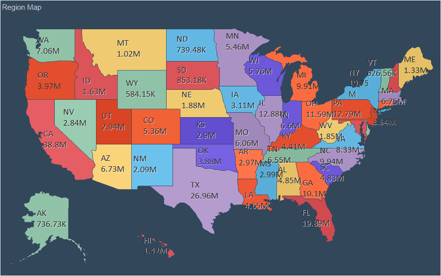
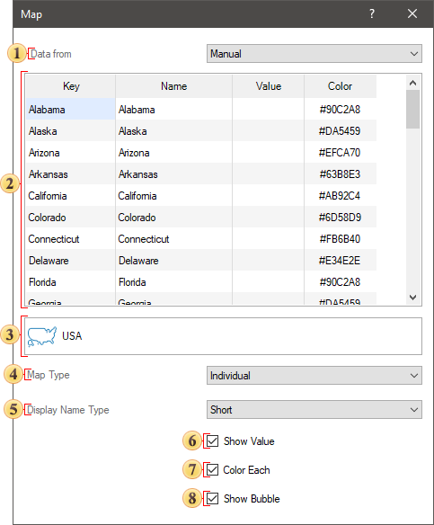
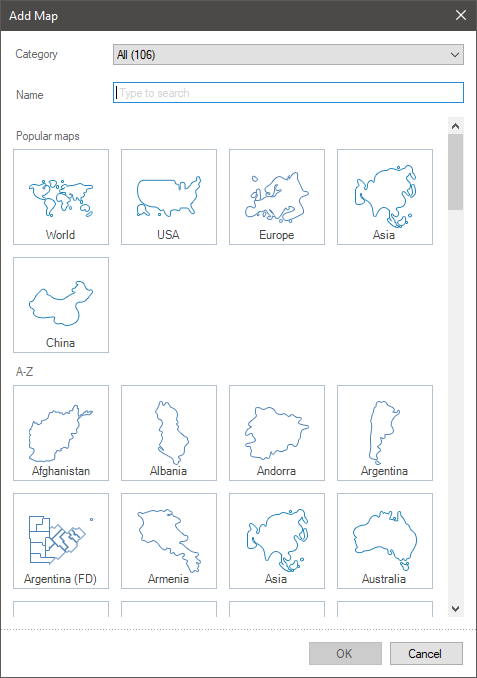
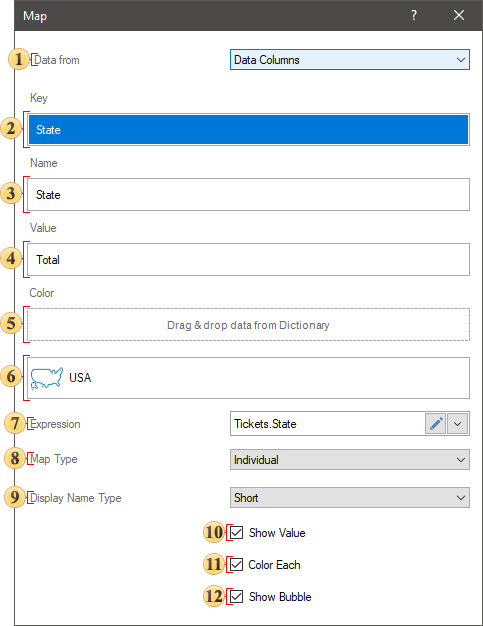
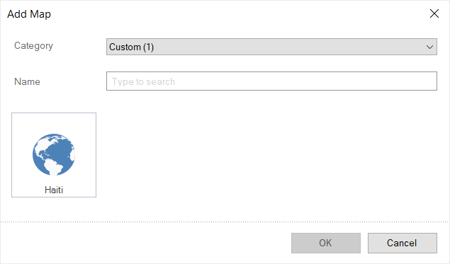
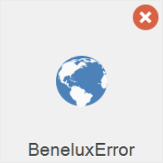
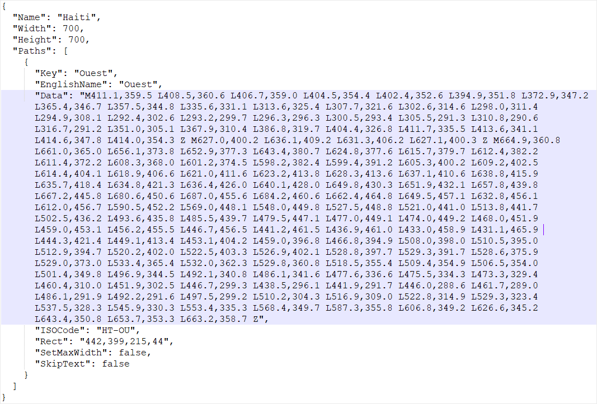
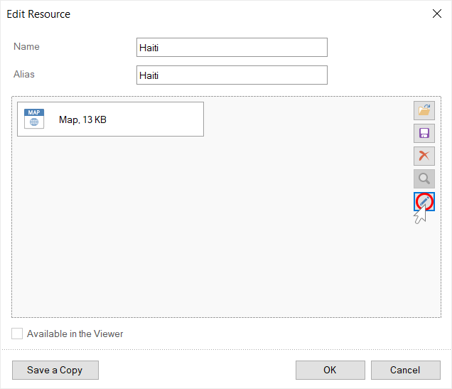
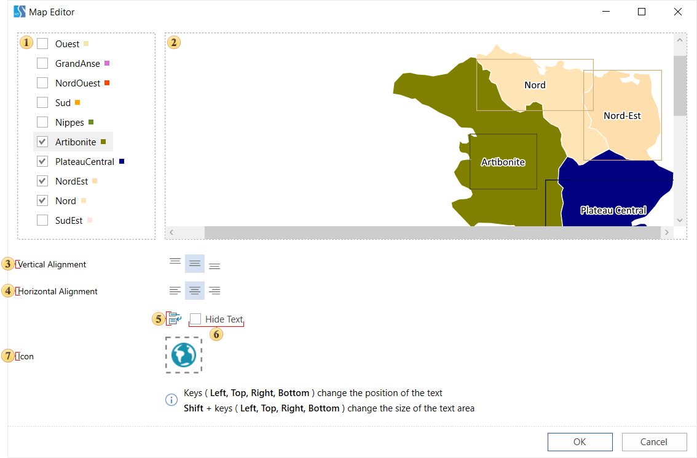

## Region Map

**Region Map** provides the ability to display any value with reference to a geographic object.

This chapter will cover the following:

* [Region Map Editor](#MapEditor);

* [Region Map Editor (Data Columns Mode)](#DataColumnsEditor);

* [Adding a custom map](#AddingCustomMap);

* [Creating a map file](#CreatingMapFile);

* [Editing a custom map](#EditingCustomMap);
* [Table of Properties](#TableOfProperties).

> **Information**
>
> [Interaction](../Interaction.md) can be applied to the values of the current element.

The **Region Map** element can be placed anywhere on the dashboard. This item is configured in its editor. To call the editor, you should:

* Double-click on an item;

* Select the **Region Map** element, and select the **Design** command in the context menu;

To resize the **Region Map** element you should:

* Select an item on the dashboard panel;

* Increase or decrease the size of the element vertically, horizontally or diagonally.

**Region Map editor**

In the region map, you can display any value, with reference to a specific geographical object. The list of geographical objects depends on the selected map view.

Below is the editor of the Region Map element when manually filling in the data.

 **Data from** parameter provides the ability to define a data source:

* **Manual** by setting a value for each map element;

* **Data Columns** by filling in the appropriate fields.

 The table contains **Key**, **Name**, **Value** and **Color**. Also, if a map with grouping or heat map with grouping is selected, a column for the grouping keys of map elements will be present. By default, keys and map elements are filled. All that is needed is to enter a value for a specific map element, and specify the key of grouping, if necessary.

 The **Add Map** menu call button where you can change the view of a regional map. All maps are grouped into regional categories. Depending on the selected category, maps of a certain type will be displayed in the list. In the **Name** field you can specify the name of a map to search for a map of a certain type.

 The **Map Type** parameter is used to change the type of the **Region Map** element. The map may be of the following type:

* **Individual** - every **Map Key** is a separate geographical object. Each geographical object will have its own value.

* **Group** - by any condition, Map Keys will be combined into a group of geographical objects.

* **Heatmap** - every **Map Key** is a separate geographical object, and the values of all geographical objects of the map will also be analyzed. For a geographic object with a maximum value, the specific color will be defined, for a geographic object with a minimum value, another specific color will be defined. The color of other geographical objects will be obtained by mixing these colors.

* **Heatmap with Group** - by any condition, map keys will be combined into a group of geographical objects. After grouping of geographical objects, their values will be analyzed. In every group, the geographic object with the maximum value will have one color, and the geographic object with the minimum value will have another color. The color of the remaining geographical objects in the group will be obtained by mixing these colors.

 The **Display Name Type** parameter allows you to select the display mode for the names of map elements:

* **None** - map names for every map element will not be displayed;

* **Full** - names for every map element will be displayed in full;

* **Short** - names for every map element will be abbreviated.

 The **Show Values** parameter is used to display the values of map elements. If the box is checked, then its value will be displayed for every map element. If the box is not checked, the values of the map elements will not be displayed.

 The **Color Each** parameter allows every element of the map to define its own color. This option is available only for an individual card. If the check box for the option is checked, then each map element will have a specific color; if the check box is not checked, all map elements will have one color. Also, this option must be enabled, if a data column with colors of geographic objects in the Color field is specified.
 The **Show Bubble** parameter allows you to display a graphical object value as a bubble.

Consider the setting of the Region Map editor, if the data will be obtained from the data fields. To do this, you should select the **Data Columns** value in the **Data from** parameter. Below is a map editor with data fields:

 The **Data from** option is used to specify a data source:

* **Manually** - setup a value for every element of the map;

* From the **Data columns** by filling in the appropriate fields.

 The **Key** field indicates a data field with a list of keys of map elements of a certain type.

 The **Name** field indicates a data field with names for map elements of a certain type.

 The **Value** field indicates a data field with values for every map element of a certain type.

 The **Color** field indicates a data field that contains the color as **#FFFFF** for every map key.

> **Information**
>
> If the **Color** field is empty and an individual map type is selected, the **Color Each** option will be available in the editor. This option is used to automatically apply an individual color to every map element. If a box next to the **Each Color** parameter is checked, each element of a map will have an individual color.

 The **Add Map** menu call button, where you can change a regional map view.

 The **Expression** field displays the expression of the selected data item.

 The **Map Type** parameter is used to change the type of the **Region Map**. There are several types of the map:

* **Individual** - every **Map Key** is a separate geographical object. Each geographical object will have its own value.

* **Group** - by any condition, **Map Keys** will be combined into a group of geographical objects.

* **Heatmap** - every **Map Key** is a separate geographical object, and the values of all geographical objects of the map will also be analyzed. The specific color will be defined for a geographic object with a maximum value; for a geographic object with a minimum value, another specific color will be defined. The color of other geographical objects will be obtained by mixing these colors.

* **Heatmap with Group** - by any condition, map keys will be combined into a group of geographical objects. After grouping of geographical objects, their values will be analyzed. In every group, the geographic object with the maximum value will have one color, and the geographic object with the minimum value will have another color. The color of the remaining geographical objects in the group will be obtained by mixing these colors.

 The **Display Name Type** option allows you to select the display mode for the name of the map elements:

* **No** - map names for every map element will not be displayed;

* **Complete** - names for every map element will be displayed in full;

* **Short** - names for every map element will be abbreviated.

 The **Show Value** parameter is used to display the values of map elements. If the check box is checked, then its value will be displayed for every map element. If the box is not checked, the values of the map elements will not be displayed.

 The **Color Each** parameter allows every element of the map to define its own color.

 The **Show Bubble** parameter allows you to display a graphical object value as a bubble.

**Adding a custom map**

When designing dashboards, you can add a custom map. This map will be displayed in the common list of maps and in the user category.

To use a custom map in the design you should:

* Add a map file to resources of a report;

* In the editor of the **Regional map**, select this type of the map or drag and drop the resource from the dictionary to the dashboard.

> **Information**
>
> If you an invalid map file to the report resources, this type of the map will be marked in the list with the icon as on the picture below.
>
>
> 

**Creating a map file**

A map file has the *.map extension, with the JSON markup of geographic data. The map file must contain the following fields:

* **Name**. This is the name of the map;

* **Width** and **Height**. Sets the width and height of the map.

* The **Paths** array. Contains data of geographic objects of the map.

Each geographic object in the **Paths** array must contain the following fields:

* **Key**. This is the identifier of the geographic object. It may only contain English characters "a-z". It cannot contain spaces, special characters, dashes, etc.

* **EnglishName**. This is the name of the geographic object.

* **Data**. This is a patch of a geographic object.

* **ISOCode**. This is the ISO code of a geographic object.

**Editing a custom map**

You may edit each map that is added to report resources. To do this:

* Call the map resource editing form;

* Click the **Edit** button in the resource editing form.

After that, the map editor will be called. In this editor, you can enable or disable geographic objects, customize the titles of geographic objects, and assign an icon to the map.

> **Information**
>
> Titles of geographic objects will be obtained from the **EnglishName** fields in the *.map file. Each title has an area in which the title text is placed. This area can be moved using the cursor keys (left, right, top, bottom). To resize an area, hold down the **Shift** key and use the cursor keys (top, right, left, bottom) to increase or decrease the size of the area in the corresponding directions.

 A panel displays a list of geographic objects of the map. If the check box is selected, then the geographic object will be displayed on the preview panel of the current editor. If the box is unchecked, then the geographic object will not be displayed.

 Map preview. This panel displays only enabled geographic objects.

 The commands are used to align a title of a geographic object vertically.

 The commands are used to align a title of a geographic object horizontally.

 The option is used to wrap the title text. If the **Word Wrap** option is enabled, the title will be wrapped to the next line. Otherwise the text wrapping will be cut off along the border of the title area.

 The **Hide Text** option. It is used to hide the title of the selected geographic object.

 The **Icon** option. It is used to load a map icon. This icon will appear as a thumbnail in the map selection window.

You can acquaint with the step-by-step instruction of adding a custom map in the [Dashboard with Custom Region Map](../../Getting_Started/Dashboard_with_Custom_Region_Map.md) chapter.

**List of properties**

The list shows the name and description of the properties of the element which you may find in the properties panel of the report designer.

| **Name** | **Description** |
| --- | --- |
| Cross-Filtering | It allows you to enable or disable the cross-filtering mode for the current element. |
| Data Transformation | Customizes the data  transformation of the current item. |
| Group | Adds the current item to a specific [group of items](../Groups.md). |
| Labels | A group of properties that is used to customize the map labels. |
| Show Value | Allows displaying or hiding the value of a geographic object on the map. |
| Show Zero | Allows displaying or hiding zero values on the current item. |
| Back Color | Changes the background color of the element. By default, this property is set to **From Style**, i.e. the color of the element will be obtained from the settings of the current element style. |
| Border | A group of properties that allows you to customize the borders of the element - color, sides, size, and style. |
| Corner Radius | It allows you to define the rounding radius for the corners of an element on the dashboard. You can round each corner of the element separately: **Top - Left**, **Top - Right**, **Bottom - Right**, **Bottom - Left**. The property can be set to a value between 0 and 30, where 0 is no rounding angle and 30 is the maximum value of the rounding radius. |
| Shadow | A group of properties that allows configuring the shadow of an element: The **Color** property allows you to specify the color that will be used to display the shadow of the element. The properties in the **Location** group allow you to define the offset of the shadow along the X and Y coordinates, relative to the element's position on the indicator panel. The **Size** property allows you to set the size of the shadow from the element's borders. It can be set to a value from 1 to 10, where 1 is the minimum size and 10 is the maximum size. The **Visible** property allows you to enable or disable the display of the element's shadow on the indicator panel. |
| Style | Selects a style for the current element. The default it is set to **Auto**, i.e. the style of this element is inherited from the style of the dashboard. |
| Enabled | Enables or disables the current item on the dashboard. If the property is set to **True**, the current item is enabled and will be displayed when previewing the dashboard in the viewer. If this property is set to **False**, this element is disabled and will not be displayed when previewing the dashboard in the viewer. |
| Interaction | Sets [interaction](../Interaction.md) of the Region Map element. |
| Margin | A group of properties that is used to define margins (left, top, right, bottom) of the map area from the border of this element. |
| Padding | A group of properties that is used to define padding (left, top, right, bottom) of the map area from the border of this element. |
| Title | A group of properties that allows you to customize the title of the element: The **Back Color** property provides the ability to change the background color of the title of the current item. By default, this property is set to **From Style**, i.e. the background color will be obtained from the style settings of the current element. Fore Color allows you to change the text color of the title of the current item. By default, this property is set to **From Style**, i.e. the text color of the title will be obtained from the settings of the current element style The group property **Font** that allows you to define the font family, its style and size for the title of the current element. The **Horizontal Alignment** property provides the ability to change the title alignment relative to the element - Left, Center, Right. The **Text** property is used to set the title text of the current element. The Visible property is used to enable or disable displaying of the title of the current item. If the property is set to **True**, then the element title will be included. If this property is set to **False**, then the element header will be disabled. |
| Value Format | Customizes the formatting of the values of the Region Map element. |
| Name | Changes the name of the current element. |
| Alias | Changes the alias of the current item. |
| Restrictions | Configures the permissions to use the current item in the dashboard: The **Allow Change** option enables or disables changes of the element. If checked, the current item can be changed. The **Allow Delete** option enables or disables the deletion of an element. The **Allow Move** option allows or prohibits moving an element. The **Allow Resize** option enables or disables resizing of an element. The **Allow Select** option enables or disables the element selection. |
| Locked | Locks or unlocks resizing and movement of the current element. If the property is set to **True**, the current element cannot be moved or resized. If this property is set to **False**, then this element can be moved and resized. |
| Linked | Binds the current location to the dashboard or another element. If the property is set to **True**, then the current item is bound to the current location. If this property is set to **False**, then this element is not tied to the current location. |
