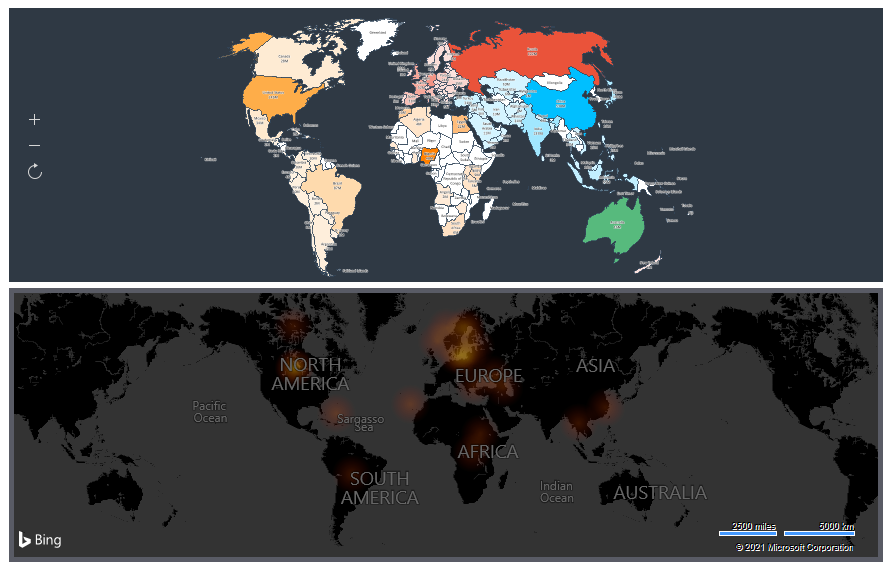

## Maps

Map is an element of the dashboard, which provides the ability to display data with reference to geographic location.

When designing a dashboard for displaying maps, you can use the following elements:

* [Region map](Region_Map.md), provides the ability to display any value with reference to a geographic object.

* [Online map](Online_Map.md), provides the ability to display any object by geographic coordinates on an online Bing map.
