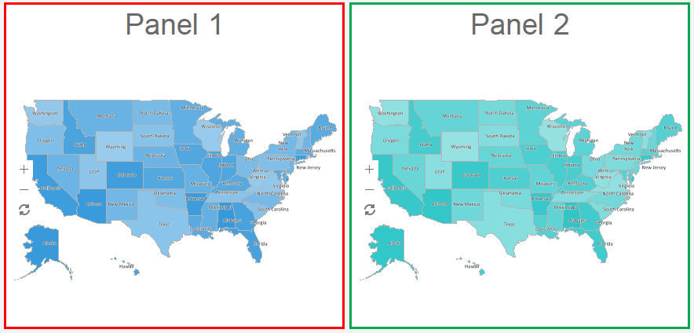

## Panel

The **Panel** is an element of the dashboard on which other elements can be placed, including other panels and dashboards.

The **Panel** element is stretched along with the dashboard by height and width. To resize the Panel element you should:

* Select a dashboard element;

* Increase or decrease the size of the element vertically, horizontally or diagonally.

**List of properties**

The list shows the name and description of the properties of the element which you may find in the properties panel of the report designer.

**Name**

**Description**

Back Color

Changes the background color of the element. By default, this property is set to **From Style**, i.e. the color of the element will be obtained from the settings of the current element style.

Border

A group of properties that allows you to customize the borders of the element - color, sides, size, and style.

Corner Radius

It allows you to define the rounding radius for the corners of an element on the dashboard. You can round each corner of the element separately: Top - Left, Top - Right, Bottom - Right, Bottom - Left. The property can be set to a value between 0 and 30, where 0 is no rounding angle and 30 is the maximum value of the rounding radius.

Shadow

A group of properties that allows configuring the shadow of an element:

The Color property allows you to specify the color that will be used to display the shadow of the element.

The properties in the Location group allow you to define the offset of the shadow along the X and Y coordinates, relative to the element's position on the indicator panel.

The Size property allows you to set the size of the shadow from the element's borders. It can be set to a value from 1 to 10, where 1 is the minimum size and 10 is the maximum size.

The Visible property allows you to enable or disable the display of the element's shadow on the indicator panel.

Style

Selects a style for the current element. The default it is set to **Auto**, i.e. the style of this element is inherited from the style of the dashboard.

Watermark

Allows setting a watermark for the panel. The watermark can be the same as that for the entire indicator panel.

Watermark Style

Allows using a watermark style for the current component.

Enabled

Enables or disables the current item on the dashboard. If the property is set to **True**, the current item is enabled and will be displayed when previewing the dashboard in the viewer. If this property is set to **False**, this element is disabled and will not be displayed when previewing the dashboard in the viewer.

Margin

A group of properties that allows you to define indents (left, top, right, bottom) of the value area from the border of this element.

Padding

A group of properties that allows you to define indents (left, top, right, bottom) of the columns from the range of values.

Name

Changes the name of the current element.

Alias

Changes the alias of the current item.

Restrictions

Configures the permissions to use the current item in the dashboard:

The **Allow Change** option enables or disables changes of the element. If checked, the current item can be changed.

The **Allow Delete** option enables or disables the deletion of an element.

The **Allow Move** option allows or prohibits moving an element.

The **Allow Resize** option enables or disables resizing of an element.

The **Allow Select** option enables or disables the element selection.

Locked

Locks or unlocks resizing and movement of the current element. If the property is set to **True**, the current element cannot be moved or resized. If this property is set to **False**, then this element can be moved and resized.

Linked

Binds the current location to the dashboard or another element. If the property is set to **True**, then the current item is bound to the current location. If this property is set to **False**, then this element is not tied to the current location.
