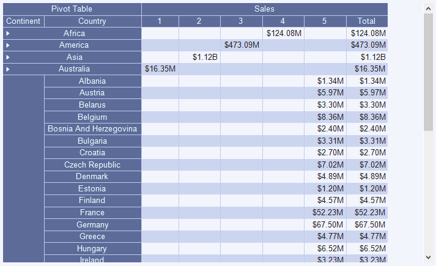
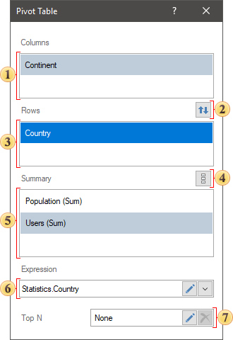
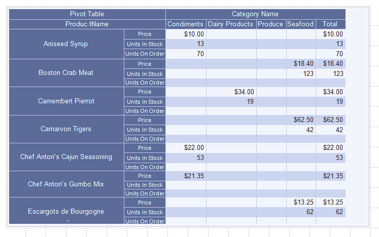
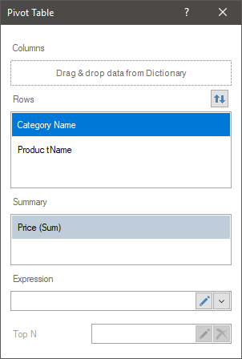
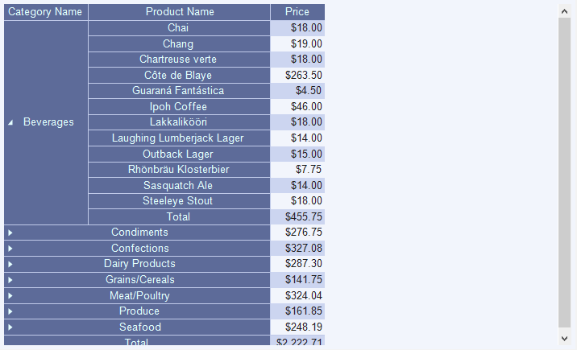
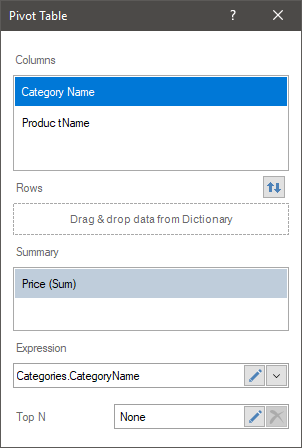
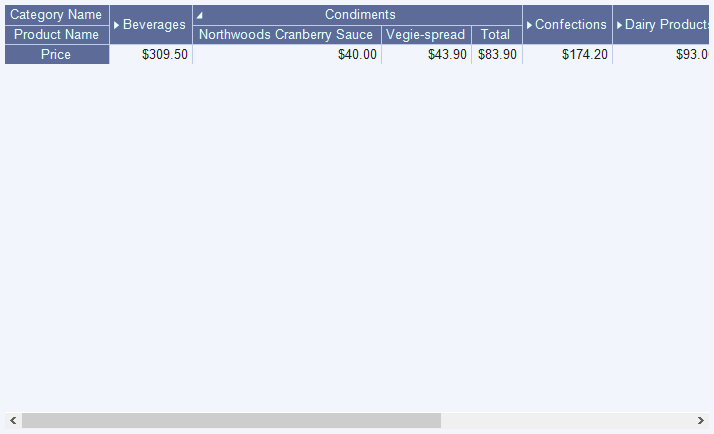

## Pivot

**Pivot** is an element of the dashboard, which is used to process, group and summarize data values by rows and columns of this table.

This chapter will cover the following:

* [Pivot Editor](#PivotEditor);

* [Totals](#PivotTotals);

* [Rows](#PivotRows);

* [Columns](#PivotColumns);

* [Table of Properties](#TableOfProperties).

To display the pivot element you should to add at least one data field in the **Totals** field. Element settings of the **Pivot** table is implemented in the element editor. To call the editor, you should:

* Double-click the Pivot item;

* Select the Pivot item, and select the **Design** command in the context menu;

* Select the Pivot item, and, on the property bar, click the **Browse** button of the **Columns** property.

> **Information**
>
> [Text formatting](Appearance.md#TextFormat) can be applied to the values of the current element.

**Editor of the Pivot table**

In the editor of the Pivot table, you can add elements with data and edit expressions for these elements, as well as adjust the top values of the element.

 The **Columns** field indicates the data fields for the rows of this table;

 The button is used to swap data fields between **Columns** and **Rows** fields.

 The **Row** field indicates data fields for the columns of this table;

 The button for changing orientation of the summary cells: by columns or rows;

 The **Summary** field indicates the data fields for the resulting cells of this table;

 The **Expression** field in which the expression of the selected data field is displayed.

 The **Top N** parameter is used to customize the list of maximum or minimum values ​​of the pivot table. The top values ​​are set to Top N values ​​editor. To call the editor, click the **Edit** button in the current field. To reset the top values, click the **Remove** button in the current field.

**Totals**

At the intersection of the columns and rows of the pivot table you can see cells. A value from the corresponding cell of the data source will be added to this cell, i.e. the value from the data source cell formed at the intersection of the corresponding column and rows in the data source. Then, all values ​​of each row and each column will be summed up and displayed in the resulting cells of the pivot table. Also, in the **Totals** field you can specify several data fields. In this case, cells will be added to the pivot table both for the first data field and for the second one.

**Rows**

This field of the pivot table indicates the data fields which values will form the rows of the pivot table. Also in this field you can specify multiple items. In this case, the data fields must be related with each other, because the values of the top data field in this field are "predecessor" for the values of the lower data field. For example, if the top data field contains a list of categories, and the bottom contains a list of products.

In this case, in the pivot table, each category will be a separate line in the pivot table. However, each category will contain its own list of products that will form the rows of the pivot table within that category.

**Columns**

This field of the pivot table indicates the data fields which values will form the rows of the pivot table. Also in this field you can specify multiple data fields. In this case, the data fields must be related to each other, because the values of the top data field in this field are "predecessor" for the values of the lower data field. For example, if the top data field contains a list of categories, and the bottom contains a list of products.

In this case, in the pivot table, each category will be a separate column in the pivot table. However, each category will contain its own list of products that will form the columns of the pivot table within that category.

**List of properties**

The list shows the name and description of the properties of the element which you may find in the properties panel of the report designer.

| **Name** | **Description** |
| --- | --- |
| Cross-Filtering | It allows you to enable or disable the cross-filtering mode for the current element. |
| Data Transformation | Customizes the data transformation of the current element. |
| Group | Adds the current item to a specific [group of items](Groups.md). |
| Back Color | Changes the background color of the element. By default, this property is set to **From Style**, i.e. the color of the element will be obtained from the settings of the current element style. |
| Border | A group of properties that allows you to customize the borders of the element - color, sides, size, and style. |
| Corner Radius | It allows you to define the rounding radius for the corners of an element on the dashboard. You can round each corner of the element separately: Top - Left, Top - Right, Bottom - Right, Bottom - Left. The property can be set to a value between 0 and 30, where 0 is no rounding angle and 30 is the maximum value of the rounding radius. |
| Shadow | A group of properties that allows configuring the shadow of an element: The Color property allows you to specify the color that will be used to display the shadow of the element. The properties in the Location group allow you to define the offset of the shadow along the X and Y coordinates, relative to the element's position on the indicator panel. The Size property allows you to set the size of the shadow from the element's borders. It can be set to a value from 1 to 10, where 1 is the minimum size and 10 is the maximum size. The Visible property allows you to enable or disable the display of the element's shadow on the indicator panel. |
| Style | Selects a style for the current element. The default it is set to **Auto**, i.e. the style of this element is inherited from the style of the dashboard. |
| Enabled | Enables or disables the current item on the dashboard. If the property is set to **True**, the current item is enabled and will be displayed when previewing the dashboard in the viewer. If this property is set to **False**, this element is disabled and will not be displayed when previewing the dashboard in the viewer. |
| Interaction | Sets [interaction](Interaction.md) of the current element. |
| Margin | A group of properties that allows you to define margin (left, top, right, bottom) of the value area from the border of this element. |
| Padding | A group of properties that allows you to define padding (left, top, right, bottom) of the columns from the range of values. |
| Title | A group of properties that allows you to customize the title of the element: The **Back Color** property provides the ability to change the background color of the title of the current item. By default, this property is set to **From Style**, i.e. the background color will be obtained from the style settings of the current element. Fore Color allows you to change the text color of the title of the current item. By default, this property is set to **From Style**, i.e. the text color of the title will be obtained from the settings of the current element style The group property **Font** that allows you to define the font family, its style and size for the title of the current element. The **Horizontal Alignment** property provides the ability to change the title alignment relative to the element - Left, Center, Right. The **Text** property is used to set the title text of the current element. The **Visible** property is used to enable or disable displaying of the title of the current item. If the property is set to **True**, then the element title will be included. If this property is set to **False**, then the element header will be disabled. |
| Name | Changes the name of the current element. |
| Alias | Changes the alias of the current item. |
| Restrictions | Configures the permissions to use the current item in the dashboard: The **Allow Change** option enables or disables changes of the element. If checked, the current item can be changed. The **Allow Delete** option enables or disables the deletion of an element. The **Allow Move** option allows or prohibits moving an element. The **Allow Resize** option enables or disables resizing of an element. The **Allow Select** option enables or disables the element selection. |
| Locked | Locks or unlocks resizing and movement of the current element. If the property is set to **True**, the current element cannot be moved or resized. If this property is set to **False**, then this element can be moved and resized. |
| Linked | Binds the current location to the dashboard or another element. If the property is set to **True**, then the current item is bound to the current location. If this property is set to **False**, then this element is not tied to the current location. |
| Data field properties: |  |
| Expand | Allows defining the default expand/collapse condition for rows or columns in a pivot table. |
| Expression | It allows you to specify an expression for a selected data field. |
| Hide Zero | Allows displaying or hiding zero values in the resulting cells. |
| Horizontal Alignment | It allows you to define horizontal alignment of a selected data field. |
| Label | It allows you to change a name of a selected data field. |
| Show Total | It allows you to enable or disable the display of total cells for rows or columns. Accordingly, the property is available only for data fields from the rows or columns of the pivot table. |
| Size | The group of properties that allows you to define the size of cells, their range, from min to max size and enable the word wrap mode, if needed. |
| Sort Direction | Allows defining the sorting direction for row or column headers in a pivot table. Possible directions include ascending, descending, or no sorting. |
| Text Format | It allows you to set text format for the values of a selected data field. |
| Total Label | It allows you to change the header of a total column or row. Accordingly, the property is available only for data fields from rows and columns of a pivot table. |
