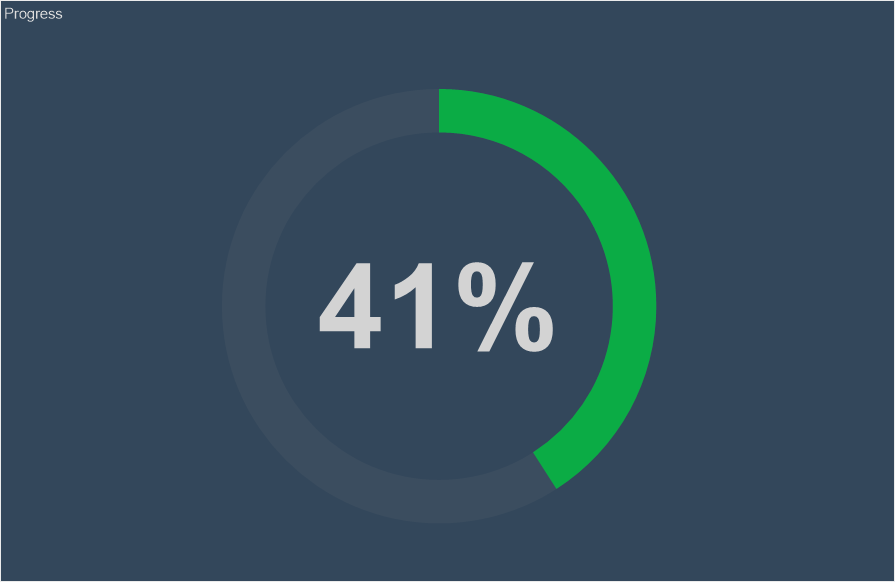
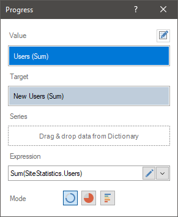
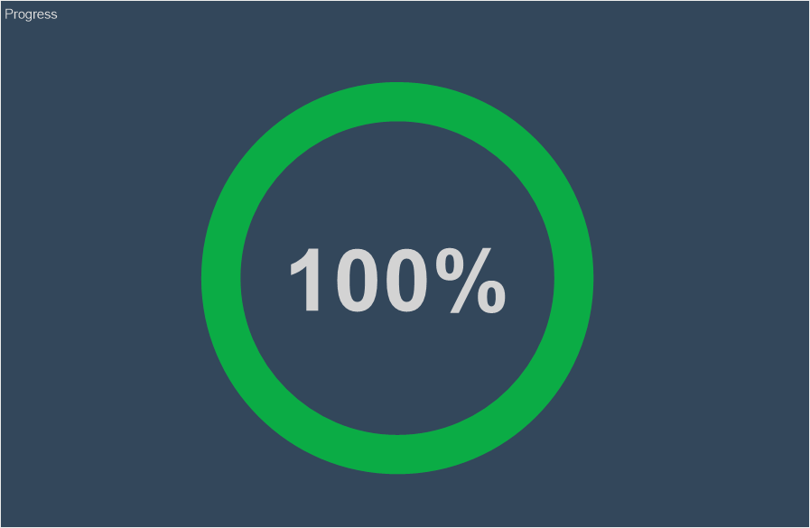
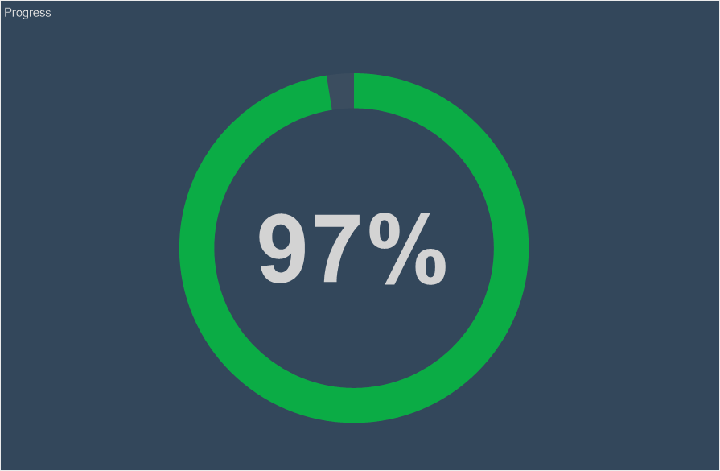
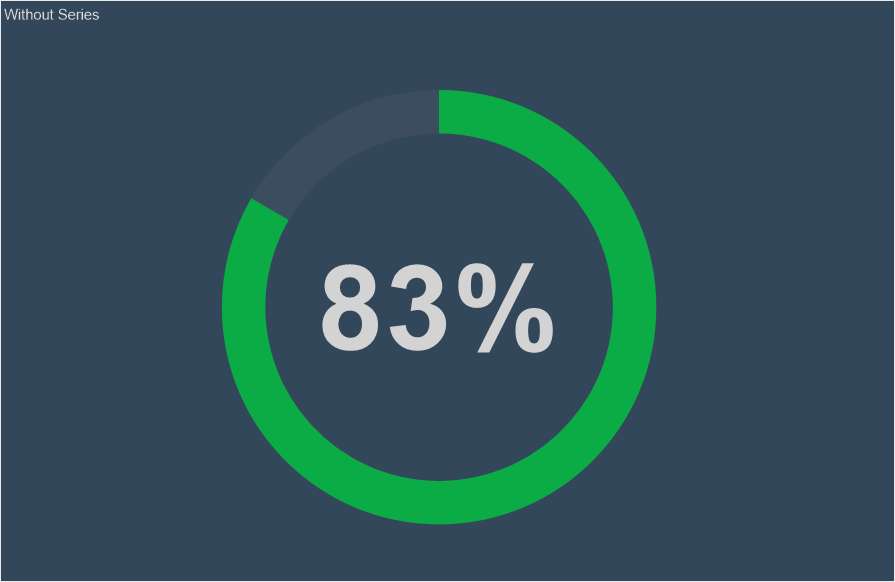
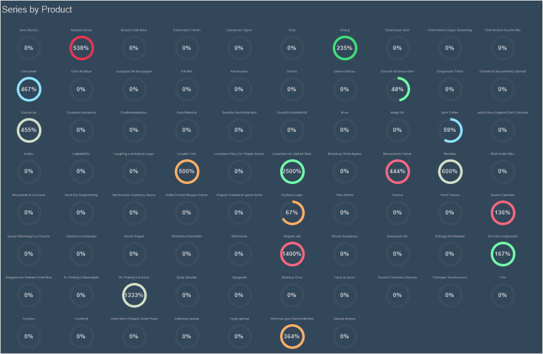
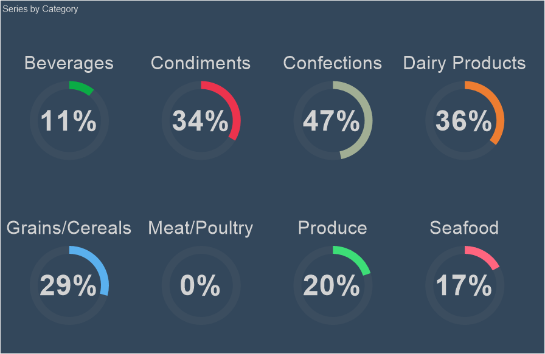
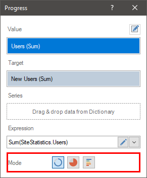
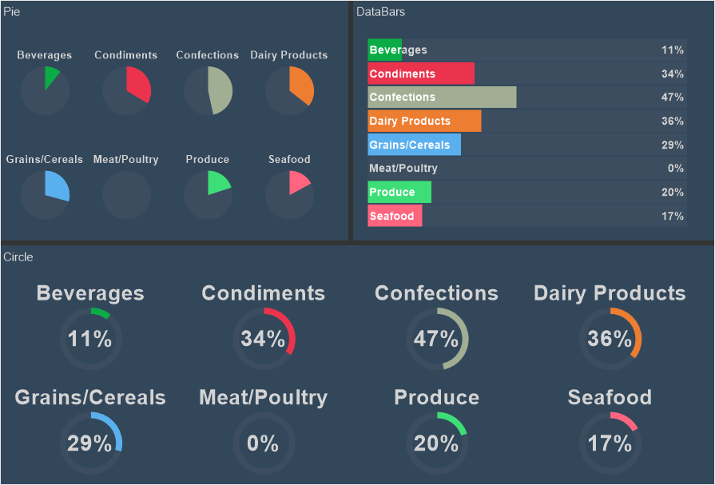

## Progress

**Progress** is an element of the dashboard panel that represents the ability to display the growth rate (relative share) of a value relative to the target value.

This chapter will cover the following:

* [Progress Editor](#ProgressEditor);

* [Progress Value](#ProgressValue);

* [Progress Target Value](#ProgressTargetValue);
* [Progress Series](#ProgressSeries);
* [Progress Types](#ProgressTypes);
* [Table of Properties](#TableOfProperties).

To display **Progress**, you need to add a data field to the **Value** and **Target** fields. In this case, using the graphical element, the growth rate of the value in relation to the target will be displayed. You can setup the **Progress** element in the editor. To call the editor, you should:

* Double-click on the **Progress** element in the dashboard panel;

* Select the **Progress** element and select the Design command in the context menu;

* Select the **Progress** element, and, on the property panel, click the **Browse** button of the **Value**, **Target**, and **Rows** properties.

> **Information**
>
> [Text formatting](Appearance.md#TextFormat) can be applied to the values of the current element.

**Progress editor**

In the **Progress** editor, you can add elements with data, edit the expressions of these elements, select the type of a graphic element to display the calculated value.

In the **Progress** editor you can:

* Specify the data field for the Progress value;

* Specify the data field for the target Progress value;

* Specify the data field for the Progress series;

* Select the type of the graphic element.

**Progress values**

In the **Value** field, you can specify only one data field. All values of this field will be aggregated, i.e. a function will be applied to them. By default, this is a summation function for numeric values. If a data field with non-numeric values is added, then, by default, the function of the number of rows in this data field is applied to them.

> **Information**
>
> Without a target value, the growth rate will always be 100 percent.

**Target value of progress**

To display the growth rate with the help of progress, besides the value in the progress it is necessary to indicate the **target** value. The target value is the aggregated value of the data field specified in the **Target** field of progress. Only one data field can be specified in this field. By default, the summation function for numeric values is applied to the data field in the **Target** field. If a field with non-numeric values is added, then by default the function of counting the number of rows in this data field is applied to it.

> **Information**
>
> If only a target value is specified in the **Progress** element, but no value is specified, then the growth rate in progress will be 0 percent.

**Progress series**

A series of progress is a separate progress for a specific segment of values selected by a certain condition. The condition in this case will be the values of the data field, which is specified in the **Series** field.

For example, in the **Progress** value field, a field with the number of orders issued is set, and the planned number of orders is set to **Target** field. One progress will be displayed without specifying a series. The value of progress will be the growth rate (the value relative to the target value).

If you specify a data field with a list of products in series, then the progress will be displayed for every product, i.e. the growth rate will be displayed for every product.

If you specify a data field in the rows with a list of product categories, then progress will be displayed for every category, i.e. growth rate will be calculated by aggregating the growth rate of all products included into this category. In other words, the growth rate of every product will be grouped into the categories to which they relate.

To set the series of progress, you should:

* Double-click the left mouse button on the **Progress** element;

* Drag and drop the data column from the dictionary to the **Series** field in the editor.

* Create **New Field** in the **Series** field. Set the expression for this data field, the processing result of which will be the values of the progress series.

**Progress types**

When creating the progress, you can select the type of graphic element with which the growth rate value will be displayed. To do this:

* Call the editor of the **Progress** element;

* Use the buttons to select the mode of the graphic element - Circle, Pie, Data Bars.

Below are the three elements of progress with different modes.

> **Information**
>
> Within one **Progress** element, you can select only one type of graphic element.

**List of properties**

The list shows the name and description of the properties of the element which you may find in the properties panel of the report designer.

**Name**

**Description**

Cross-Filtering

It allows you to enable or disable the cross-filtering mode for the current element.

Data Transformation

Customizes the data transformation of the current element.

Group

Adds the current item to a specific [group of items](Groups.md).

Color Each

Sets a unique shade for every graphic element of the progress. If this property is set to True, the colors from the style collection will be applied to the graphic elements. A different color will be applied to each graphic item. After all the colors from the collection are used, the same colors with the lightening cofficient will be applied to the remaining graphical elements. This way, each graphic item will be with a certain shade. If this property is set to False value, one color from the collection of style colors will be applied to graphic items of the one row.

Back Color

Changes the background color of the element. By default, this property is set to **From Style**, i.e. the color of the element will be obtained from the settings of the current element style.

Border

A group of properties that allows you to customize the borders of the element - color, sides, size, and style.

Conditions

Customizes the conditions element of the progress.

Corner Radius

It allows you to define the rounding radius for the corners of an element on the dashboard. You can round each corner of the element separately: Top - Left, Top - Right, Bottom - Right, Bottom - Left. The property can be set to a value between 0 and 30, where 0 is no rounding angle and 30 is the maximum value of the rounding radius.

Font

A group of properties defines the font family, its style, and size for the values of the element.

Fore Color

Specifies the color of the values of the element. By default, this property is set to **From Style**, i.e. the color of the values will be obtained from the settings of the current element style.

Series Color

Customizes the list of colors for the series of the element.

Shadow

A group of properties that allows configuring the shadow of an element:

The Color property allows you to specify the color that will be used to display the shadow of the element.

The properties in the Location group allow you to define the offset of the shadow along the X and Y coordinates, relative to the element's position on the indicator panel.

The Size property allows you to set the size of the shadow from the element's borders. It can be set to a value from 1 to 10, where 1 is the minimum size and 10 is the maximum size.

The Visible property allows you to enable or disable the display of the element's shadow on the indicator panel.

Style

Selects a style for the current element. The default it is set to **Auto**, i.e. the style of this element is inherited from the style of the dashboard.

Enabled

Enables or disables the current item on the dashboard. If the property is set to **True**, the current item is enabled and will be displayed when previewing the dashboard in the viewer. If this property is set to **False**, this element is disabled and will not be displayed when previewing the dashboard in the viewer.

Interaction

Sets [interaction](Interaction.md) of the current element.

Margin

A group of properties that allows you to define margin (left, top, right, bottom) of the value area from the border of this element.

Padding

A group of properties that allows you to define padding (left, top, right, bottom) of the columns from the range of values.

Show Blanks

Allows displaying or hiding the label "Show (blank)" in the dashboard element when there is no data available for that element.

Text Format

Sets the [formatting values](../Report_Internals/Text_Formatting/index.md) of the element.

Title

A group of properties that allows you to customize the title of the element:

The **Back Color** property provides the ability to change the background color of the title of the current item. By default, this property is set to **From Style**, i.e. the background color will be obtained from the style settings of the current element.

Fore Color allows you to change the text color of the title of the current item. By default, this property is set to **From Style**, i.e. the text color of the title will be obtained from the settings of the current element style

The group property **Font** that allows you to define the font family, its style and size for the title of the current element.

The **Horizontal Alignment** property provides the ability to change the title alignment relative to the element - Left, Center, Right.

The **Text** property is used to set the title text of the current element.

The **Visible** property is used to enable or disable displaying of the title of the current item. If the property is set to **True**, then the element title will be included. If this property is set to **False**, then the element header will be disabled.

Name

Changes the name of the current element.

Alias

Changes the alias of the current item.

Restrictions

Configures the permissions to use the current item in the dashboard:

The **Allow Change** option enables or disables changes of the element. If checked, the current item can be changed.

The **Allow Delete** option enables or disables the deletion of an element.

The **Allow Move** option allows or prohibits moving an element.

The **Allow Resize** option enables or disables resizing of an element.

The **Allow Select** option enables or disables the element selection.

Locked

Locks or unlocks resizing and movement of the current element. If the property is set to **True**, the current element cannot be moved or resized. If this property is set to **False**, then this element can be moved and resized.

Linked

Binds the current location to the dashboard or another element. If the property is set to **True**, then the current item is bound to the current location. If this property is set to **False**, then this element is not tied to the current location.
