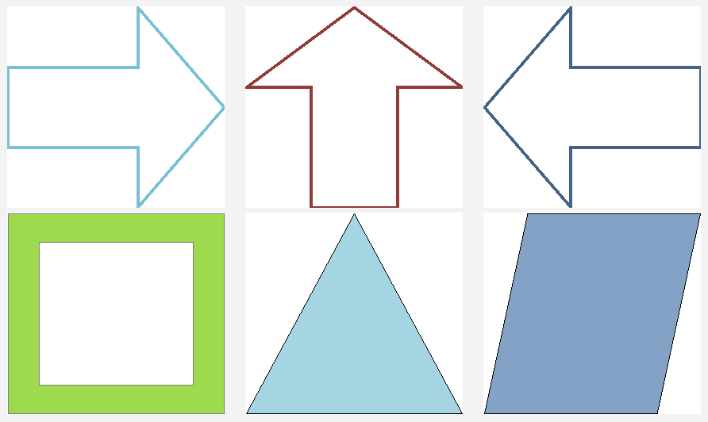
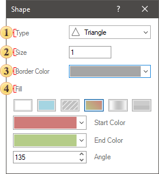

## Shape

Shape is an element with the help of which various shapes can be displayed on the dashboard.

This chapter will cover the following:

* [Shape editor](#ShapeEditor);

* [Table of properties](#TableOfProperties).

The **Shape** element can be placed anywhere on the dashboard. The setting of the **Shape** element is carried out in the shape editor. To invoke the editor of this element, you should:

* Double-click on a **Shape**;

* Select the Shape element, and select the **Design** command in the context menu;

To resize the Shape element you should:

* Select it in the dashboard;

* Increase or decrease the size of the element vertically, horizontally or diagonally.

**Shape editor**

Shape settings can be found in the Shape editor.

 **Type** - determines the type of shapes. Click on the value field and select a shape from the drop-down list.

 **Size** - changes the size of the stroke of shapes.

 **Stroke** - changes the stroke color of shapes. Click on the value field and select a shape from the drop-down list.

 **Fill** - changes the fill type of shapes and, depending on the type selected, override the colors, angle, scale, focus, blending, and hatching. For example, for the Solid type, only one color can be defined. If the **Gradient fill** type is selected, then the starting and ending colors must be selected. You can also change the gradient angle.

> **Information**
>
> All these parameters are represented as identical properties on the property panel. You can configure settings by selecting the **Shape** element and changing the values of these properties in the properties panel.

**List of Shape properties**

The list shows the name and description of the properties of the **Shape** element which you may find in the properties panel of the report designer.

| **Name** | **Description** |
| --- | --- |
| Fill | A property group that is used to change the brush and fill color of a shape in the current element. |
| Shape Type | Changes the type of a shape in the current element. |
| Size | Changes the stroke width of a shape for the current element. |
| Stroke | Changes the stroke color of a shape. |
| Back Color | Changes the background color of the Shape element. By default, this property is set to **From Style**, i.e. the color of the element will be obtained from the settings of the current element style. |
| Border | A group of properties that allows you to customize the borders of a table - color, sides, size, and style. |
| Enabled | Enables or disables the current item on the dashboard. If the property is set to **True**, the current item is enabled and will be displayed when previewing the dashboard in the viewer. If this property is set to **False**, this element is disabled and will not be displayed when previewing the dashboard in the viewer. |
| Margin | A group of properties that allows you to define indents (left, top, right, bottom) of the value area from the border of this element. |
| Padding | A group of properties that allows you to define indents (left, top, right, bottom) of the columns from the range of values. |
| Title | A group of properties that allows you to customize the title of the element: The **Back Color** property provides the ability to change the background color of the title of the current item. By default, this property is set to **From Style**, i.e. the background color will be obtained from the style settings of the current element. **Fore Color** allows you to change the text color of the title of the current item. By default, this property is set to **From Style**, i.e. the text color of the title will be obtained from the settings of the current element style The group property **Font** allows you to define the font family, its style and size for the title of the current element. The **Horizontal Alignment** property provides the ability to change the title alignment relative to the element - Left, Center, Right. The **Text** property is used to set the title text of the current element. The **Visible** property is used to enable or disable displaying of the title of the current item. If the property is set to **True**, then the element title will be included. If this property is set to **False**, then the element header will be disabled. |
| Name | Changes the name of the current element. |
| Alias | Changes the alias of the current item. |
| Restrictions | Configures the permissions to use the current item in the dashboard: The **Allow Change** option enables or disables changes of the element. If checked, the current item can be changed. The **Allow Delete** option enables or disables the deletion of an element. The **Allow Move** option allows or prohibits moving an element. The **Allow Resize** option enables or disables resizing of an element. The **Allow Select** option enables or disables the element selection. |
| Locked | Locks or unlocks resizing and movement of the current element. If the property is set to **True**, the current element cannot be moved or resized. If this property is set to **False**, then this element can be moved and resized. |
| Linked | Binds the current location to the dashboard or another element. If the property is set to **True**, then the current item is bound to the current location. If this property is set to **False**, then this element is not tied to the current location. |
