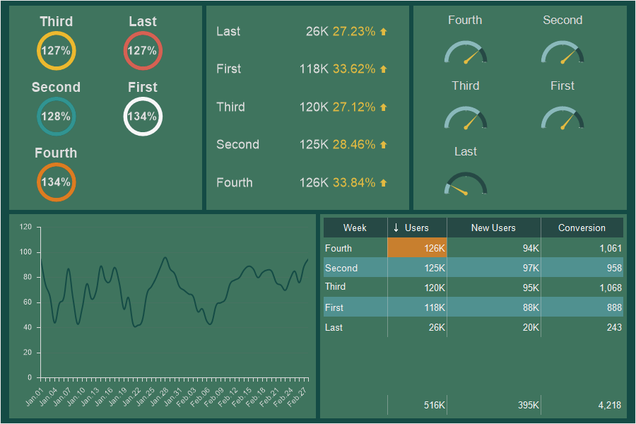
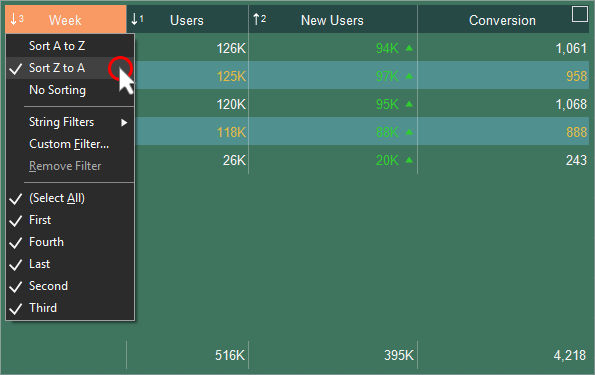
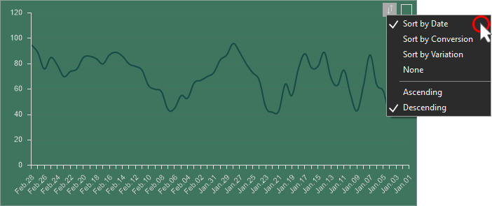
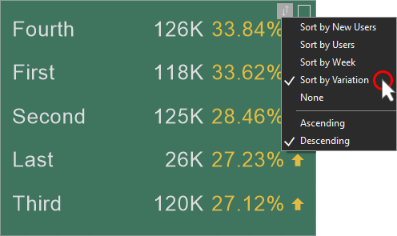
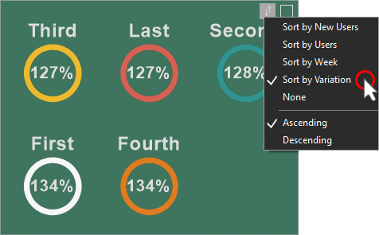
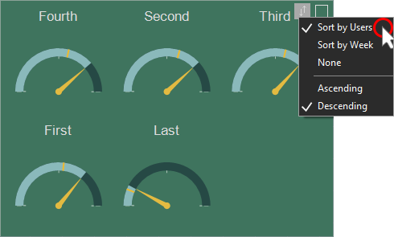

## Sorting

Read the following in this chapter:

* [Sorting in a Table;](#datasortingintable)

* [Sorting in a Chart](#datasortinginchart);

* [Sorting in an Indicator](#datasortinginindicator);

* [Sorting in a Progress](#datasortinginprogress);

* [Sorting in a Gauge](#datasortingingauge).

When designing an analytical panel, you often need to sort data. You can do this in the following ways:

* Create a sorted data source that will be used for elements of the dashboard;

* [Sort data in data transformation](Data_Filtering/Data_Transformation.md#DTSorting);

* Sort data in each item.

Sorting data in an element can be:

* Preset, customized when you design the dashboard panel;

* Interactive, when the user is viewing the dashboard panel, he/she can change the sorting options.

You may set up data sorting for the following items:

* [Chart](Chart.md);

* [Table](Table.md);

* [Indicator](Indicator.md);

* [Progress](Progress.md);

* [Gauge](Gauge.md).

> **Information**
>
> You may enable/disable interactive sorting in the [Interaction editor](Interaction.md) of a dashboard element. To do this, you should:
>
> * Select an item;
>
> * Call the Interaction editor;
>
> * Enable the interactive sort button, or uncheck the box to disable the interactive sort button for the Allow User Sorting option.

Sorting in a Table

Sorting data in a Table is the ordering of table rows by the values of a specific column. You can sort the data in the Table by one or more data columns. In this case, the sorting will be performed by the first column, then by the second, etc. Sort commands are located in the column header menu.

In the column title menu, you may select the sort direction for the values of the current. If None is selected, then sorting by the values of the current column will not happen.

Sorting in a Chart

Sorting data can be performed for each data field that is used in the Chart. To specify sorting in the Chart, you should:

* Press the Sort button on the current item;

* Select a data field by the values of which sorting will be performed;

* Select the direction of sorting.

> **Information**
>
> Please note that sorting in the Indicator, Progress, Gauge is possible only if Series of elements are specified.

Sorting in an Indicator

Sorting data can be performed for each data field that is used in the Indicator. To set the sorting in the Indicator, you should:

* Press the Sort button on the current item;

* Select a data field by the values of which sorting will be performed;

* Select the direction of sorting.

Sort in a Progress

Sorting data can be performed for each data field that is used in the Progress. To specify sorting in the Progress, you should:

* Press the Sort button on the current item;

* Select a data field by the values of which sorting will be performed;

* Select the direction of sorting.

Sort in a Gauge

Sorting data can be performed for each data field that is used in the Gauge. To specify sorting in the Gauge, you should:

* Press the Sort button on the current item;

* Select a data field by the values of which sorting will be performed;

* Select the direction of sorting.

