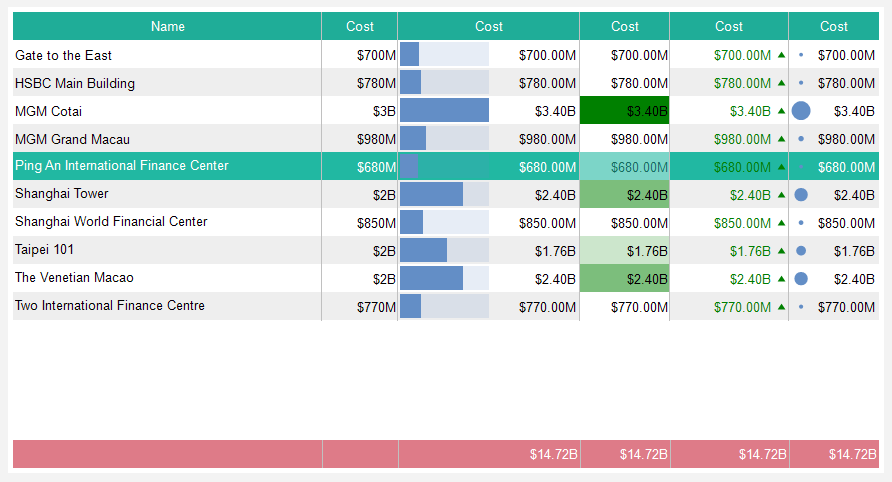
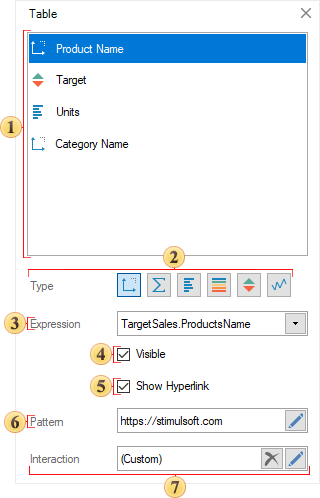
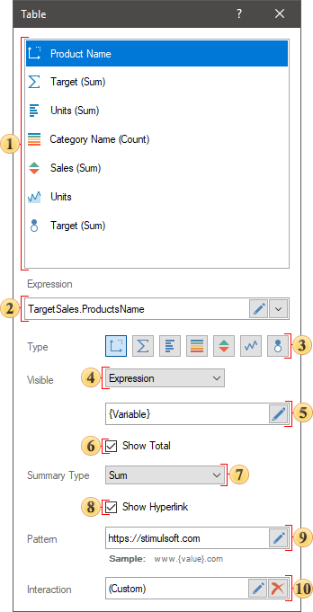
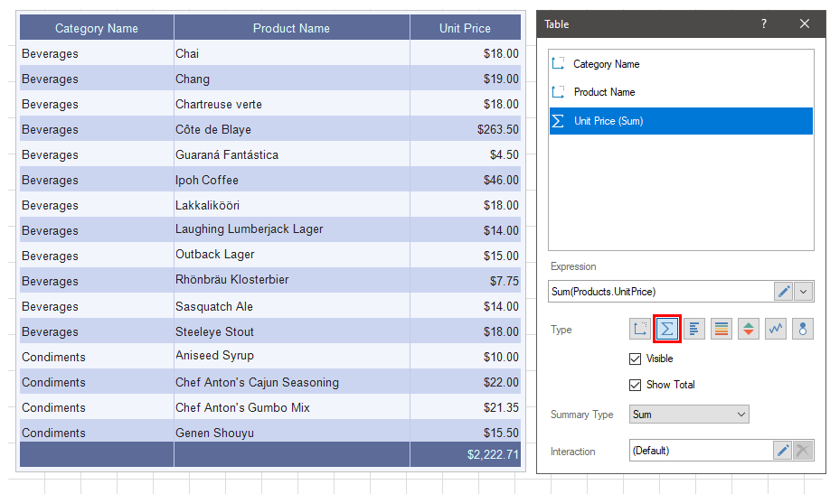
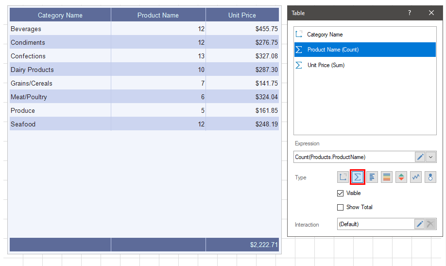
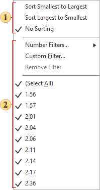

## Table

**Table** is an element of data analysis, which provides the ability to display data field values in Measure and Dimension modes, as well as apply Data Bars, Color Scale, Indicator, Sparklines to data field values. In addition, the table element has settings for data aggregation — filtering, sorting, replacing values, calculating a cumulative total, etc.

> **Information**
>
> When dragging a data source to the dashboard, a table element will be created with all the data columns of this source.

This chapter will cover the following:

* [Table Editor](#TableEditor);

* [The Order of Elements](#OrderOfElements);

* [Size Mode](#SizeMode);

* [Grouping data](#GroupingData);

* [Images in Table](#ImagesInTable);
* [Header Menu](#HeaderMenu);
* [Table of Properties](#TableofProperties).

The options for displaying the values of the Table element are made in its editor. To call the editor, you should:

* Double-click on the Table element;

* Select the **Table** element, and select the **Design** command in the context menu;

* Select the **Table** element, and click the **Browse** button of to the **Columns** property on the property panel.

> **Information**
>
> [Text formatting](Appearance.md#TextFormat) and [Interaction](Interaction.md) can be applied to the values of the current element.

**Table element editor**

In the editor of the Table element, you may add data fields, the order in which they are displayed in the table, the deletion, and the insertion of graphical indicators of data analysis are determined.

 The list of data fields of the Table element.

 The **Expression** field of the selected data field.

 The type of values ​​of the selected data field:

  * **Dimension**, the type in which the value of the data field will be displayed in the initial state.

  * **Measure**, a type in which various functions can be applied to the values ​​of a data field.

  * **Data Bars**, the type in which different functions can be applied to the values ​​of the data field, and a data bar will be added for each value of this field.

  * **Color Scale**, the type in which different functions can be applied to the data field values, and a color scale will be added for each value of this field.

  * **Indicator**, the type in which different functions can be applied to the values ​​of the data field, and an indicator will be added for each value of this field.

* Sparklines, a type in which different functions can be applied to the values ​​of a data field, and a sparkline will be added to each value of this field. By the way, in this case, sparkline also has several types - a graph, area, data bar, a win/loss. Also for a sparkline graph or area, you can define a starting point mode.
* Bubble. It`s the type where various functions can be applied to to the values of data fields and each value will be presented as Bubble.

 The **Visible** parameter provides the ability to enable or disable the display of the selected column in the dashboard table. Also enabling and disabling of the column can depend on the result of a logic expression. If the result of the expression calculation is the true value, the column will be enabled. If the result of the expression calculation is the false value, the column will be disabled.

 The field where the expression of enabling (disabling) visibility of a data column in a table. This field is displayed, only if the Visible parameter is set to Expression value.

 The Show Total parameter allows you to display the total by the values of a selected field.

 The Summary Type parameter allows you to select the function which will be applied to calculate total for the current data field.

 The **Show Hyperlink** parameter allows you to set a hyperlink for the current field values. This option is available only if the data field type is defined as Dimension.

 In the **Pattern** field, a hyperlink is specified for the values ​​of the current data field. This field is available only if the **Show** hyperlink option is enabled.

 The **Interaction** parameter provides the ability to configure interactive actions for the current data field of an item.

**The order of elements output**

The order of the fields in the editor from top to bottom, displays the sequence of their output in the Table element, from left to right. To change the order of the output fields in the table you should change their order in the editor. To do this:

* Move the cursor to the required field;

* Press the left button of the mouse and, without releasing it, drag the field to a specific place.

**Size mode**

By default, the table has a fixed width of columns both in the report designer and in the report viewer. However, you can enable stretching the table. You may do this the following way:

* Select the Table element in the dashboard.

* Set the Fit value to the Size Mode property on the property panel. In this case, the table will stretch across the width of the element. However, in the viewer the width of the columns cannot be less than the preset width. To prevent the table from stretching by the width of the element, set the **Resizing Method** property to **AutoSize**.

**Grouping data in a table**

To group the data in the **Table** element, it is necessary for the data fields which values are to be grouped, to switch the mode from **Dimension** to **Measure**. For example, if there are three data fields in the table - a list of categories, products, the number of orders for each product from different states, then to group by product, follow the fields with the number of orders for different states to switch the item type from **Dimension** to **Measure**.

In the case of grouping data into categories, it is also necessary for the data field with the list of products to change the element type from **Dimension** to **Measure**.

Images in Table

In the table, you can display images obtained from data sources, as well as images obtained by URL. To display images in a table from a data source, you should add the data field to the list of table fields.

If the data field contains image URLs, then by default, these URLs will be displayed as text in the table. To get images by URL and display them in a table, you should:

* Select the data field with the image URL in the Table editor;

* Apply the Image() function to the expression of this field. For example, Image(DataSource.DataColumn1).

* Specify the height and width of the image in the function arguments, if the URL redirects to an SVG image - Image(DataSource.DataColumn, height, width).

**Menu of a header of value ​​columns**

Each data field added to the editor is a column of values ​​in the **Table** element. In this case, for each column a column header values will be created. The text of this header is the name of the data field in the **Table** element editor. Each header of the value column contains a drop-down menu, in which the commands for sorting and filtering by the values ​​of the current column can be found. To call the drop-down menu of the header, you should click the left button of the mouse.

 Commands to sort the table data by the values of the current column. In this case, the data is sorted according to the same principle as in data conversion.

 Commands to filter table data and related items by the values of the current column. In this case, the data filtering is carried out on the same principle as when converting data - a typical filter, a custom filter, the selection of values.

> **Information**
>
> You can disable the sorting and filtering commands in the value column header menu using [the interaction parameters of the Table element](Interaction.md#TableInteraction).

**List of Table properties**

The list shows the name and description of the properties of the **Table** element and its fields, which you may find in the properties panel of the report designer.

| **Name** | **Description** |
| --- | --- |
| Cross-Filtering | It allows you to enable or disable the Cross-Filtering mode for the current item. |
| Data Transformation | Customizes the data transformation of the current item. |
| Frozen Columns | It allows you to specify the number of columns, which will be anchored to the left and will not be scrolled horizontally with scrolling. The number of columns is caunted from left to right. |
| Group | Adds the current item to a specific [group of items](Groups.md). |
| Size Mode | Sets the size mode of the columns of the element: AutoSize - optimal column widths will be calculated; Fit - the columns will be proportionally stretched across the entire width of the element. |
| Rows per Page | Provides the ability to set the number of rows per page in a table. By default, this property is set to 0, meaning all rows are displayed on a single page. |
| Page Turn Time | Provides the ability to set the time interval after which the table will switch to the next page. |
| Back Color | Changes the background color of the element. By default, this property is set to **From Style**, i.e. the color of the element will be obtained from the settings of the current element style. |
| Border | A group of properties that allows you to customize the borders of the element - color, sides, size, and style. |
| Corner Radius | It allows you to define the rounding radius for the corners of an element on the dashboard. You can round each corner of the element separately: Top - Left, Top - Right, Bottom - Right, Bottom - Left. The property can be set to a value between 0 and 30, where 0 is no rounding angle and 30 is the maximum value of the rounding radius. |
| Font | A group of properties defines the font family, its style, and size for the values of the element. |
| Footer Font | A group of properties defines the font family, its style, and size for the footer values of the element. |
| Footer Fore Color | Specifies the color of the footer values of the element. By default, this property is set to **From Style**, i.e. the color of the footer values will be obtained from the settings of the current element style. |
| Fore Color | Specifies the color of the values of the element. By default, this property is set to **From Style**, i.e. the color of the values will be obtained from the settings of the current element style. |
| Header Font | A group of properties that allows you to define a font family, its style and size for the headers of the values of the Table element. |
| Header Fore Color | Determines the color of the headers of the values of the element. By default, this property is set to **From Style**, i.e. the color of the value headers will be obtained from the settings of the current element style. |
| Shadow | A group of properties that allows configuring the shadow of an element: The Color property allows you to specify the color that will be used to display the shadow of the element. The properties in the Location group allow you to define the offset of the shadow along the X and Y coordinates, relative to the element's position on the indicator panel. The Size property allows you to set the size of the shadow from the element's borders. It can be set to a value from 1 to 10, where 1 is the minimum size and 10 is the maximum size. The Visible property allows you to enable or disable the display of the element's shadow on the indicator panel. |
| Style | Selects a style for the current element. The default it is set to **Auto**, i.e. the style of this element is inherited from the style of the dashboard. |
| Enabled | Enables or disables the current item on the dashboard. If the property is set to **True**, the current item is enabled and will be displayed when previewing the dashboard in the viewer. If this property is set to **False**, this element is disabled and will not be displayed when previewing the dashboard in the viewer. |
| Interaction | Sets [interaction](Interaction.md) of the current element. |
| Margin | A group of properties that allows you to define margin (left, top, right, bottom) of the value area from the border of this element. |
| Padding | A group of properties that allows you to define padding (left, top, right, bottom) of the columns from the range of values. |
| Title | A group of properties that allows you to customize the title of the element: The **Back Color** property allows the ability to change the background color of the title of the current item. By default, this property is set to **From Style**, i.e. the background color will be obtained from the style settings of the current element. **Fore Color** allows you to change the text color of the title of the current item. By default, this property is set to **From Style**, i.e. the text color of the title will be obtained from the settings of the current element style The group property **Font** that allows you to define the font family, its style and size for the title of the current element. The **Horizontal Alignment** property allows the ability to change the title alignment relative to the element - Left, Center, Right. The **Text** property is used to set the title text of the current element. The **Visible** property is used to enable or disable displaying of the title of the current item. If the property is set to **True**, then the element title will be included. If this property is set to **False**, then the element header will be disabled. |
| Name | Changes the name of the current element. |
| Alias | Changes the alias of the current item. |
| Restrictions | Configures the permissions to use the current item in the dashboard: The **Allow Change** option enables or disables changes of the element. If checked, the current element can be changed. If unchecked, the element can`t be changed. The **Allow Delete** option enables or disables the deletion of an item. If checked, the current element can be deleted. If unchecked, the element can`t be deleted. The **Allow Move** option allows or prohibits moving an item. If checked, the current element can be moved. If unchecked, the element can`t be moved. The **Allow Resize** option enables or disables resizing of an element. If checked, the current element can be changed. If unchecked, the element can`t be changed. The **Allow Select** option enables or disables the element selection. If checked, the current element can be selected. If unchecked, the element can`t be selected. |
| Locked | Locks or unlocks resizing and movement of the current element. If the property is set to **True**, the current element cannot be moved or resized. If this property is set to **False**, then this element can be moved and resized. |
| Linked | Binds the current location to the dashboard or another element. If the property is set to **True**, then the current item is bound to the current location. If this property is set to **False**, then this element is not tied to the current location. |
| Data field properties: |  |
| Expression | It allows you to specify an expression for the current data field. |
| Label | It allows you to change the label of a data field. |
| Show Total Summary | It allows the ability to display or hide the summary value for a specific data field. |
| Fore Color | It allows you to specify text color for the current data field. |
| Header Alignment | It allows you to align the value of header. |
| Horizontal Alignment | It allows you to specify horizontal text alignment for the current data field. |
| Summary Alignment | It allows you to align the value of total in a range: Left, Center, Right. |
| Text Format | It allows you to specify text format for the values of the current data field. |
| Hyperlink Pattern | It allows you to specify a hyperlink for the values of the current data field. |
| Show Hyperlink | It allows you to enable or disable a hyperlink for the values of the current data field. |
| Size | The group of properties, which allows you to set a fixed column width or max column width. Also, depending on the Word wrap property value, the word wrap mode for the current data field will be either enabled or disabled. |
| Data Bar properties: |  |
| Maximum | Allows setting the maximum value for the data bar. |
| Minimum | Allows setting the minimum value for the data bar. |
| Fill Color | Allows setting the color of the data bar area. |
| Negative Color | Allows setting the color for negative values. |
| Overlapped Color | Allows setting the color for values that exceed the defined maximum and/or minimum. |
| Positive Color | Allows setting the color for positive values. |
