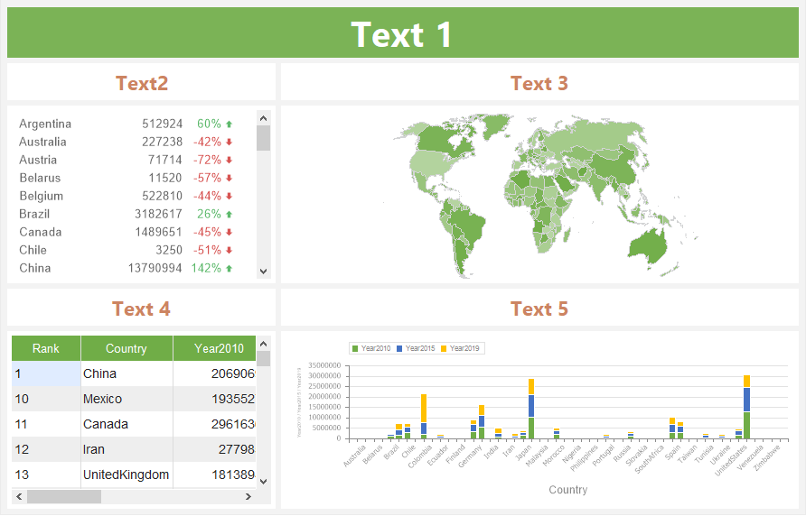
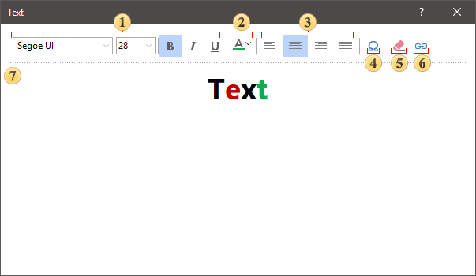

## Text

Text is an element that allows you to display any text or the result of a specified expression on the dashboard. An expression can be a reference to a system variable or a data column.

This chapter will cover the following:

* [Text editor](#TextEditor);

* [Table of properties](#TableOfProperties).

> **Information**
>
> [Interaction](Interaction.md) can be applied to the current element.

> **Information**
>
> If the text element contains a reference to a system variable, then the result that appears in this element will be the value of the system variable. For example, if a reference to the **Today** system variable is specified, the result will be the current date and time of the operating system. If the text element expression is a reference to a data column, then the result that is displayed using this element will be the current value of this data column.

The **Text** element can be placed anywhere on the dashboard. The text element is configured in its editor. To invoke the **Text** element editor, you should:

* Double-click on this item;

* Select the **Text** element and select the **Edit** command in the context menu;

* Select the **Text** element, and,  on the property panel, click the **Browse** button of the **Text** property.

To resize the text element you should:

* Select it on the dashboard;

* Increase or decrease the size of the element vertically, horizontally or diagonally.

**Text editor**

In the **Text** editor you can change the content of this element. You can customize the design of the text in the editor or using the control buttons on the Ribbon panel.

 The group of commands for managing text fonts - font family, font size, font type.

 Sets the color of the text or its characters. Each character of the text can select its own color. To do this, select the character in the field and select a color from the palette or enter a color value in the RGBA format.

 Commands for horizontal text alignment in the Text element area - left, center, right, justify.

 Insert Symbol. It calls the menu with a set of various symbols, which can be inserted to a text.

 Text field clear command.

 The Insert Link allows you to insert a URL address. In the editor of a hyperlink you should specify a URL address and the text, which will be displayed instead of this address.

 Text or expression input field. An expression is specified in curly brackets. For example, {DataSource.DataColumn}.

> **Information**
>
> Similar commands to work with text  - , are located on the Home tab of the Ribbon panel in the report designer. Select the **Text** element and change its font settings, text color, text alignment. In addition, on the Ribbon panel on the Home tab, you can align text vertically - top, bottom, center.

Also, the text element can change the Back Color and the borders of the element. In more detail can be found in the chapter [Appearance](Appearance.md).

**List of properties**

The list shows the name and description of the properties of the **Text** element which you may find in the properties panel of the report designer.

| **Name** | **Description** |
| --- | --- |
| Cross-Filtering | It allows you to enable or disable the cross-filtering mode for the current element. |
| Text | Specifies text in a Table element. When you click the **Browse** button, the editor of the element will be opened, in which you can add or delete text, as well as customize its appearance. |
| Group | It allows you to add the current element to a definite group of elements. |
| Size Mode | It allows you to define text behavior in the current element: The Fit value allows you to scale element content, i.e. change text size to fit it within the element. The Trimming value allows you not to scale element content, i.e. not to change text size. At the same time, if the text doesn't fit within the element, it will be trimmed by the borders of the element. The Word wrap value allows you not to scale element content, i.e. not to change text size. At the same time, if the text doesn't fit within the element, it will be wrapped to the next row. In cases, if the number of rows is greater than element height, the rows will be trimmed in the element height. |
| Right ro Left | Allows enabling right-to-left text display mode. |
| Back Color | Changes the background color of the element. By default, this property is set to **From Style**, i.e. the color of the element will be obtained from the settings of the current element style. |
| Border | A group of properties that allows you to customize the borders of a  table - color, sides, size, and style. |
| Corner Radius | It allows you to define the rounding radius for the corners of an element on the dashboard. You can round each corner of the element separately: Top - Left, Top - Right, Bottom - Right, Bottom - Left. The property can be set to a value between 0 and 30, where 0 is no rounding angle and 30 is the maximum value of the rounding radius. |
| Fore Color | Specifies the color of the values of the element. By default, this property is set to **From Style**, i.e. the color of the values will be obtained from the settings of the current element style. |
| Shadow | A group of properties that allows configuring the shadow of an element: The Color property allows you to specify the color that will be used to display the shadow of the element. The properties in the Location group allow you to define the offset of the shadow along the X and Y coordinates, relative to the element's position on the indicator panel. The Size property allows you to set the size of the shadow from the element's borders. It can be set to a value from 1 to 10, where 1 is the minimum size and 10 is the maximum size. The Visible property allows you to enable or disable the display of the element's shadow on the indicator panel. |
| Style | Selects a style for the current element. The default it is set to **Auto**, i.e. the style of this element is inherited from the style of the dashboard. |
| Enabled | Enables or disables the current item on the dashboard. If the property is set to **True**, the current item is enabled and will be displayed when previewing the dashboard in the viewer. If this property is set to **False**, this element is disabled and will not be displayed when previewing the dashboard in the viewer. |
| Interaction | Sets [interaction](Interaction.md) of the current element. |
| Margin | A group of properties that allows you to define indents (left, top, right, bottom) of the value area from the border of this element. |
| Padding | A group of properties that allows you to define indents (left, top, right, bottom) of the columns from the range of values. |
| Title | A group of properties that allows you to customize the title of the element: The **Back Color** property provides the ability to change the background color of the title of the current item. By default, this property is set to **From Style**, i.e. the background color will be obtained from the style settings of the current element. **Fore Color** allows you to change the text color of the title of the current item. By default, this property is set to **From Style**, i.e. the text color of the title will be obtained from the settings of the current element style The group property **Font** allows you to define the font family, its style and size for the title of the current element. The **Horizontal Alignment** property provides the ability to change the title alignment relative to the element - Left, Center, Right. The **Text** property is used to set the title text of the current element. The **Visible** property is used to enable or disable displaying of the title of the current item. If the property is set to **True**, then the element title will be included. If this property is set to **False**, then the element header will be disabled. |
| Name | Changes the name of the current element. |
| Alias | Changes the alias of the current item. |
| Restrictions | Configures the permissions to use the current item in the dashboard: The **Allow Change** option enables or disables changes of the element. If checked, the current item can be changed. The **Allow Delete** option enables or disables the deletion of an element. The **Allow Move** option allows or prohibits moving an element. The **Allow Resize** option enables or disables resizing of an element. The **Allow Select** option enables or disables the element selection. |
| Locked | Locks or unlocks resizing and movement of the current element. If the property is set to **True**, the current element cannot be moved or resized. If this property is set to **False**, then this element can be moved and resized. |
| Linked | Binds the current location to the dashboard or another element. If the property is set to **True**, then the current item is bound to the current location. If this property is set to **False**, then this element is not tied to the current location. |
