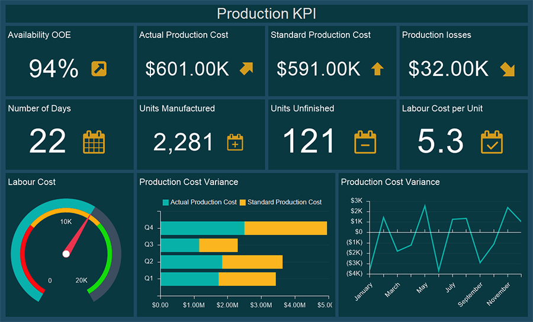
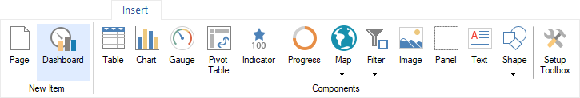
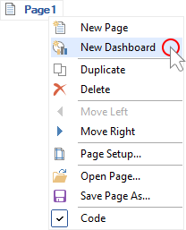
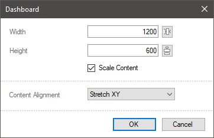
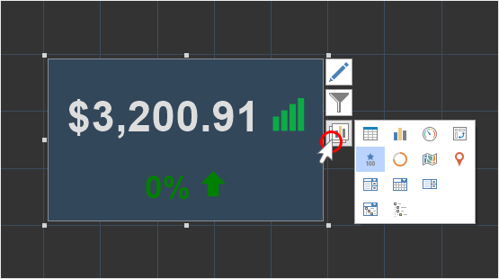

## Dashboards

The **Dashboard** component is a scalable area on which you can place elements of data analysis. All elements placed on the dashboard can be related to each other or split into groups of related elements. The dashboard panel is created in the report designer and viewed in the preview panel in the report designer or viewer.

This chapter covers the following:

* [Creating dashboards](#CreatingDashboards);

* [The size of a dashboard](#DashboardSize);

* [Elements of data analysis](#ElementAnalysis);

* [Elements of data filtering](#ElementFiltering);

* [Other dashboard elements](#OtherElement);

* [Actions with the dashboard](#ActionsWithDashboard)**;**

* [Adding items to the dashboard](#AddingItems);

* [Changing the item type](#ItemType).

**Creating dashboards**

Do the following steps in the report designer to add a new dashboard in the report:

* Click the **Dashboard** button on the **Insert** tab;

* Select **New Dashboard** in the context menu of the page title or dashboard panel.

**The size of a dashboard**
When creating the dashboard in the designer, its size has a working area that looks like a white sheet with a grid. To change the size of the dashboard in the report designer, you should:
* Double-click on the working area of the dashboard;
* Specify the width and height of the dashboard in pixels. Pay attention to the fact, that there are also control commands that can be used to make the same free distance top-bottom and left right.

When you change the size of the working area of the dashboard in the report designer, the elements can stretch (shrink) or keep their size unchanged. It depends on the **Scale Content** parameter. If this option is enabled, then, when resizing the dashboard, all elements will also be stretched or shrunk. If this parameter is disabled, only the size of the working area of the dashboard will increase, while the size of the elements will remain unchanged.

The **Content Alignment** parameter allows you to define the indicator panel mode in the view area. Depending on the parameter value you select, a dashboard will be stretched in the view area, or remain unchanged. For the Content Alignment parameter, one of the following values can be set:

* **Left**, **Right**, **Center**. In this case, a dashboard will not be stretched in the viewer. The value defines only the horizontal alignment of the dashboard in the viewer area.

* **Stretch X**. In this case, a dashboard will be stretched horizontally across the entire viewer area. The height of the current dashboard can also be changed so as the aspect ratio of the dashboard will be kept.

* **Stretch XY**. In this case, a dashboard will be stretched (or shirked) across the entire area of the viewer horizontally and vertically.

> **Information**
>
> Data filtering elements of drop-down type ([combo box](Data_Filtering/Combo_Box.md), [date picker](Data_Filtering/Date_Picker.md), [tree view box](Data_Filtering/Tree_View_Box.md)) are not stretched in height.

All elements of the dashboard are grouped into the following categories according to their functionality:

**Elements of data analysis**

* [Table](Table.md);
* [Chart](Chart.md);

* [Pivot](Pivot_Table.md);

* [Indicator](Indicator.md);
* [Progress](Progress.md);
* [Maps](Maps/index.md);

**Elements of data filtering**
* [List box](Data_Filtering/List_Box.md);

* [Combo box](Data_Filtering/Combo_Box.md);

* [Tree View](Data_Filtering/Tree_View.md);

* [Tree View Box](Data_Filtering/Tree_View_Box.md);

* [Date Picker](Data_Filtering/Date_Picker.md).

**Other dashboard elements**

* [Panel](Panel.md);
* [Text](Text.md);
* [Image](Image.md);
* [Shapes](Shape.md);

* [Button](Button.md).

**Actions with the dashboard**

* [View the dashboard](../Viewer/Dashboards.md);

* [Export the dashboard and its items](../Exports/Dashboards.md);

* Share the dashboard and embed it into your website;

* Publish the dashboard.

**Adding items to the dashboard**

Do the following to add an element to the dashboard:

* Drag items from the **Toolbox** or the **Insert** tab to the working area of the dashboard;

* Select items on the **Toolbox** or the **Insert** tab and left-click in the dashboard panel.

**Changing the item type**

You can change the type of the element without redesigning it. To do this:

* Select an element that needs to be changed on the dashboard;

* Left-click on the **Change Type** button;

* In the menu that opens, select the element to which you want to convert the current one.

