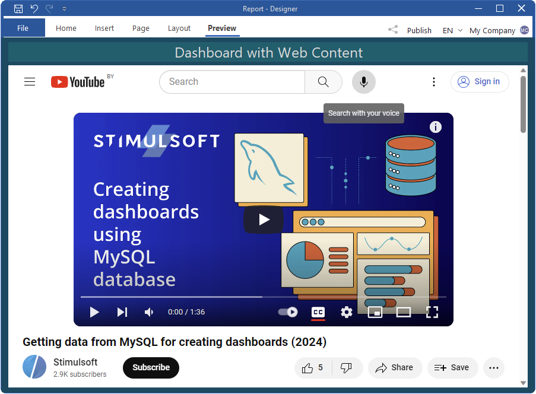
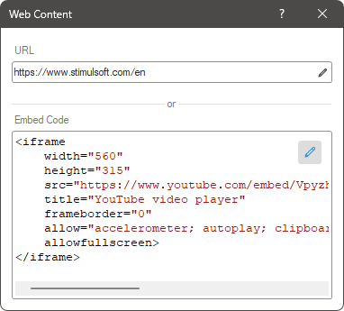

## Web content

Web Content is an element through which you can display various types of content from the Internet, including videos, web pages, animated images, and more, on the indicator panel within the viewer. To exhibit content in Stimulsoft Designer, the WebView2 environment is utilized. Consequently, the dashboard can showcase everything that a web browser can display.

This chapter will cover the following questions:

* [Web Content editor](#webcontenteditor);

* [List of properties](#propertiestable).

The Web Content can be positioned anywhere on the dashboard. Setting the content source is accomplished in the element editor. To access the editor:

* Double-click the Web Content element.

* Select the Web Content element and choose the Design command from the context menu.

* Choose the Web Content element and click the Design button.

To resize the Web Content element:

* Select it on the indicator panel.

* Adjust the size vertically, horizontally, or diagonally as needed.
Web Content editor
The editor specifies the source URL for the content to be displayed or the embed code. Within one element, you can display content from only one source - either via a link or by using an embed code.

* In the URL field, you can specify a link to web content.

* In the Embed Code field, you can specify a code to embed the content.

**List of properties**
The list shows the name and description of the properties of the element which you may find in the properties panel of the report designer.

| **Name** | **Description** |
| --- | --- |
| Back Color | Changes the background color of the element. By default, this property is set to **From Style**, i.e. the color of the element will be obtained from the settings of the current element style. |
| Border | A group of properties that allows you to customize the borders of the element - color, sides, size, and style. |
| Corner Radius | It allows you to define the rounding radius for the corners of an element on the dashboard. You can round each corner of the element separately: Top - Left, Top - Right, Bottom - Right, Bottom - Left. The property can be set to a value between 0 and 30, where 0 is no rounding angle and 30 is the maximum value of the rounding radius. |
| Shadow | A group of properties that allows configuring the shadow of an element: The Color property allows you to specify the color that will be used to display the shadow of the element. The properties in the Location group allow you to define the offset of the shadow along the X and Y coordinates, relative to the element's position on the indicator panel. The Size property allows you to set the size of the shadow from the element's borders. It can be set to a value from 1 to 10, where 1 is the minimum size and 10 is the maximum size. The Visible property allows you to enable or disable the display of the element's shadow on the indicator panel. |
| Enabled | Enables or disables the current item on the dashboard. If the property is set to **True**, the current item is enabled and will be displayed when previewing the dashboard in the viewer. If this property is set to **False**, this element is disabled and will not be displayed when previewing the dashboard in the viewer. |
| Margin | A group of properties that allows you to define indents (left, top, right, bottom) of the value area from the border of this element. |
| Padding | A group of properties that allows you to define indents (left, top, right, bottom) of the columns from the range of values. |
| Title | A group of properties that allows you to customize the title of the **Table** element: The **Back Color** property provides the ability to change the background color of the title of the current item. By default, this property is set to **From Style**, i.e. the background color will be obtained from the style settings of the current element. Fore Color allows you to change the text color of the title of the current item. By default, this property is set to **From Style**, i.e. the text color of the title will be obtained from the settings of the current element style The group property **Font** that allows you to define the font family, its style and size for the title of the current element. The **Horizontal Alignment** property provides the ability to change the title alignment relative to the element - Left, Center, Right. The **Text** property is used to set the title text of the current element. The Visible property is used to enable or disable displaying of the title of the current item. If the property is set to **True**, then the element title will be included. If this property is set to **False**, then the element header will be disabled. |
| Name | Changes the name of the current element. |
| Alias | Changes the alias of the current item. |
| Restrictions | Configures the permissions to use the current item in the dashboard: The **Allow Change** option enables or disables changes of the element. If checked, the current item can be changed. The **Allow Delete** option enables or disables the deletion of an element. The **Allow Move** option allows or prohibits moving an element. The **Allow Resize** option enables or disables resizing of an element. The **Allow Select** option enables or disables the element selection. |
| Locked | Locks or unlocks resizing and movement of the current element. If the property is set to **True**, the current element cannot be moved or resized. If this property is set to **False**, then this element can be moved and resized. |
| Linked | Binds the current location to the dashboard or another element. If the property is set to **True**, then the current item is bound to the current location. If this property is set to **False**, then this element is not tied to the current location. |
