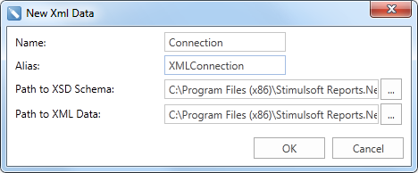
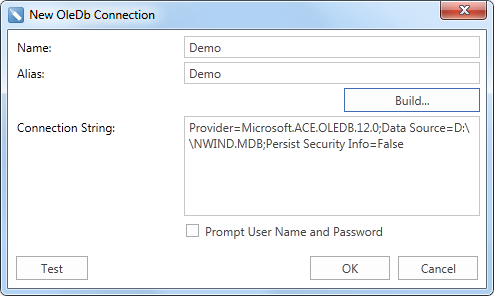
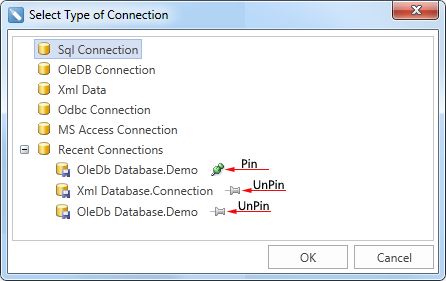

## Connection

The **Connection** object of the data dictionary describes the report parameters that are used to retrieve data from the database. Stimulsoft Reports supports many types of connection object. All types can be divided into two groups: built-in ones that are included into the report generator, and external data adapters that can be downloaded from our website [Database Packs](http://www.stimulsoft.com/en/downloads/database-packs). These packs can be used only for the reporting tools of the product line [Stimulsoft Reports](http://www.stimulsoft.com/en/products/net).

**Built-in data adapters**

To create a new built-in connection it is necessary to call the **Select Type Of Connection** dialog. This window can be opened from the **Dictionary** tab, selecting **New Connection...**, as well as from the **New Data Source** dialog by clicking the **New Connection...** After selecting the connection type, press the **OK** button. Depending on the type of connection a dialogue form will be displayed. If you choose an XML connection type, then the following dialog will appear (see the picture below - New XML Data. Fill the Name, the path to the XSD schema and XML data. Also specify the connection alias.

If to choose any other type of connection, the dialog box will be a **New** ***type*** **connection**, in which set the connection **Name** and **String**. Also specify the connection **Alias**. The picture below shows the **New Ole DB Connection** dialog box:

There is a list below with built-in connection types:

* **SQL** - this connection describes the parameters to access the Microsoft SQL Server database;

* **OleDB** - connection describes the parameters to access databases via the OleDB driver;

* **ODBC** connection describes the parameters to access databases via the ODBC driver

* **XML** connection describes the parameters to access XML files;

* **MS Access** connection describes the parameters to access the MS Access database;

The picture below shows the **Select Type Of Connection** window:

**Recent Connection tab**

Also in the **Select Type Of Connection** window we can find a **Recent Connections** folder, which contains previously established connections. At the same time it can contain up to 15 connections. When creating subsequent connections, the first connection will be overwritten and so on. If you need the connection never be overwritten, set write protection for it, you should click the Pin icon. To remove the write protection, you must click UnPin icon (see the picture above). When selecting a connection from the **Recent Connections** folder, the next dialog box is **New xml Data** when choosing previously created **xml** connection, or **New** ***type*** **connection**, when any other type is chosen, with already filled fields. If necessary, empty fields may be edited.

**External adapters**

In addition to the basic types of connections, there are also external data adapters that provide connection to the following databases:

 **Firebird**;

 **IBM Db2**;

 **MySQL** **Connector.Net**;

 **MySQL** **CoreLab**;

 **Oracle**;

 **Oracle Data Provider for .NET**;

 **PostgreSQL**;

 **PostgreSQL CoreLab**;

 **Sybase Advantage Database Server**;

 **Sybase Adaptive Server Enterprise**;

 **SqlCe**;

 **SQLite**;

 **VistaDB**;

 **Uni Direct**;

 **dot Connect Universal**;

 **Informix**;

 **EffiProz**.

Consider the example of creating a connection to an external data adapter. Download the external data adapter from our [website](http://www.stimulsoft.com/Downloads.aspx). In our example, we downloaded the MySQL Connector.Net adapter. Unpack the archive into a temporary directory and run the project. Add references to assemblies **Stimulsoft.Report.dll**, **Stimulsoft.Controls.dll**, **Stimulsoft.Base.dll** and **Stimulsoft.Editor.dll** in the running project and compile the project. Copy the compiled **dll** files to the **bin** folder, and in the beginning of the program add the following code:

StiOptions.Services.DataAdapters.Add(new Stimulsoft.Report.Dictionary.StiTestXAdapterService());StiOptions.Services.DataBases.Add(new Stimulsoft.Report.Dictionary.StiTestXDatabase());

To attach an assembly file to **Designer.exe**, place this assembly file in the same directory in which the **Designer.exe** is located. Furthermore, it should provided an access to a data provider assembly. Thereafter, in the **Select Type Of Connection** dialog a new type of connection will be available, in our case, **MySQL Connector.Net**. There are no restrictions on the number of connections created for various types of data sources in report generator.
