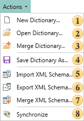

## Actions Menu

In the **Actions** menu the main commands to control the data dictionary are located. The picture below shows this menu item:

 The **New Dictionary...** command is used to create a new data dictionary in an editing report;

 The **Open Dictionary...** command invokes a dialog box in which one should specify the path to the previously saved data dictionary, select it and click Open. In this case, the current data dictionary is replaced with the specified data dictionary.

 If it is necessary to add a data dictionary to the data dictionary in the report, you can use the **Merge Dictionary...** command. Using this option, the user will see a dialog box in which it is possible to specify the path to the previously saved data dictionary, select it and click Merge. Then, the selected data dictionary will be added to the data dictionary in the report. If the current data dictionary and the data dictionary, which will be added, have the same items, the existing items will be replaced on data items from the added data dictionary;

 The **Save Dictionary As** command invokes a dialog box in which it is possible to specify the path by what data dictionary, the name of the saving *.dct file will be saved, click the Save button. After that, the data dictionary of a report will be saved;

 Using the **Import XML Schema...** command it is possible to import information about the data from the selected XML schema to the data dictionary.  After clicking this item, a dialog box will be invoked where a user must specify the path to a previously saved XML schema, select it and click Open;

 Using the **Export XML Schema...** command it is possible to save the data dictionary as an XML schema. After clicking this item, a dialog box will be invoked where one must specify the path to save the XML schema and the *.xsd file name. Then click the Save button;

 If it is necessary to add more information about the data from the selected XML schema to the information about the data in the data dictionary, click the Merge XML Schema... command. A dialog box will be invoked where one must specify the path to the XML schema, information from which will be added, select it and click Open;

 The **Synchronize** command provides the ability to synchronize the contents of a data dictionary with the data that are registered for the report. This command synchronizes the registered data in a data store and data dictionary of a report. Moreover, the data can be passed to the report from both the program and be connected in the report. If data were registered using the **RegData** or **RegBusinessObjects** methods then, when running the report designer, they will be synchronized. It is necessary to note that if the data are registered in a report as connections to databases, then synchronization will not be performed automatically. This remark is not related to a connection in the report, generated for the **XML** data. For data that are registered in the report and receive the information from databases using queries, one must use the wizard to create a new data source. A wizard to create a new data source provides the ability to add tables from the database automatically.
