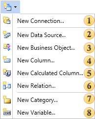

## New Item Menu

Commands using which it is possible to add new items to the data dictionary of a report can be found in the **New Item** menu. The picture below shows the **New Item** drop down list:

 If you want to create a new data source in the data dictionary of a report, you must select the **New Data Source...** command. The type of the data source depends on the type of connection. When using this command, a wizard to create a new data source that provides the ability to add more than one data table in a data dictionary of a report. It is necessary to know that this is just a method of describing the data source.

 To add a description of a new business object to the data dictionary of a report you should select the **New Business Object...** command. It should be remembered that for each created business object, you must pass real business objects from the program. Since, as already mentioned before, only a method of describing data is created in the data dictionary. So, without real business objects, it will not work.;

 Add a new column in the selected data source or a business object using the **New Column...** command. Also, if the data column is added to the report data dictionary, but it does not really exist in the database, it can lead to incorrect report rendering.

 In the report data dictionary, it is possible add a new calculated column in the selected data source. Use the **New Calculated Column...** command for this. In contrast to the simple data column, for proper report rendering, it is not necessary for a new calculated data column be placed in the database.

 The command to add the variable to the data dictionary.

 To organize a new relation between the data sources, you should use the New Relation... command. It is worth to note that relations can be created only between data sources and cannot be created between business objects. Therefore, if needed to create the relation between business objects, the **RegData** method should be used instead of the **RegBusinessObjects** method. The **RegData** method converts the business object into the ADO.NET DataSet. As a result, you can work with this business object by means of ADO.NET. Accordingly, it will provide an opportunity to add new relations between business objects and use them.

 If you want to add a new category of variables in the report data dictionary, you should use the **New Category...** command. All variables are organized in a two-level structure, where the variable can be located both in the main list and in the category, which is located in the main list. Such a category can be created with this command.

 The **New Variable...** command provides an opportunity to add a new variable into the data dictionary. If, when calling this command, any category of variables has been selected in the data dictionary, then the variable will be created in this category. If no category in the data dictionary has been selected or the Variable element has been selected in the data dictionary, then the new variable will be created at the top level of the variables list.
