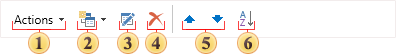
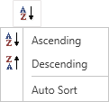

## Control Panel

The basic elements to control data dictionary can be found on the control panel. The picture below shows the control panel:

 The **Actions** menu. This menu contains the main control commands for the data dictionary;

 The **New Item** menu. In this menu the basic commands to create new elements in the data dictionary are placed;

 The **Edit** button provides an opportunity to change any element, which can be edited;

 Using the **Delete** button one can delete any item in the data dictionary available for deleting;

 Pressing the **Up/Down** buttons, the selected item in the data dictionary is moved one position up/down;

 The **Sorting Items** menu. In this menu one can select the sorting direction: **Ascending**, **Descending**. Also in this menu, one can enable **Auto Sort**. The picture below shows the Sorting Items menu:

The Ascending option sorts the information in order from A to Z; The Descending option sorts the information in order from Z to A. The Auto Sort sorts in order from A to Z. One should note that the items are sorted within functional groups. For example, data sources within the data sources group are not mixed with the variables and the variables within the variables group are not mixed with the data sources, etc. Also note the nesting of elements of the data dictionary.
