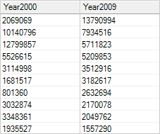
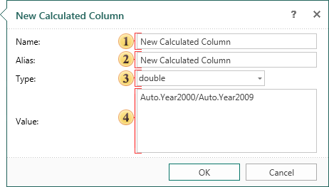
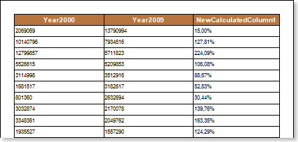

## Calculated Data Column

The calculated data column is calculated on the base of an expression that can be used by other data columns into an existing data source. The expression can be a name of the non-calculated column, constant, function, or any combination, connected to one or more operators. The expression cannot be a nested query. The calculated data column is a virtual column that is not stored physically in the data source. The values ​​of the calculated data column are updated each time you access to them in the query. Also, the values ​​of calculated column are updated every time you change the columns included into the calculated expression. Before you add a calculated column, you must connect at least one data source. Consider the creation of calculated data column in the data source Auto. The following columns are in this data source: Rank, Country, Year2000, Year2005, Year2009. Columns Year2000, Year2005, Year2009 contain data about cars produced in 2000, 2005, and 2009. Create a calculated data column, which will contain data on the growth of production cars in 2009 relative to 2000, the results are displayed in percentages. The picture below shows the data column of Year2000 and Year2009:

To create a new calculated column you should call the New Calculated Column dialog and fill in the dialogue form. The dialog can be called from the context menu of data source or from the Actions menu. The picture below shows the New Calculated Column dialog:

 The Name column is used to call this calculated column in the report. Enter in the Name.

 The Alias column is used as a prompt. Enter in the Alias.

 The Type field provides the ability to choose the data type that will contain the new calculated column.

 The Dictionary button contains a drop-down menu that displays the structure of the data dictionary. In this menu you can select data columns, business objects, or system variables that will be added to the calculation of expression of the calculated data column.

 The Value field is used to define an expression for calculating the values ​​of the new calculated data column.

In this example, the calculation expression will contain data columns Year2000 and Year2009 from the data source Auto, and the type of data in a new calculated column will be double. After the column is created, you should place a text component with a reference to this data column. In this example, the text component will contain a link {Auto.NewCalculatedColumn1}. As the result of calculations is necessary to be displayed in the percentage, then this text component should change the format, i.e. set the Percentage format. Below is a report with the calculated data column:

