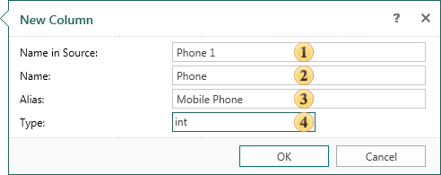
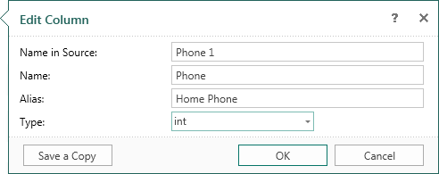

## Creating and Editing Data Columns

**Creating data columns**

To create a new column select the data source, which will be added to the data column, and select **New Column...** in the **New Item** menu or the context menu of the selected data source. After selecting this option the **New Column** dialog will be invoked. In this dialog you should specify new columns. The picture below shows a **New Column** dialog:

 The **Name in Source** field. Specifies the name in the data source (not in the report).

 The column **Name**. Used to call the new column in the report.

 The column **Alias**. Specified in the Alias.

 The **Type** field. Used to select the type of data that will be contained in the new column.

After clicking **OK**, a new data column in the selected data source will be created. It should be noted that the data column generated this way is only a description of the (virtual) data columns and it does not contain real data. If the database does not have this column, then when calling the database, the report generator will produce an error.

**Editing data columns**

The data column can be edited. To do this, you must select **Edit** in the context menu of the selected column, or click the **Edit** button on the toolbar in the data dictionary. After that, the user will be shown the **Edit Column** dialog, where you can change settings such as **Name in Source**, **Name**, **Alias** and **Type** of the edited column. Press **OK** to apply changes. The picture below shows the **Edit Column** dialog:

The **Save a Copy** button saves a copy of the edited data column, with the assignment of the Copy postfix in the name of the data column.
