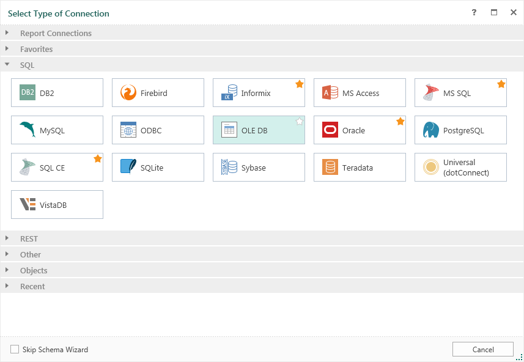
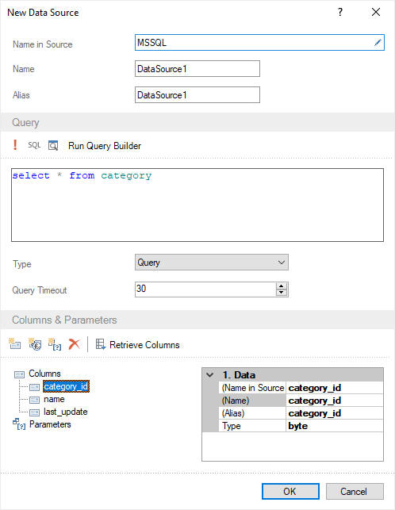
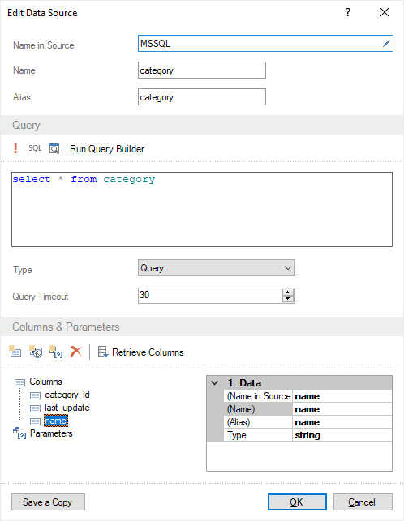

## Creating Data Source

Consider an example of creating a new data source. It is worth noting that before you can create a data source, you must setup a connection. If there is no connection, then go to Dictionary, select New the **New Data Source** command in the **New Item** menu:

In the opened menu, select the type of a connection, for example, OleDB. The form to create the connection will be opened:

Specify the connection name, alias, and the connection string. Also you can find buttons to call the query builder, to clean the connection string, the button to check the connection and the button of the connection string template (for OleDB pattern is as follows: Provider=SQLOLEDB.1; Integrated Security=SSPI; Persist Security Info=False; Initial Catalog=myDataBase; Data Source=myServerAddress). To verify the connection string, press the Test button. In this case, if the connection string does not contain errors, the user will see the Connection was successful window. If the connection string contains an error, the user will be shown a window with the text of the error which was returned by the database server in response to the attempt to create the connection. After clicking the OK button, a new connection will be created.

Next, the following ways to create a new data source are possible:

* Obtaining data by schema;

* Creating a request for retrieving data.

It specifies how to create a data source, such parameter as Skip Schema Wizard. If it is checked, then after creating a connection, the user will see a the query form. If the check box is not checked, the data schema will be retrieved.

Consider a ways of obtaining data in detail.

**Retrieving the data schema** (the check box of the Skip Schema is not set)

After you create the connection you will go to the Select Data dialog. To get a list of tables from the database, you must click the **Refresh** button in this window. You can also enable/disable the **Auto Refresh** mode check/uncheck the check box. If checked, the wizard will automatically update the list of data tables. The list in this window is represented as tabs which are arranged in a hierarchical form. The Home tab is a category (for example, Queries, Tables, Views, Procedures).

For creating a new data source you should select the data table. It is also possible to exclude the table data columns from the future data source. For this purpose, it is necessary to open the selected table and uncheck the flag next to the name of the column that you want to exclude. By default, if you select the data table, all the columns in this table are checked. They will be added to the new data source. Each selected data table will be a single data source, one table is one source. The picture below shows the Select Data window with selected data tables and data columns selected:

After clicking OK, the Categories, Products and Shippers data sources will be created. The picture below shows the data sources created in the Dictionary:

Now, report templates will be created on the basis of these data descriptions.

**Retrieving data without schema (the check box of the Skip Schema is set)**

After the connection has been created and Skip Schema is checked and you will go to the **New Data Source** dialog to create the query:

In this window you must define parameters such as the Name in Source, Name, Alias. Also, in the Query Text field, it is necessary to form a database query and execute it. If the request is successful, press the **Retrieve Columns** button.

Each column contains properties such as the Name in Source, Name, Alias, and Type. To change the values of these properties, high you should select the data column, and, in the Properties panel, to change and edit them. It is also possible to add or remove a data column. To add a column, click the **New Column** button or the **New Calculated Column** button. To delete a column, it is necessary to select it and click **Delete**.

After clicking OK, a new source will be created.

**Editing the data source**

Any created data source can be edited. To do this, select the data source, click the **Edit** button on the toolbar in the Dictionary, or select the Edit button in the context menu of the data source. After clicking the button or selecting the Edit item of the context menu, the user will see the **Edit Data Source** dialog. It has the same tools and fields as a second dialog - **New Data Source**.

Depending on the type of source, this box may not have the **Query Text** field, because not all connections support SQL queries. All changes will be applied after pressing the OK button. The **Save a Copy** button saves a copy of the edited data source, with the Copy postfix in the name of the data source.
