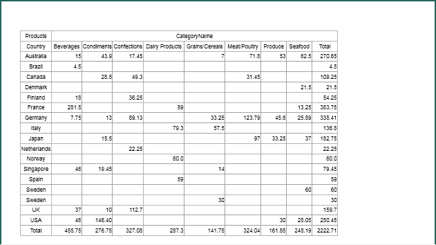
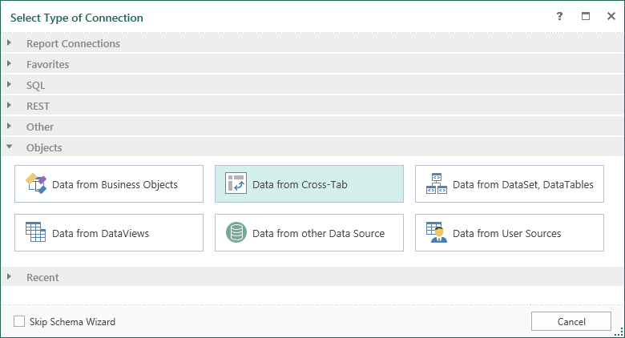
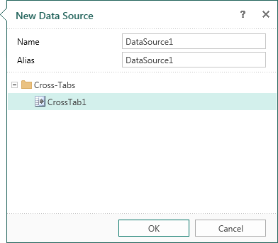
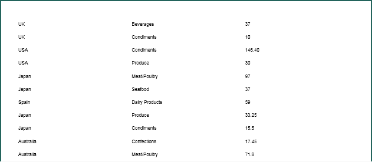

## Data From Cross-Tab

In Stimulsoft Reports you can create a data source based on cross-table, i.e. you can create a new source, which columns will be columns of the rendered cross-table, and strings are the strings of the rendered cross-table. Consider an example of creating a data source based on the cross-table. The picture below shows a report page with the rendered cross-table:

To create a data source based on cross-table, you should call the **New Data Source** dialog and select the **Data from Cross-tab** item. The picture below shows the **New Data Source** dialog:

After clicking **OK**, in the next dialog form **New Data Source**, you should indicate the **Name** of the new data source and cross-table, which will be used as a basis. You can also specify the **Alias** of the new data source. The picture below shows the second form of the **New Data Source** dialog:

After clicking **OK**, you will create a data source **DataSource1**, which will contain the columns **ShipCountry**, **CategoryName**, **UnitsPrice**. The data source on the base of the cross-table is a virtual data source that does not contain real data. Filling this source occurs when rendering the cross-table. Therefore, a report that will use this data source, for example, to render a report with the list, must contain the cross-table on the base of which the data source was created. For example, create a report with the list.  Put the cross-table in the first report page, and in the second page, put the **DataBand** with text components, which will contain the expressions **{DataSource1.ShipCountry}**, **{DataSource1.CategoryName}**, **{DataSource1.UnitsPrice}**. The picture below shows a part of the report page with the rendered list:

When rendering a report, the report generator fills created data source **DataSource1** with data from the cross-table and display the data as a list.
