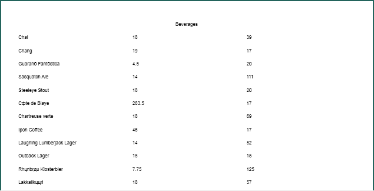
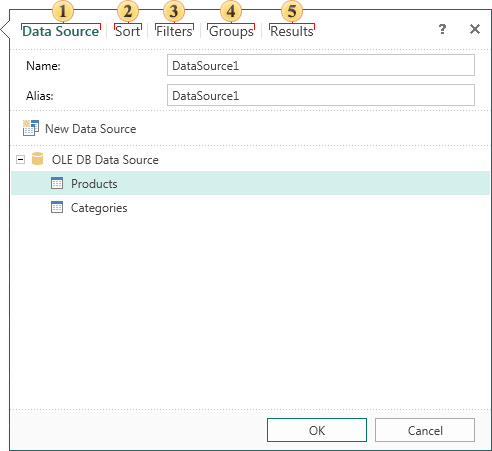
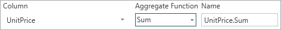
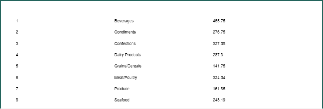

## Data From Other Data Source

In the report generator you can create a data source based on existing data sources. The **Data from other Data Source** provides analogical features like the query to the database. When creating a data source using the visual interface, in the process of creating a data source, to perform sorting, grouping, filtering, and calculating of totals using aggregate functions. Consider the example of creating data from other data sources. Suppose there is a **Master-Detail** report, to which each category corresponds a number of products. The picture below shows a page of the **Master-Detail** report (shown partially):

As can be seen from the picture above, the name of the category, product name (related to this category) and the price of the product are displayed in the report. If you want to create a report that displays the name of the category and the total value of all products included in this category, it can be done in various ways. But the easiest way is to create a data source based on another data. To do this, select **Data from other Data Source** item in the **New Data Source** dialog and setup the data source you create. The picture below shows the second form of the **New Data Source** dialog:

As can be seen from the picture above, the process of creating data from other sources includes the following steps:

 **Data Source**. On this stage, you must specify the Name of a new data source and its Alias. In our example, the alias name and the data source name is DataSource1. You should also select a data source on which to setup a new one. In this case, the selected data source Products. This step is optional.

 Sorting criteria are specified in the Sort step. On this stage you should specify the data column to be used for sorting, and to select the sorting direction. This step is optional.

 Set conditions of filtering data in a new data source on stage Filters. To filter the data you need to add a filter to specify an expression or a condition that will be filtered. This step is optional.

 To specify the conditions of grouping data in a new data source, you can do the step **Groups**. To group the data you should indicate the data column by which the data will be grouped, and select your destination of groups location. Data column, by which grouping will be performed will present in the new data source. In this example, using the relation, between data sources **Categories** and **Products**, indicate grouping by the data column **CategoriesName**, which contains the names of categories. This step is optional.

 The last step is **Results**. In this step, you can make the calculation on a data column with aggregate functions. The picture below shows the Results tab:

As can be seen from the picture, this tab should indicate the following parameters:

* Select the data column in the **Column** field that will be present in the new data source or from which data will be collected to calculate the aggregate. This field is mandatory. For example, the data column **UnitPrice** is selected. It contains data on the products prices.

* The **Aggregate Function** menu is a list of aggregate functions that can be used to calculate the selected data columns. Aggregate functions can be omitted in this case, the data column will contain data, which are in the data column, which is the basic one. In this example, select the aggregate function **Sum**, which summarizes the data.

* In the **Name** field specify the column name, which is used to refer to this calculated column in the report.

Now for the report rendering the data source **DataSource1** can be used, which contains two data columns: **CategoryName** and **UnitPrice.Sum**. The picture below shows a report, based on data from a data source **DataSource1**:

As can be seen in the picture above, each category corresponds to the total value of all products included in this category.
