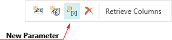
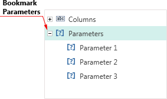
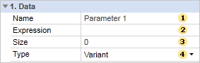
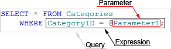
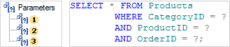
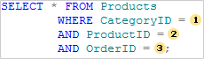
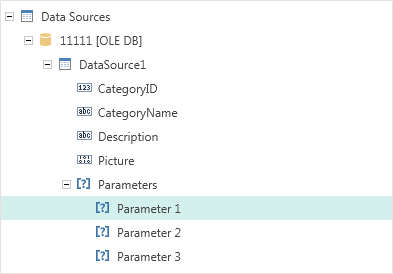
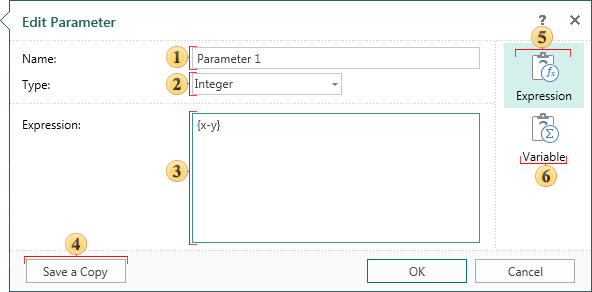
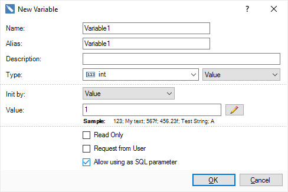
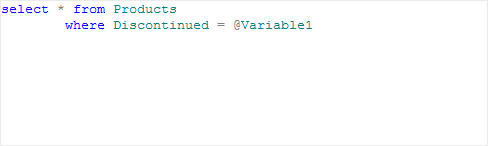

## Parameters

When creating a query it is possible to use the Parameter object. This object is designed to send additional conditions for selecting data into a query. For example, if you need a query to use a value entered by the user each time the query is executed, you can create a query using parameters. The Parameter object can only be used with SQL data sources. These data sources are typically have the Text Query field. To insert a parameter in the query, you must click the New Parameter button. The picture below shows the toolbar, on which the New Parameter button can be found:

After clicking this button a new parameter will be created. This parameter will be displayed in the Parameters tab in the Columns panel. The picture below shows an example of the Columns panel with the Parameters tab:

Each parameter has a property with which you can change its settings. The picture below shows the panel of parameters properties:

 For each parameter you can specify a value that is used to populate the parameter. The value can be an expression, **const**, variable, etc. For example, **{x + y}** or **{variable}**.

 The **Name** property. Used to change the parameter name. This feature works only for named parameters.

 The **Size** property provides an opportunity to change the size of the type used in the parameter. Keep in mind that each type in the database has its own size. Therefore, when using a query, you must specify the correct type size. For some adapters, database size may be omitted, but generally if the size is not specified or is incorrect, then the queries using these parameters will be performed incorrectly.

 Use the **Type** property to change the parameter type. The values ​​of the properties are in the drop-down list, and are a list of types used in the parameters for a particular database. It should be noted that a list of types differs depending on the database.

Also, you must specify the parameter in the query. Here is an example of schematic position of parameters in the query:

As a rule, the @ symbol is used to specify a parameter in the query. The @ symbol is used with named parameters, i.e. after the @ symbol goes the name of the parameter. But in some databases (for example in OleDB), the @ symbol cannot be perceived by the adapter and database queries with parameters will not work. In this case, you can use unnamed parameters. For specifying unnamed parameters in the query the ? character is used. After the ? character, the parameter name is not specified. In this case, the order of parameters in the Parameters tab is important. As indications of the ? characters in the query, parameters will be taken sequentially from the Parameters tab in the top-down direction. Consider the following example. Suppose there are three parameters that are specified in the query:

Since, in this case, unnamed parameters (marked with ?) are used, then, when running, the query parameters will be taken from the Parameters tab in the top-down order. The picture below schematically presents a comparison of parameters of the Parameters tab to the parameters in the query:

In this case, the parameters used in this example, can have names, but when using the ? character they play no role. Once a query to parameters is created and executed, the parameters will also be displayed in the Dictionary, in the created data source in the Parameters tab. The picture below shows an example of the Dictionary panel and placing parameters in it:

To edit a parameter separately from the data source, select the Parameter in the data dictionary and click Edit on the toolbar in the dictionary or select Edit item in the context menu of the selected parameter. After pressing the button or selecting Edit, the user will be shown the Edit Parameter dialog, in which you can edit the selected parameter. The picture below shows an example of the Edit Parameter dialog:

 This field displays the parameter Name, which can be edited;

 This field displays the Type of the parameter, which can be edited;

 The Expression field displays used expressions in a query parameter, which, if necessary, can be edited;

 The Save a Copy button saves a copy of the edited parameter by assigning the Copy postfix in the parameter name.

 The **Expression** tab. An expression, link to the data column, etc is specified as a value of the parameter.

 The **Variable** tab. A variable is specified as a value of the parameter.

Using variable as SQL parameter

A variable can be specified as a value in the parameter. In this case, values of the variable will be the values of the parameter when requesting data. There are two ways to use a variable in a query as a parameter:

* Create a variable in the data dictionary. Open the data source for editing. Create a parameter in the data source. Specify a variable as the value of this parameter. Insert the parameter in the text of the query.

* When creating or editing a variable, set the **Allow using as SQL** parameter check box:

Register this variable in the text of the query, using the special "**@**" symbol before the variable name:

Click **OK**. Now the variable is present in the data source and is used as a parameter in the query.
