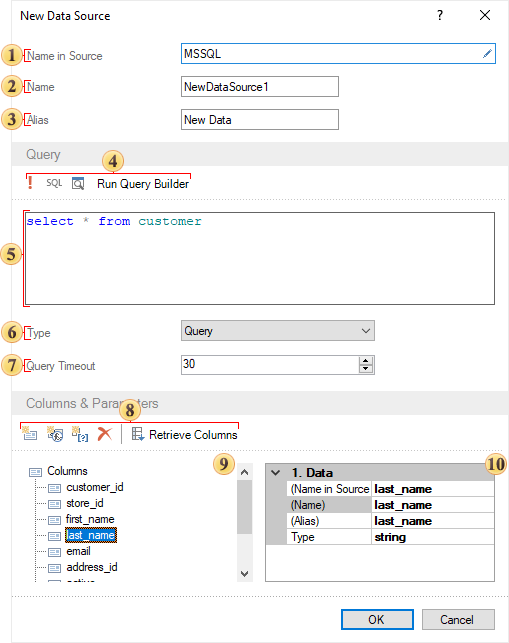
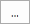
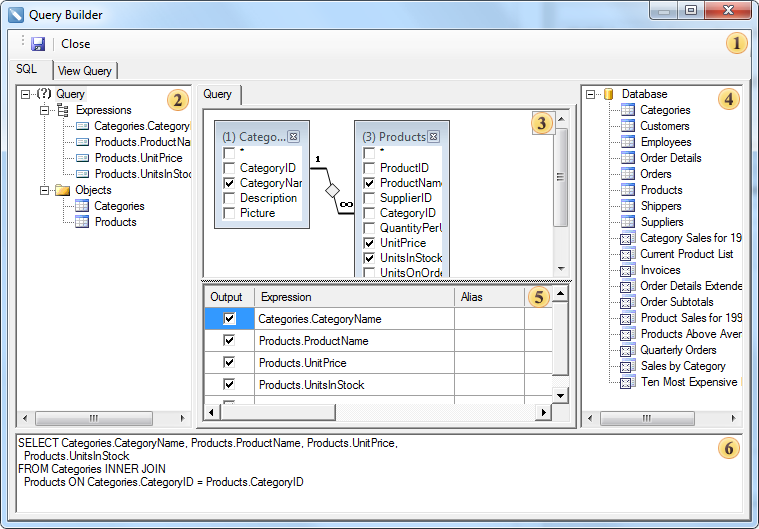
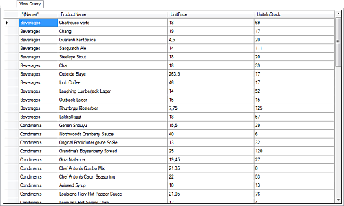

## Queries

Queries are text script forms, which are used to extract data from tables and making them available in the report generator. Queries is that they get data from database tables and create them on the basis of a temporary table. The data in the temporary table will be filtered, grouped, sorted and ordered, according to the query parameters. Then, the temporary table is passed to the report generator. Applying queries provides the ability to avoid duplication of data in tables and provides maximum flexibility for searching and displaying data in a database. Most of queries are used to fetch data from the database and transfer them to the report generator. Not all data source types support SQL queries. If the type of a data source supports SQL queries, the New Data Source dialog will display the Text Query with the query. The picture below shows a New Data Source dialog, where in the Query Text field a query for fetching is created.

 The Name in Source field. In this field, you can enter the name or you can click the 

 to call a list of names.

 In the Name field specifies the data source name that appears in the report generator;

 The Alias of the data source should be indicated in the Alias field;

 Command to control queries. This panel has the main items to control text queries. Click the Run button to run the query for execution.

 The Query Text field. This field specifies the text of the query.

 The menu to select the data source type. The following types of data source are Table and Stored Procedure. The picture below shows the selection menu of the data source type:

 The Query Timeout parameter is used to specify the execution time of a query, which means time during which the request will be executed. If the request timed out and the request failed, the user will see a message about this. The parameter value is indicated in seconds.

 Commands to manage data. This panel lists commands such as creating a new column, the new calculated columns, the new parameter. Among other things, this panel has the Retrieve Columns command.

 The Columns panel. This panel displays the data source columns, and parameters. Properties of the selected column or parameter are located on the property bar.

 Properties panel of the selected data column or a parameter.

Query Builder
The Query Builder is a visual component that allows creating queries visually. Creating a query using a designer allows complete controlling the query parameters and building of complex conditions of data selection using simple visual user interaction. The picture below shows the Query Builder dialog:

 **Control Panel**. Contains the Save button (saves the query) and the Close button (closes the query builder);

 **Query tree panel**. This panel shows the query tree.

 **Query design panel**. This panel is an area in which the query is visually represented. In this area, you can determine the initial database objects and derived data sources, as well as define relations between data sources, configure the data source properties, and references.

 bar databases. This panel displays the database and included in her data sources;

 Table panel. This panel shows a table in which rows are data columns used in the query and columns are operations. In this table, you can define data columns, aliases, sorting type, sorting order, grouping, criteria.

 This panel displays a query built on the panel  as a code.

The Query Builder contains the View tab, which provides an opportunity to display data columns selected by the query. There operations in the query should also be taken into account. The picture below shows the View tab in the Query Builder:

Click the **Save** button to add the created query text into the **Query Text** field.
