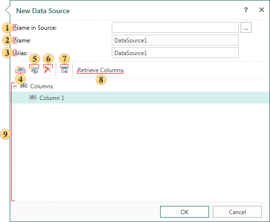

## Custom Data Sources

If you want to build a report based on the custom data then, in Stimulsoft Reports, you can create custom data based on custom data sources. To do this, you should select Data from User Sources in the New Data Source window, and in the next New Data Source dialog box, configure a custom data source. The picture below shows the form **New Data Source**:

Setting the data source is done using the following controls:

 The **Name in Source** field. Specifies the name of a connection or database. When creating data on the base user data sources this is not mandatory to fill this field.

 The source name that is used to access the report is indicated in the Name field. This field is mandatory.

 The alias of the source is indicated in the **Alias** field. This field is not mandatory.

 Using the **New Column** button you can add the new column to the data source.

 The new calculated data column can be added to the data source using the **New Calculated Column** button.

 The **Delete** button deletes the selected  data column or deletes all data columns when the **Columns** tabs is selected.

 Preview the query.

 Using the **Retrieve Columns** button you can get all the columns from the database. In this case, there is no connection to the database and the query is not built, so the button is no longer relevant.

 This panel displays the data source structure.
