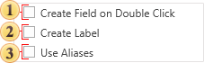

## Panel Setup

The panel (see the picture below) contains controls that provide an opportunity to change auxiliary parameters of the data dictionary.

 If the option **Create Field on Double Click** is enabled, then when double clicking the data column data in the report data dictionary, the report template in the DataBand will create a text component with reference to this data column;

 The parameter **Create Label** is used to create two text components (one with the signature, the a second with reference to the data column) when dragging a data column into the report. If this option is disabled, then, when dragging, only one text component with reference to a data column will be created;

 To show the alias instead of the name, enable the option **Use Aliases**. If this option is disabled, it will display a name of the element.
