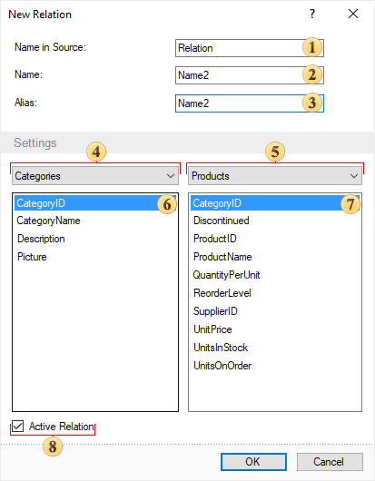

## Creating Relation

It is possible to create a relation between data sources in the data dictionary. To do this select the item **New Relation** in the context menu of a data source or from the menu **Actions**. The picture below shows a **New Relation** dialog:

As can be seen there are nine fields, which define the relation parameters:

 In the field **Name in Source** the name of a relation is specified. By this name the relation will be found from the original data (for example in the **DataSet**). If the relation between data sources will be created on the basis of a relation in the DataSet, then this name will coincide with the field **Name**. This field is required to be filled.

 Filed Name is used to specify the name of a relation which is used to refer to this relation in the report. This field is required to be filled.

 In the field **Alias** a hint for the relation will be specified and displayed to the user. This field is mandatory.

 Filed **Parent DataSource** indicates the parent data source for the relation. This field is required to be filled.

 Filed **Child Data Source** indicates a detail data source for this event. This field is required to be filled.

 This field displays the selected column from the parent data source. In order  to create a relation, you should select the column by which the relationship will be arranged.

 This field displays the selected column from the child data source. In order  to create a relation, you should select the column by which the relationship will be arranged.

 The **Active Relation** parameter sets the mode of using the current relation by default, for example, when creating a new data transformation.

> **Information**
>
> The editor of relations has the built-in control. In case of issues with creating a relation, the user will see an error message. In this case, you cannot click the OK button, until the issues are fixed.
