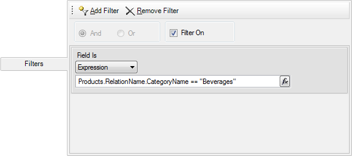
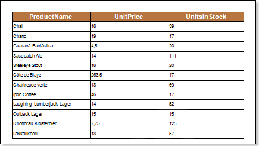

## Filtering

In Stimulsoft Reports it is possible to filter data using relations between data sources. Let's review data filtering via a relation (in the example we use data source Products). If you want to filter data by the category name, i.e. by the entries in the data column CategoryName of the data source Categories, then, with established relation between data sources Categories and Products, to add a filter to the expression: Products.RelationName.CategoryName == "category name" by which filtering will occur. The picture below shows a window of data filtering via the relation between data sources:

where Products is a data source name; RelationName is a name of the relation between data sources, i.e. reference to another data source vie the relation; CategoryName is a data column in the data source.

Now, when rendering a report, the report generator filters data from the data source Products and displays the data that belong to the category Beverages. The picture below shows a page of the rendered report:

