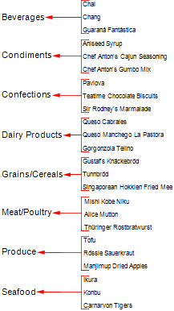

## Master-Detail Report

"From the detail via a relation to the master data source" scheme was used in the previous chapters (filtering, sorting, and showing information). When you render a Master-Detail reports a different scheme "from master to detail" is used, i.e. the relation works in reverse order. For example, in the report template DataBand1 is placed in the report template. This band contains a text component with reference to a data column, which contains the categories names. Then, when rendering a report, you will see a list of categories. The picture below shows a report page with the names of categories:

Suppose you want to compare each category from the list to the list of products. To do this, follow these steps:

 Add DataBand2 to the report template;

 Specify a data source that contains a list of products and the relation between data sources;

 Select the Master component;

 Put a text component with reference to a data column from the selected data source in the DataBand2. For example, on a data column that contains the name of the product.

And then, when rendering a report, each Master entry will be compared to a list of Detail entries. The picture below shows a diagram of a Master-Detail report:

