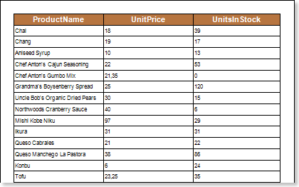
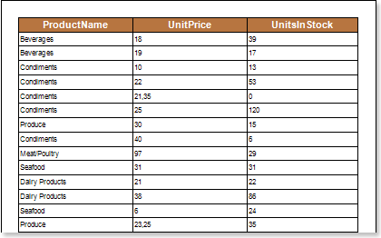

## Showing Information

Stimulsoft Reports tools can display data from a bound data source. For example, data from columns are displayed in a report: **ProductName**, **UnitPrice**, **UnitslnStock** of the data source **Products**. The picture below shows the a page of the report:

If you want to display a category name instead of a product one, and the data column with the names of categories is not present in the data source **Products**, then it can be done using a relation between data sources. To do this, you should change the expression **Products.ProductName** in the text component to the expression **Products.RelationName.CategoryName**. Using the relationship between data sources, the report generator, when report rendering, will take the names of categories from the column **CategoryName** of the data source **Categories**, and substitute them instead of the expression. The picture below shows the a page of the rendered report displaying category names instead of the product name:

As can be seen in the picture above, instead of the product names, the category names to which products are related are output.
